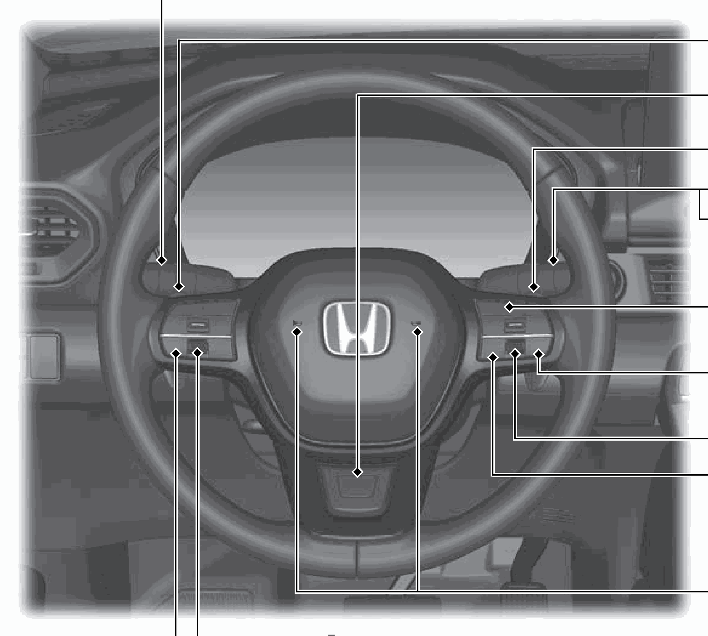
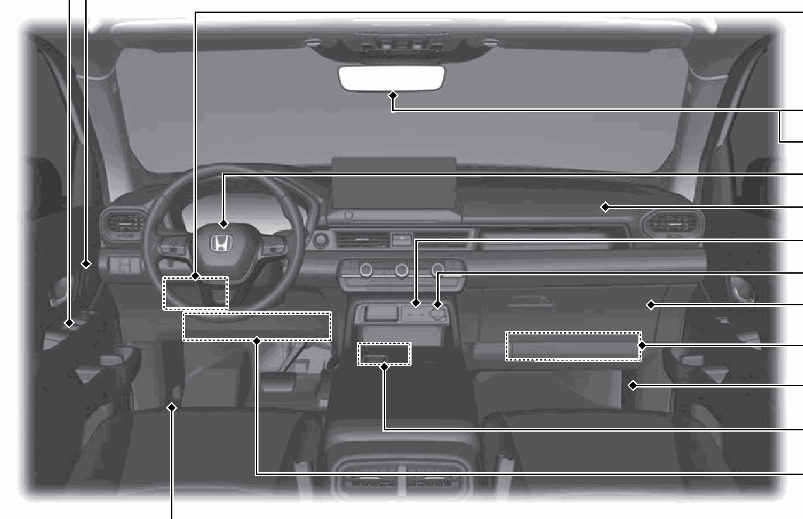
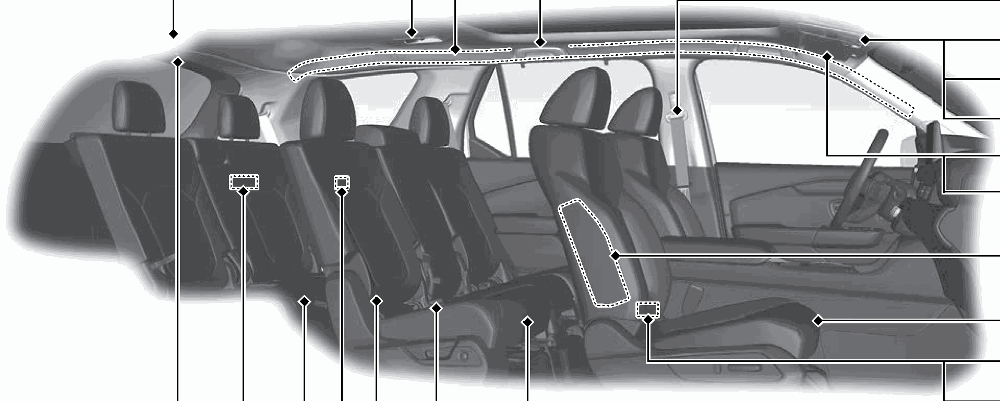
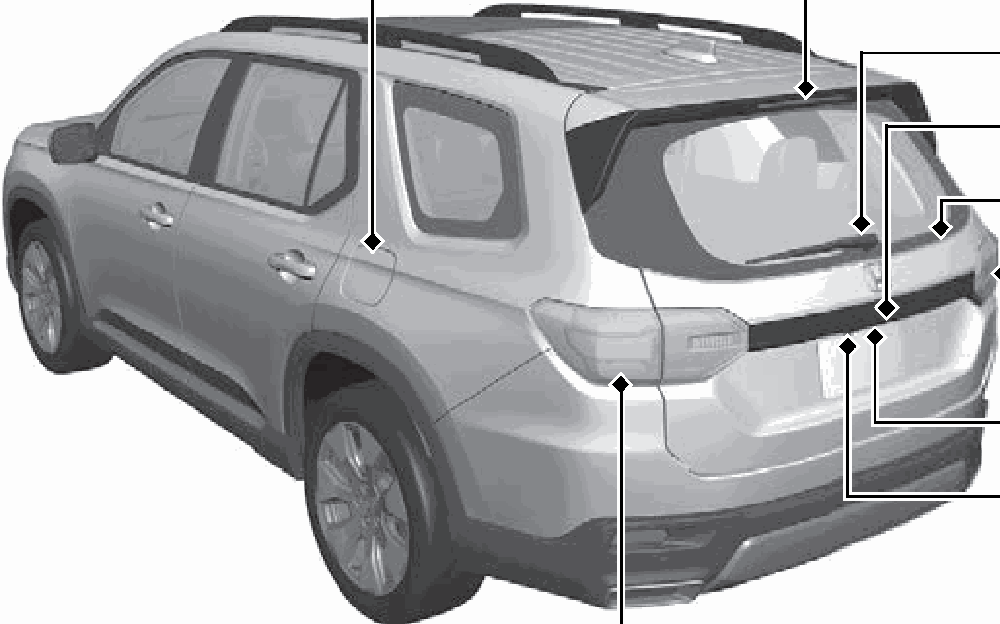
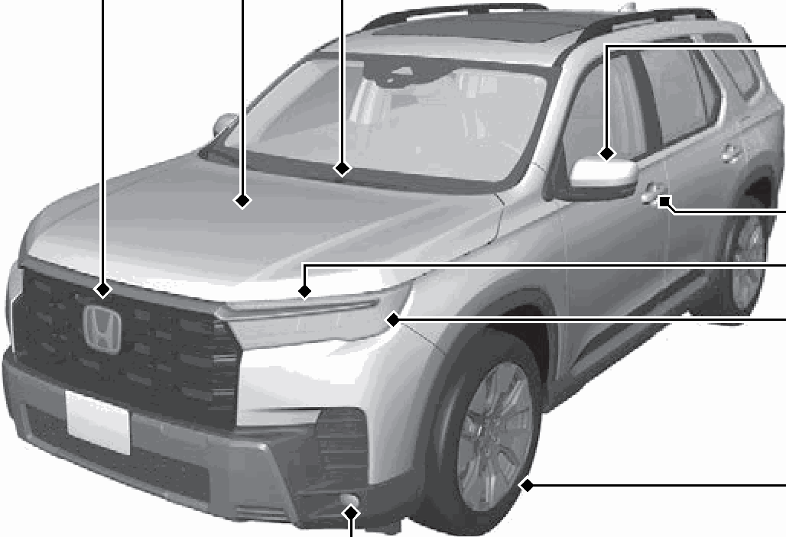

<!-- GENERATED:START function=cce166261af8 (generated; edits inside this block are overwritten by the next publish — write your own notes outside it) -->
# 1. Visual Index

<b>Function path:</b> Quick Reference Guide / Visual Index <b>Source:</b> printed page 8, 9, 10, 11, 12 <b>Test-ready:</b> no — procedure missing or thresholds unfilled

Every "Presumed requirement" row below is machine-derived from the Owner's Manual text by rule-based extraction — not AI-written — and traceable to the printed page in its Source column.

## Figures (areas of the original PDF; the OM has no figure numbers or captions)

- Figure 1-1 source: p.9
- (Copied from OM) ❚Left Selector Wheel

- Figure 1-2 source: p.10
- (Copied from OM) ❚Interior Fuse Box

- Figure 1-3 source: p.11
- (Copied from OM) ❚Panoramic Roof Switch*

- Figure 1-4 source: p.12
- (Copied from OM) ❚Rear Wiper

- Figure 1-5 source: p.12
- (Copied from OM) ❚Power Door Mirrors

## Numeric thresholds (filled in by a tester)
Filled: 0 / unfilled: 1

| Threshold | Matching text (Copied from OM) | Kind | Unit | Value | Status | Evidence | Filled by |
|---|---|---|---|---|---|---|---|
| 4bef3793cf68 | Low Speed | speed | speed | **unfilled** | unfilled | — | — |

## 1-2-1. Service overview

| # | Presumed requirement | Strength | Source |
|---|---|---|---|
| 1 | Visual IndexHeated Windshield Button* (P204) ❚ Power Tailgate Button (P176). | capability | p.8 / text |
| 2 | Visual Index❚Audio System (P264). | capability | p.8 / text |
| 3 | Visual Index❚Hazard Warning Button ❚ Front Seat Heaters and Seat Ventilator* Buttons (P251). | capability | p.8 / text |
| 4 | Visual Index❚ Rear Defogger/ Heated Door Mirror* Button (P204) ❚Climate Control System (P256) ❚Shift Button (P419) ❚Drive Mode Switch (P433) ❚ Hill Descent Control Button (P440) ❚ Auto Idle Stop OFF Button (P428) ❚ Electric Parking Brake Switch (P533) ❚Automatic Brake Hold Button (P537) ❚ENGINE START/STOP Button (P190) ❚Steering Wheel Adjustments (P207). | capability | p.8 / text |
| 5 | Visual Index❚Left Selector Wheel ❚Audio Remote Controls ❚Bluetooth® HandsFreeLink® Buttons. | capability | p.9 / text |
| 6 | Visual Index❚ Headlights/ Turn Signals (P193, 195) ❚ Fog Lights (P197). | capability | p.9 / text |
| 7 | Visual Index❚(- Paddle Shifter (Shift down) (P426). | capability | p.9 / text |
| 8 | Visual Index❚ Heated Steering Wheel Button* (P250). | capability | p.9 / text |
| 9 | Visual Index❚(+ Paddle Shifter (Shift up) (P426) ❚ Wipers/Washers (P201) ❚ Camera Button* (P555). | capability | p.9 / text |
| 10 | Visual Index❚ Adaptive Cruise Control (ACC) with Low Speed Follow Buttons (P483) ❚ Lane Keeping Assist System (LKAS) Button (P507) ❚Right Selector Wheel (P127) ❚ Interval Button (P495). | capability | p.9 / text |
| 11 | Visual Index❚Horn (Press an area around .). | capability | p.9 / text |
| 12 | Visual Index(P124) (P264) (P369). | capability | p.9 / text |
| 13 | Visual Index❚Power Window Switches (P183) ❚ Master Door Lock Switch (P168) ❚ Door Mirror Controls (P209) ❚Memory Buttons* (P206) ❚SET Button* (P206) ❚Interior Fuse Box (P656). | capability | p.10 / text |
| 14 | Visual Index❚Rearview Mirror (P208) ❚HomeLink® Buttons* (P253) ❚Driver’s Front Airbag (P58) ❚Passenger’s Front Airbag (P58) ❚ USB Ports (P265) ❚Accessory Power Socket (P244) ❚Glove Box (P234) ❚Passenger’s Knee Airbag (P63) ❚Interior Fuse Box (P658). | capability | p.10 / text |
| 15 | Visual Index❚ Wireless Charger* (P246). | capability | p.10 / text |
| 16 | Visual Index❚Driver’s Knee Airbag (P63). | capability | p.10 / text |
| 17 | Visual Index❚Hood Release Handle (P582). | capability | p.10 / text |
| 18 | Visual Index❚Seat Belt with Detachable Anchor (P50) ❚Side Curtain Airbags (P68) ❚Grab Handle ❚Coat Hook (P237) ❚Seat Belts (P41) ❚Panoramic Roof Switch* (P186) ❚ Map Lights (P232) ❚Sunglasses Holder (P238) ❚Sun Visors (P243) ❚Vanity Mirrors. | capability | p.11 / text |
| 19 | Visual Index❚Side Airbags (P66). | capability | p.11 / text |
| 20 | Visual Index❚Front Seat (P211) ❚ USB Ports (P265) ❚Second Row Outer Seat Heater Buttons* (P252) ❚Second Row Seat (P214) ❚Seat Belt (Installing a Child Seat) (P84) ❚Seat Belt to Secure a Child Seat (P86) ❚LATCH to Secure a Child Seat (P79) ❚ USB Ports* (P265) ❚Third Row Seat (P220) ❚Accessory Power Socket* (P244) ❚Walk Away Close Button* (P174) ❚Cargo Area Light (P233). | capability | p.11 / text |
| 21 | Visual Index❚Multi View Camera* (P554) ❚Maintenance Under the Hood (P581) ❚Windshield Wipers (P201, 599) ❚Power Door Mirrors (P209) ❚Side Turn Signal Lights* (P195, 594) ❚Multi View Camera* (P554) ❚Door Lock/Unlock Control (P155) ❚Front Turn Signal Lights (P195, 594) ❚Headlights (P193, 594) ❚Front Side Marker Lights (P193, 594) ❚Daytime Running Lights/Parking Lights (P193, 197, 594) ❚Tires (P604, 627) ❚Fog Lights (P197, 594) ❚How to Refuel (P566) ❚High-Mount Brake Light (P598) ❚Rear Wiper (P203, 602) ❚Rear License Plate Light (P597) ❚Opening/Closing the Tailgate (P170) ❚Back-Up Lights (P597) ❚Taillights* (P597) ❚Tailgate Outer Handle (P176) ❚Rear View Camera* (P552) ❚Multi View Camera* (P554) ❚Brake/Taillights (P595) ❚Rear Side Marker Lights (P595) ❚Rear Turn Signal Lights (P595). | capability | p.12 / text |
<!-- GENERATED:END function=cce166261af8 -->

