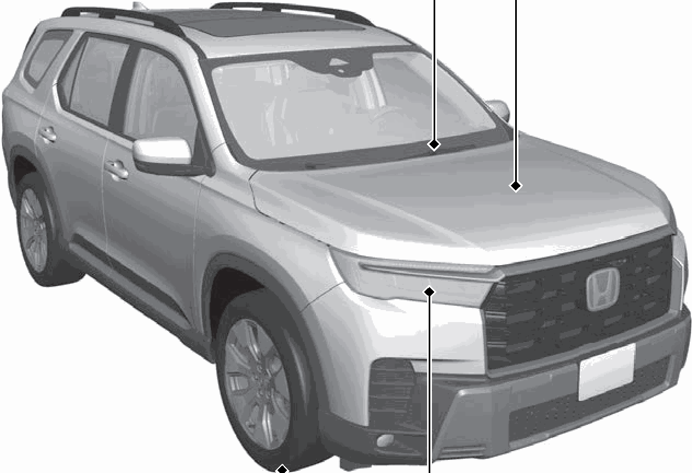
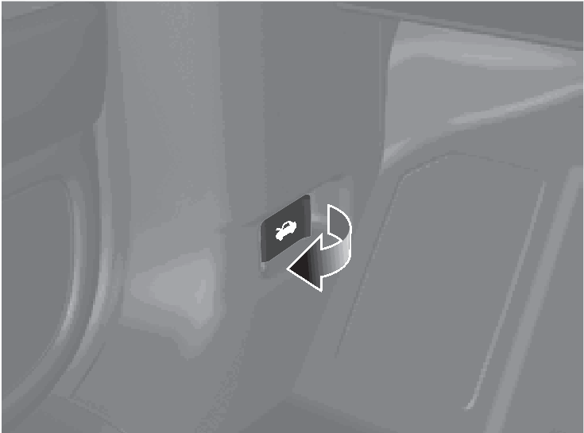
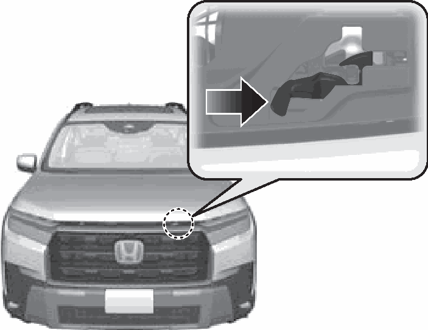

<!-- GENERATED:START function=bdf3d2c7f0dd (generated; edits inside this block are overwritten by the next publish — write your own notes outside it) -->
# 10. Maintenance (P569)

<b>Function path:</b> Quick Reference Guide / Maintenance (P569) <b>Source:</b> printed page 30 <b>Test-ready:</b> no — procedure missing or thresholds unfilled

Every "Presumed requirement" row below is machine-derived from the Owner's Manual text by rule-based extraction — not AI-written — and traceable to the printed page in its Source column.

## Figures (areas of the original PDF; the OM has no figure numbers or captions)

- Figure 10-1 source: p.30
- (Copied from OM) (P599)

- Figure 10-2 source: p.30
- (Copied from OM) (P581)

- Figure 10-3 source: p.30
- (Copied from OM) (P581)

## 10-2-1. Service overview

| # | Presumed requirement | Strength | Source |
|---|---|---|---|
| 1 | Maintenance (P569)Under the Hood (P581). | capability | p.30 / text |

## 10-2-2. Service requirements

| # | Presumed requirement | Strength | Source |
|---|---|---|---|
| 1 | Step -Check engine oil, engine coolant, and windshield washer fluid. Add when necessary. | constraint | p.30 / bullet |
| 2 | Step -Check brake fluid. | capability | p.30 / bullet |
| 3 | Step -Check the battery condition monthly. a Pull the hood release handle under the corner of the dashboard. | capability | p.30 / bullet |
| 4 | Maintenance (P569)b Locate the hood latch lever, push it to the side, and then raise the hood. Once you have raised the hood slightly, you can release the lever. | capability | p.30 / text |
| 5 | Maintenance (P569)c When finished, close the hood and make sure it is firmly locked in place. | constraint | p.30 / text |
| 6 | Maintenance (P569)Wiper Blades (P599). | capability | p.30 / text |
| 7 | Step -When lifting the front wiper arms, move them into the maintenance position before lifting them. | capability | p.30 / bullet |
| 8 | Step -Replace blades if they leave streaks across the windshield or become noisy. | constraint | p.30 / bullet |
| 9 | Maintenance (P569)Lights Tires (P594) (P604). | capability | p.30 / text |
| 10 | Step -Inspect all lights regularly. | capability | p.30 / bullet |
| 11 | Step -Inspect tires and wheels regularly. | capability | p.30 / bullet |
| 12 | Step -Check tire pressures regularly. | capability | p.30 / bullet |
| 13 | Step -Install snow tires for winter driving. | capability | p.30 / bullet |
<!-- GENERATED:END function=bdf3d2c7f0dd -->

