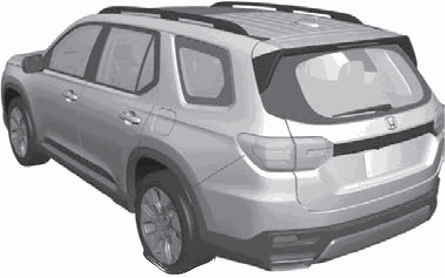
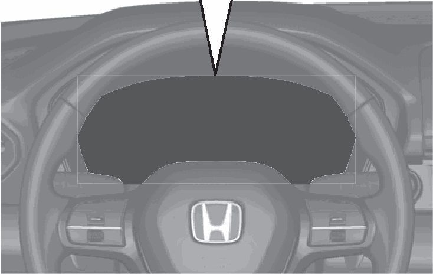
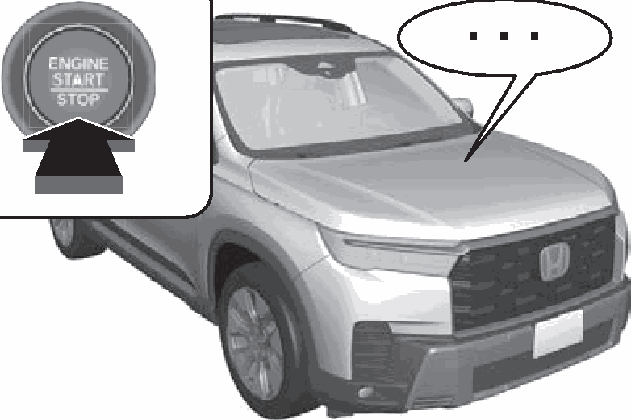
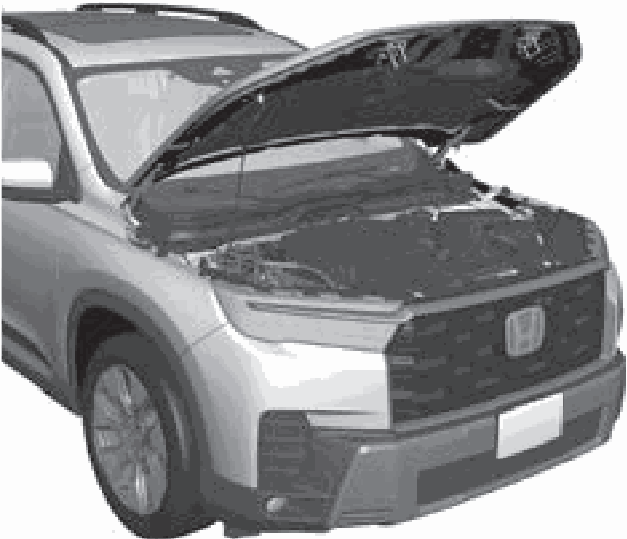

<!-- GENERATED:START function=930102048b88 (generated; edits inside this block are overwritten by the next publish — write your own notes outside it) -->
# 11. Handling the Unexpected (P625)

<b>Function path:</b> Quick Reference Guide / Handling the Unexpected (P625) <b>Source:</b> printed page 31 <b>Test-ready:</b> no — procedure missing or thresholds unfilled

Every "Presumed requirement" row below is machine-derived from the Owner's Manual text by rule-based extraction — not AI-written — and traceable to the printed page in its Source column.

## Figures (areas of the original PDF; the OM has no figure numbers or captions)

- Figure 11-1 source: p.31
- (Copied from OM) the cargo area.

- Figure 11-2 source: p.31
- (Copied from OM) owner’s manual.

- Figure 11-3 source: p.31
- (Copied from OM) booster battery.

- Figure 11-4 source: p.31
- (Copied from OM) and let the engine cool down.

## 11-2-1. Service overview

| # | Presumed requirement | Strength | Source |
|---|---|---|---|
| 1 | Handling the Unexpected (P625)Flat Tire Engine Won’t Start Overheating (P627) (P638). | capability | p.31 / text |

## 11-2-2. Service requirements

| # | Presumed requirement | Strength | Source |
|---|---|---|---|
| 1 | Step -If the battery is dead, jump start using a. | capability | p.31 / bullet |
| 2 | Step -Park in a safe location. If you do not see. | constraint | p.31 / bullet |
| 3 | Step -Park in a safe location and replace the booster battery. steam under the hood, open the hood, flat tire with the spare tire located under and let the engine cool down. the cargo area. | capability | p.31 / bullet |
| 4 | Handling the Unexpected (P625)Indicators Come On Blown Fuse Emergency Towing (P647) (P654). | capability | p.31 / text |
| 5 | Step -Identify the indicator and consult the. | capability | p.31 / bullet |
| 6 | Step -Check for a blown fuse if an electrical. | constraint | p.31 / bullet |
| 7 | Step -Call a professional towing service if you owner’s manual. device does not operate. need to tow your vehicle. | constraint | p.31 / bullet |
<!-- GENERATED:END function=930102048b88 -->

