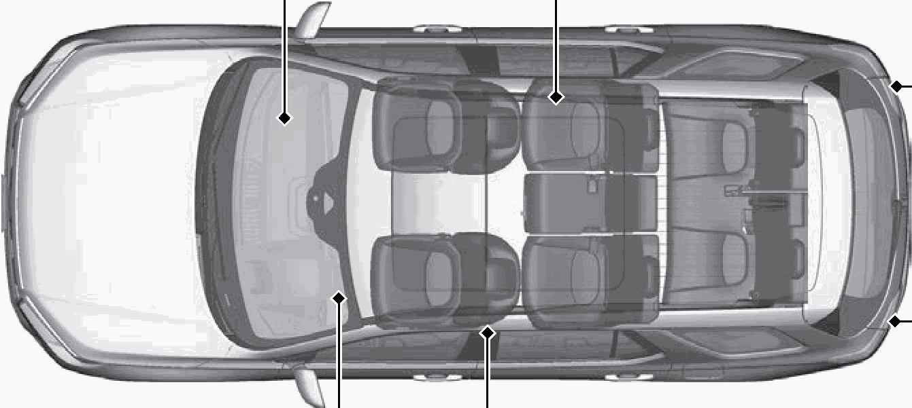

<!-- GENERATED:START function=cee2bf69ca87 (generated; edits inside this block are overwritten by the next publish — write your own notes outside it) -->
# 4. Safe Driving (P35)

<b>Function path:</b> Quick Reference Guide / Safe Driving (P35) <b>Source:</b> printed page 15 <b>Test-ready:</b> no — procedure missing or thresholds unfilled

Every "Presumed requirement" row below is machine-derived from the Owner's Manual text by rule-based extraction — not AI-written — and traceable to the printed page in its Source column.

## Figures (areas of the original PDF; the OM has no figure numbers or captions)

- Figure 4-1 source: p.15
- (Copied from OM) Before Driving Checklist

## 4-2-1. Service overview

| # | Presumed requirement | Strength | Source |
|---|---|---|---|
| 1 | Safe Driving (P35)Before Driving Checklist. | capability | p.15 / text |

## 4-2-2. Service requirements

| # | Presumed requirement | Strength | Source |
|---|---|---|---|
| 1 | Step -Before driving, check that the front seats, head restraints, steering wheel, and mirrors have been properly adjusted. | capability | p.15 / bullet |
| 2 | Safe Driving (P35)Airbags (P55). | capability | p.15 / text |
| 3 | Step -Your vehicle is fitted with airbags to help protect you and your passengers during a moderate-to-severe collision. | capability | p.15 / bullet |
| 4 | Safe Driving (P35)Child Safety (P74). | capability | p.15 / text |
| 5 | Step -All children 12 and younger should be seated in the rear seat. | capability | p.15 / bullet |
| 6 | Step -Smaller children should be properly restrained in a forward-facing child seat. | capability | p.15 / bullet |
| 7 | Step -Infants must be properly restrained in a rear-facing child seat. | capability | p.15 / bullet |
| 8 | Step -Your vehicle emits dangerous exhaust gases that contain carbon monoxide. Do not run the engine in confined spaces where carbon monoxide gas can accumulate. | capability | p.15 / bullet |
| 9 | Safe Driving (P35)Seat Belts (P41). | capability | p.15 / text |
| 10 | Step -Fasten your seat belt and sit upright well back in the seat. | capability | p.15 / bullet |
| 11 | Step -Check that your passengers are wearing their seat belts correctly. (P40). | capability | p.15 / bullet |
| 12 | Safe Driving (P35)Fasten your lap belt as low as possible. | capability | p.15 / text |

## 4-5. Exception operation

| # | Presumed requirement | Strength | Source |
|---|---|---|---|
| 1 | Safe Driving (P35)Exhaust Gas Hazard (P92). | capability | p.15 / text |
<!-- GENERATED:END function=cee2bf69ca87 -->

