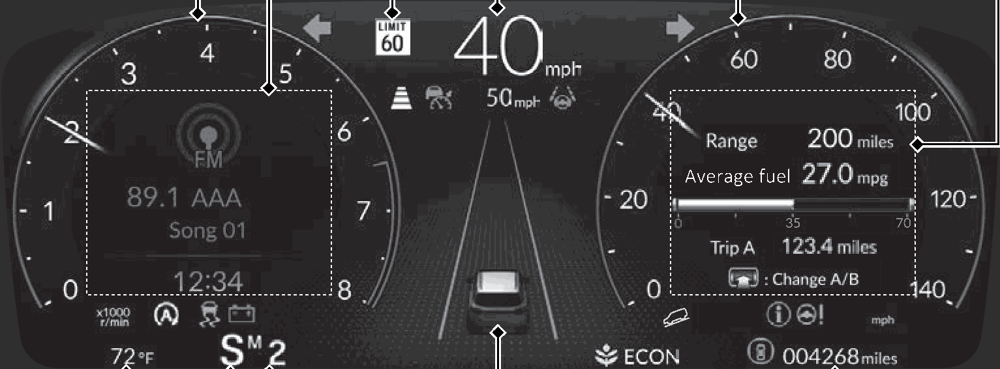

<!-- GENERATED:START function=50ca0ad67758 (generated; edits inside this block are overwritten by the next publish — write your own notes outside it) -->
# 5. Instrument Panel (P95)

<b>Function path:</b> Quick Reference Guide / Instrument Panel (P95) <b>Source:</b> printed page 16 <b>Test-ready:</b> no — procedure missing or thresholds unfilled

Every "Presumed requirement" row below is machine-derived from the Owner's Manual text by rule-based extraction — not AI-written — and traceable to the printed page in its Source column.

## Figures (areas of the original PDF; the OM has no figure numbers or captions)

- Figure 5-1 source: p.16
- (Copied from OM) Current Mode for ACC with Low Speed Follow, the LKAS, and Traffic Jam Assist

## Numeric thresholds (filled in by a tester)
Filled: 0 / unfilled: 1

| Threshold | Matching text (Copied from OM) | Kind | Unit | Value | Status | Evidence | Filled by |
|---|---|---|---|---|---|---|---|
| 764cc95978f5 | Low Speed | speed | speed | **unfilled** | unfilled | — | — |

## 5-2-1. Service overview

| # | Presumed requirement | Strength | Source |
|---|---|---|---|
| 1 | Instrument Panel (P95)Indicators /Gauges /Driver Information Interface (P96) (P118) Head-Up Display* (P143). | capability | p.16 / text |

## 5-2-2. Service requirements

| # | Presumed requirement | Strength | Source |
|---|---|---|---|
| 1 | Step -You can change the gauge design. Change gauge design (P142) Traffic Sign Recognition System (P120). | capability | p.16 / bullet |
| 2 | Instrument Panel (P95)Driver Information Interface (Left Side Area) (P122). | capability | p.16 / text |
| 3 | Instrument Panel (P95)Tachometer (P119) Speedometer (P118). | capability | p.16 / text |
| 4 | Instrument Panel (P95)Temperature Gauge (P119). | capability | p.16 / text |
| 5 | Instrument Panel (P95)Outside Temperature (P120) Current Mode for ACC with Low Speed Follow, the LKAS, and Traffic Jam Assist (P121) Parking Sensor System* (P121). | capability | p.16 / text |
| 6 | Instrument Panel (P95)M (sequential mode) Indicator/Gear Selection Indicator (P102). | capability | p.16 / text |
| 7 | Instrument Panel (P95)Gear Position Indicator/Transmission System Indicator (P102, 103). | capability | p.16 / text |
| 8 | Instrument Panel (P95)/ (P122, 126). | capability | p.16 / text |
| 9 | Instrument Panel (P95)Head-Up Display* (P143). | capability | p.16 / text |
| 10 | Instrument Panel (P95)Driver Information Interface (Right Side Area) (P126). | capability | p.16 / text |
| 11 | Instrument Panel (P95)Fuel Gauge (P119). | capability | p.16 / text |
| 12 | Instrument Panel (P95)Odometer (P119). | capability | p.16 / text |
<!-- GENERATED:END function=50ca0ad67758 -->

