<!-- GENERATED:START function=d60ef66ba4ee (generated; edits inside this block are overwritten by the next publish — write your own notes outside it) -->
# 6. Controls (P149)

<b>Function path:</b> Quick Reference Guide / Controls (P149) <b>Source:</b> printed page 17, 18, 19, 20, 21 <b>Test-ready:</b> no — procedure missing or thresholds unfilled

Every "Presumed requirement" row below is machine-derived from the Owner's Manual text by rule-based extraction — not AI-written — and traceable to the printed page in its Source column.

## Figures (areas of the original PDF; the OM has no figure numbers or captions)
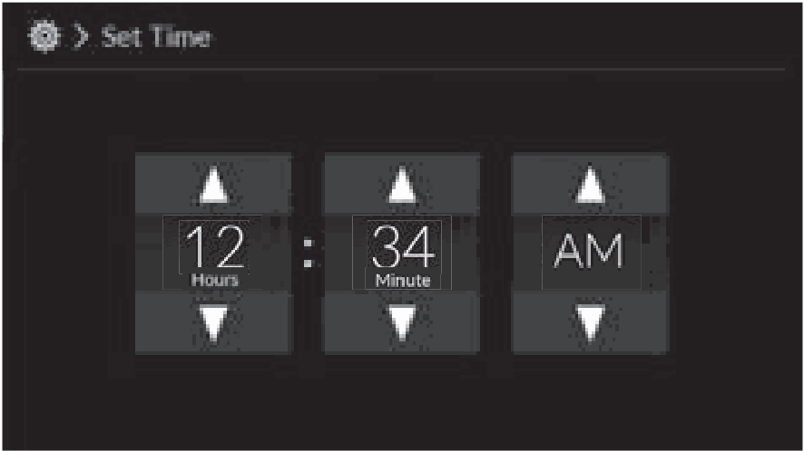
- Figure 6-1 source: p.17
- (Copied from OM) c Select Set Date &amp; Time.
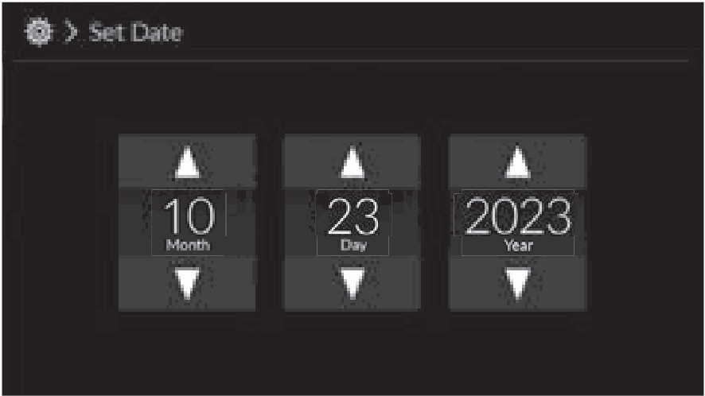
- Figure 6-2 source: p.17
- (Copied from OM) The clock is automatically updated through
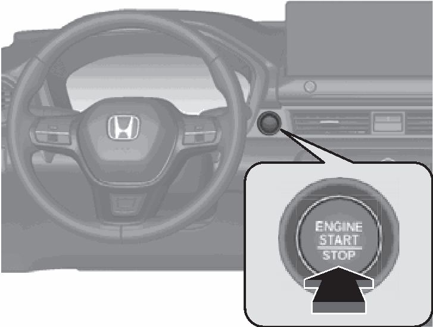
- Figure 6-3 source: p.17
- (Copied from OM) ENGINE START/STOP
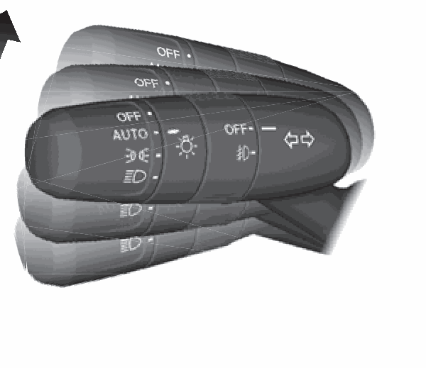
- Figure 6-4 source: p.18
- (Copied from OM) Turn Signal Control Lever
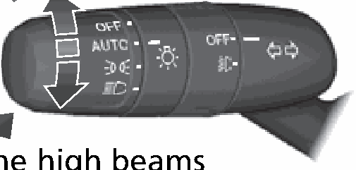
- Figure 6-5 source: p.18
- (Copied from OM) (P195)
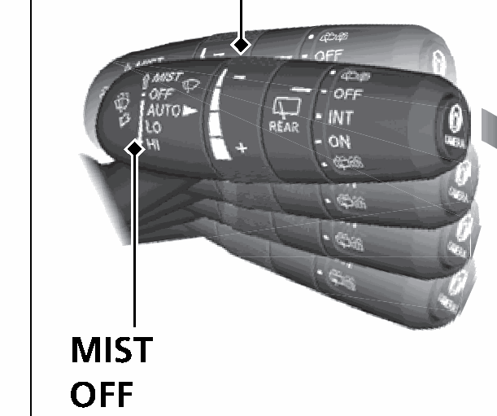
- Figure 6-6 source: p.18
- (Copied from OM) Wipers and Washers
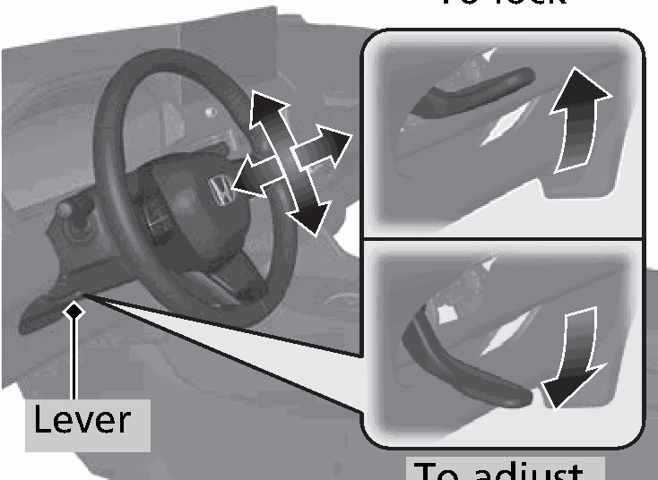
- Figure 6-7 source: p.18
- (Copied from OM) Models with automatic intermittent wipers
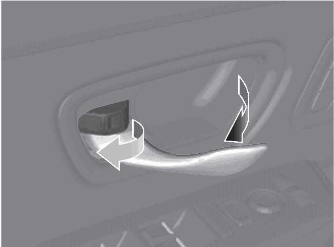
- Figure 6-8 source: p.19
- (Copied from OM) unlock and open it at the same time.
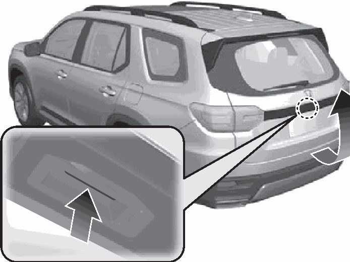
- Figure 6-9 source: p.19
- (Copied from OM) power tailgate.
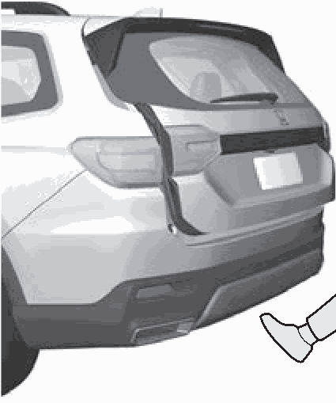
- Figure 6-10 source: p.19
- (Copied from OM) 1 sec.
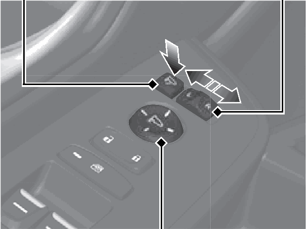
- Figure 6-11 source: p.19
- (Copied from OM) selector switch to L or R.
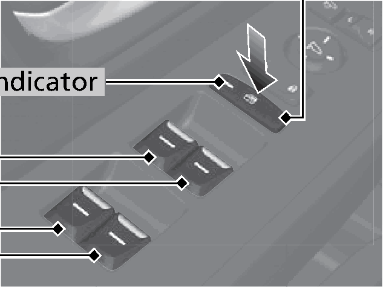
- Figure 6-12 source: p.20
- (Copied from OM) Indicator
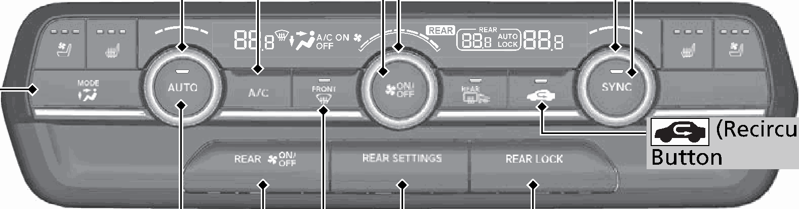
- Figure 6-13 source: p.21
- (Copied from OM) Button

## Numeric thresholds (filled in by a tester)
Filled: 0 / unfilled: 3

| Threshold | Matching text (Copied from OM) | Kind | Unit | Value | Status | Evidence | Filled by |
|---|---|---|---|---|---|---|---|
| 211c8411286f | Low speed | speed | speed | **unfilled** | unfilled | — | — |
| dac19ca20b25 | Low speed | speed | speed | **unfilled** | unfilled | — | — |
| cbf8e79a604d | High speed | speed | speed | **unfilled** | unfilled | — | — |

## 6-2-1. Service overview

| # | Presumed requirement | Strength | Source |
|---|---|---|---|
| 1 | Controls (P149)a Select the Home icon, then select Clock (P150) General Settings. To adjust time b Select System, then Date &amp; Time. | capability | p.17 / text |
| 2 | Controls (P149)c Select Set Date &amp; Time. | capability | p.17 / text |
| 3 | Controls (P149)d Select Automatic Date &amp; Time, then select Off. | capability | p.17 / text |
| 4 | Controls (P149)e Select Set Date or Set Time. | capability | p.17 / text |
| 5 | Controls (P149)f Adjust the dates, hours, and minutes by selecting 3/4. To adjust date. | capability | p.17 / text |
| 6 | Controls (P149)g Select the (back) icon to set the date or time. | capability | p.17 / text |
| 7 | Controls (P149)The clock is automatically updated through the audio system. | capability | p.17 / text |
| 8 | Controls (P149)ENGINE START/STOP. | capability | p.17 / text |
| 9 | Controls (P149)Button (P190) Press the button to change the vehicle’s power mode. | capability | p.17 / text |
| 10 | Controls (P149)Turn Signals (P195). | capability | p.18 / text |
| 11 | Controls (P149)Turn Signal Control Lever. | capability | p.18 / text |
| 12 | Controls (P149)Lights (P193). | capability | p.18 / text |
| 13 | Controls (P149)Light Control Switches. | capability | p.18 / text |
| 14 | Controls (P149)High Beam. | capability | p.18 / text |
| 15 | Controls (P149)Low Beam. | capability | p.18 / text |
| 16 | Controls (P149)Flashing the high beams. | capability | p.18 / text |
| 17 | Controls (P149)Wipers and Washers Models with automatic intermittent wipers AUTO should always be turned OFF before the following situations in order to prevent (P201) severe damage to the wiper system: Wiper/Washer Control Lever Cleaning the windshield ● ● Driving through a car wash Adjustment Ring. | capability | p.18 / text |

## 6-2-2. Service requirements

| # | Presumed requirement | Strength | Source |
|---|---|---|---|
| 1 | Step -No rain present : Lower speed, fewer sweeps*1 (-: Low Sensitivity*2 Steering Wheel : Higher speed, more sweeps*1 (P207) (+: High Sensitivity*2. | capability | p.18 / bullet |
| 2 | Step -To adjust, push the adjustment lever down, adjust to the desired position, then lock the lever back in place. To lock. | capability | p.18 / bullet |
| 3 | Controls (P149)Pull toward you to spray washer fluid. MIST OFF INT*1: Low speed with intermittent AUTO*2: Wiper speed varies automatically Lever LO: Low speed wipe To adjust HI: High speed wipe. | capability | p.18 / text |
| 4 | Controls (P149)*1:Models with manual intermittent operation *2:Models with automatic intermittent operation. | capability | p.18 / text |
| 5 | Controls (P149)Unlocking the Front. | capability | p.19 / text |
| 6 | Controls (P149)Doors from the Inside. | capability | p.19 / text |
| 7 | Step -Pull either front door inner handle to unlock and open it at the same time. | capability | p.19 / bullet |
| 8 | Controls (P149)Tailgate (P 170). | capability | p.19 / text |
| 9 | Step -Press the tailgate outer handle to unlock and open the tailgate when you have the keyless remote on you. | constraint | p.19 / bullet |
| 10 | Step -Press and hold the power tailgate button on the driver’s side control panel or the remote transmitter to open and close the power tailgate. | capability | p.19 / bullet |
| 11 | Controls (P149)Power Door Mirrors Models with hands free access With the remote on you, raise and lower your foot (in a kicking motion) under the (P 209) center of the rear bumper to open or close. | capability | p.19 / text |
| 12 | Step -With the power mode in ON, move the the tailgate. selector switch to L or R. | capability | p.19 / bullet |
| 13 | Step -Push the appropriate edge of the adjustment switch to adjust the mirror. Models with folding button. | capability | p.19 / bullet |
| 14 | Step -Press the folding button to fold in and out the door mirrors. | capability | p.19 / bullet |
| 15 | Controls (P149)Folding Button* Selector Switch. | capability | p.19 / text |
| 16 | Controls (P149)Adjustment Switch 1 sec. | capability | p.19 / text |
| 17 | Controls (P149)Power Windows. | capability | p.20 / text |
| 18 | Step -With the power mode in ON, open and close the power windows. | capability | p.20 / bullet |
| 19 | Step -If the power window lock button is in the off position, each passenger’s window can be opened and closed with its own switch. | capability | p.20 / bullet |
| 20 | Step -If the power window lock button is in the on position (indicator is on), each passenger’s window switch is disabled. | capability | p.20 / bullet |
| 21 | Controls (P149)Power Window Lock Button. | capability | p.20 / text |
| 22 | Controls (P149)Indicator. | capability | p.20 / text |
| 23 | Controls (P149)Window Switches. | capability | p.20 / text |
| 24 | Controls (P149)Climate Control System (P256). | capability | p.21 / text |
| 25 | Step -Press the AUTO button to activate the climate control system. | capability | p.21 / bullet |
| 26 | Step -Press the button to turn the system on or off. | capability | p.21 / bullet |
| 27 | Step -Press the button to defrost the windshield. | capability | p.21 / bullet |
| 28 | Controls (P149)Passenger’s Side Driver’s Side A/C (Air Conditioning) Button Temperature Temperature (ON/OFF) Button Control Dial Control Dial. | capability | p.21 / text |
| 29 | Controls (P149)SYNC Fan Control Dial (Synchronization) MODE Control Button Button. | capability | p.21 / text |
| 30 | Controls (P149)(Recirculation) Button. | capability | p.21 / text |
| 31 | Controls (P149)AUTO Button REAR LOCK Button* REAR (ON/OFF) REAR SETTINGS Button Button. | capability | p.21 / text |
| 32 | Controls (P149)(Windshield Defroster) Button. | capability | p.21 / text |
| 33 | Controls (P149)Dashboard vents’ and back of the console compartment Dashboard and floor vents’, and back of the console compartment Floor vents Floor and windshield defroster vents. | capability | p.21 / text |
| 34 | Controls (P149)Rear Climate Control (P260). | capability | p.21 / text |
| 35 | Step -Press the rear AUTO button to activate the rear climate control system. | capability | p.21 / bullet |
| 36 | Step -Press the button to turn the system on or off. | capability | p.21 / bullet |
| 37 | Controls (P149)Rear Temperature Rear Fan Control Buttons Control Buttons. | capability | p.21 / text |
| 38 | Controls (P149)MODE Control AUTO Button Button (ON/OFF) Button. | capability | p.21 / text |
| 39 | Controls (P149)Back of console and 3rd row vents’. | capability | p.21 / text |
| 40 | Controls (P149)Back of console, rear floor, and 3rd row vents’ Rear floor vents. | capability | p.21 / text |
<!-- GENERATED:END function=d60ef66ba4ee -->

