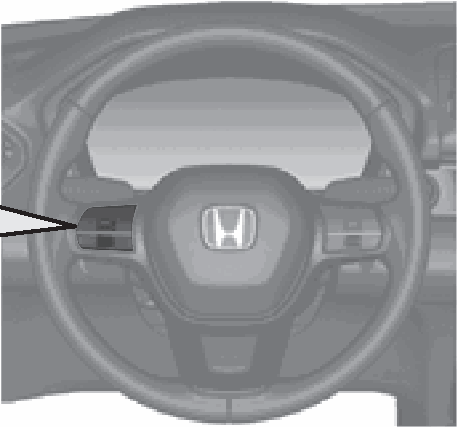
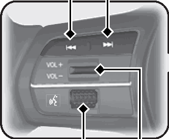
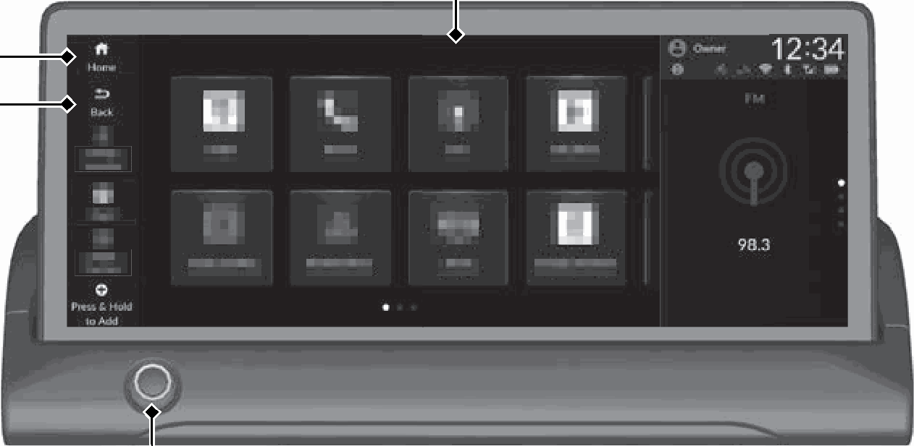

<!-- GENERATED:START function=d1fafc42d9f6 (generated; edits inside this block are overwritten by the next publish — write your own notes outside it) -->
# 7. Features (P263)

<b>Function path:</b> Quick Reference Guide / Features (P263) <b>Source:</b> printed page 22, 23, 24 <b>Test-ready:</b> no — procedure missing or thresholds unfilled

Every "Presumed requirement" row below is machine-derived from the Owner's Manual text by rule-based extraction — not AI-written — and traceable to the printed page in its Source column.

## Figures (areas of the original PDF; the OM has no figure numbers or captions)

- Figure 7-1 source: p.22
- (Copied from OM) (P263)

- Figure 7-2 source: p.22
- (Copied from OM) VOL(+/VOL(- (Volume)

- Figure 7-3 source: p.23
- (Copied from OM) Audio/Information Screen

## 7-2-1. Service overview

| # | Presumed requirement | Strength | Source |
|---|---|---|---|
| 1 | Features (P263)Audio Remote Controls. | capability | p.22 / text |
| 2 | Features (P263)/ (Seek/Skip) Buttons. | capability | p.22 / text |
| 3 | Features (P263)VOL(+/VOL(- (Volume) Switch Left Selector Wheel. | capability | p.22 / text |

## 7-2-2. Service requirements

| # | Presumed requirement | Strength | Source |
|---|---|---|---|
| 1 | Step -VOL(+/VOL(- (Volume) Switch Press to adjust the volume up/down. / (Seek/Skip) Buttons. | capability | p.22 / bullet |
| 2 | Step -Radio: Press / to change the preset station. A wired connection, USB device, Bluetooth® Audio or Smartphone Connection: Press / to skip to the beginning of the next song or return to the beginning of the current song. USB device: Press and hold / to change a folder. | capability | p.22 / bullet |
| 3 | Step -Left Selector Wheel Roll up or down: To cycle through the audio modes, roll up or down and then press the left selector wheel. | capability | p.22 / bullet |
| 4 | Features (P263)Audio System (P 264). | capability | p.23 / text |
| 5 | Features (P263)Home Back. | capability | p.23 / text |
| 6 | Features (P263)VOL/ AUDIO (Volume/Power) Knob. | capability | p.23 / text |
| 7 | Features (P263)Audio/Information Screen. | capability | p.23 / text |
| 8 | Features (P263)About System Updates. | capability | p.24 / text |
| 9 | Features (P263)When a software update is available for your vehicle, a notification will be displayed on the Meter or the audio/information screen. Instructions for performing updates via the audio information screen are included in this manual. For details on other methods of performing an update, please refer to the HondaLink manual, or ask a dealer. System updates that change specifications may result in some discrepancies with the information in this owner’s manual. | capability | p.24 / text |
| 10 | Features (P263)Instructions. | capability | p.24 / text |
| 11 | Features (P263)2 System Updates (P282). | capability | p.24 / text |
<!-- GENERATED:END function=d1fafc42d9f6 -->

