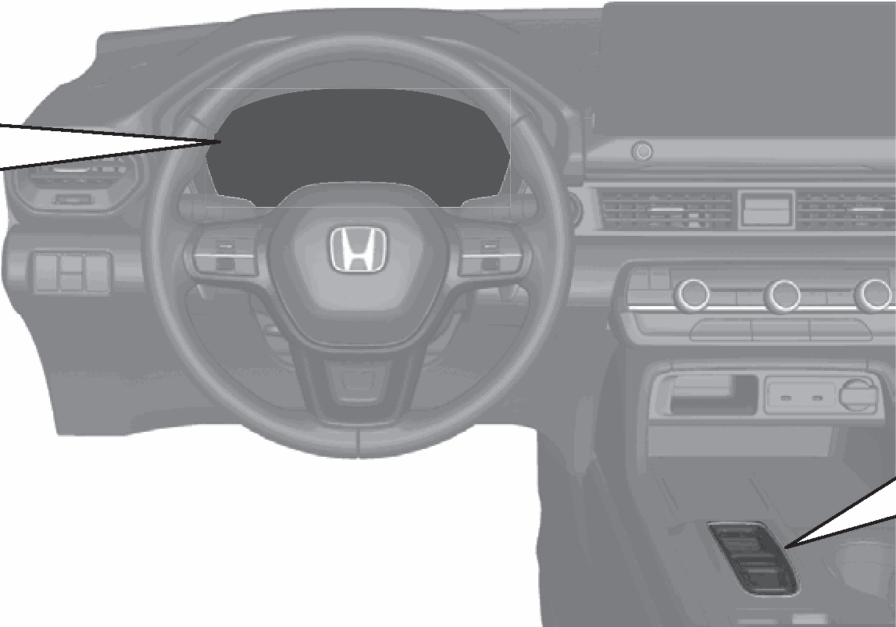
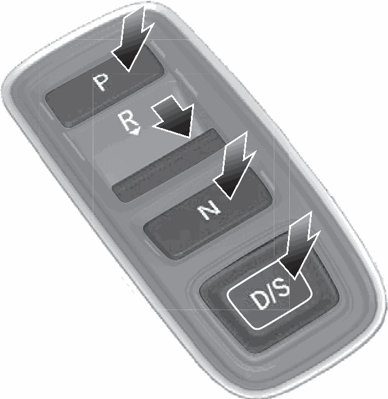
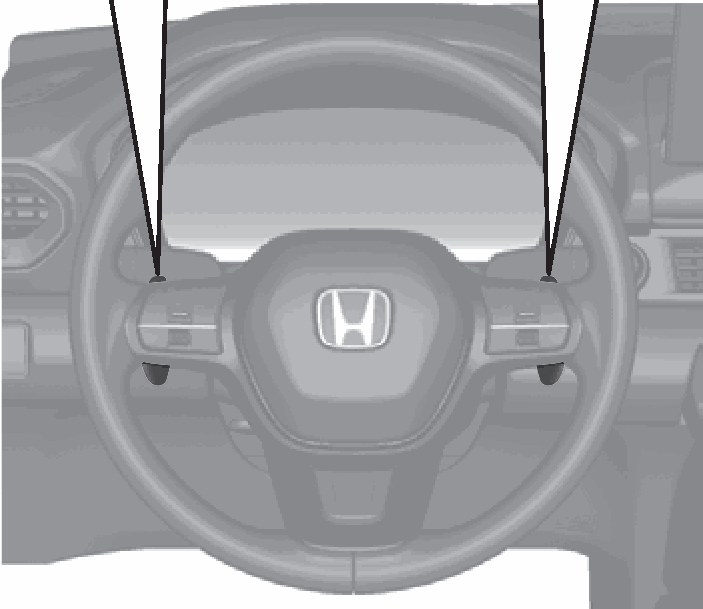
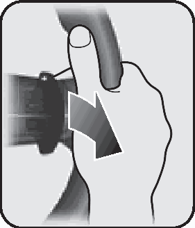
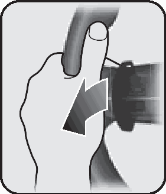
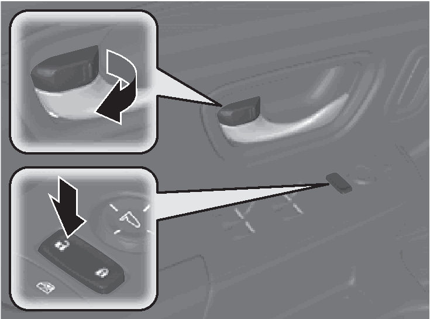
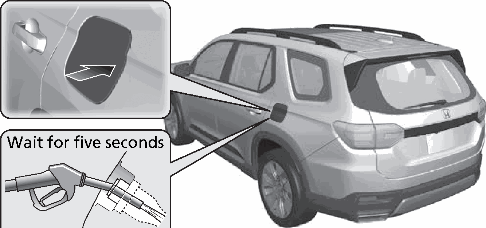

<!-- GENERATED:START function=5d9abca3e6e4 (generated; edits inside this block are overwritten by the next publish — write your own notes outside it) -->
# 8. Driving (P387)

<b>Function path:</b> Quick Reference Guide / Driving (P387) <b>Source:</b> printed page 25, 26, 27 <b>Test-ready:</b> no — procedure missing or thresholds unfilled

Every "Presumed requirement" row below is machine-derived from the Owner's Manual text by rule-based extraction — not AI-written — and traceable to the printed page in its Source column.

## Figures (areas of the original PDF; the OM has no figure numbers or captions)

- Figure 8-1 source: p.25
- (Copied from OM) Park

- Figure 8-2 source: p.25
- (Copied from OM) Gear Position Indicator

- Figure 8-3 source: p.26
- (Copied from OM) Indicator

- Figure 8-4 source: p.26
- (Copied from OM) Indicator

- Figure 8-5 source: p.26
- (Copied from OM) Paddle Shifter Paddle Shifter

- Figure 8-6 source: p.27
- (Copied from OM) Wait for five seconds

- Figure 8-7 source: p.27
- (Copied from OM) Wait for five seconds

## Numeric thresholds (filled in by a tester)
Filled: 0 / unfilled: 1

| Threshold | Matching text (Copied from OM) | Kind | Unit | Value | Status | Evidence | Filled by |
|---|---|---|---|---|---|---|---|
| 72be49833552 | high speed | speed | speed | **unfilled** | unfilled | — | — |

## 8-2-1. Service overview

| # | Presumed requirement | Strength | Source |
|---|---|---|---|
| 1 | Driving (P387)Automatic Transmission (P419). | capability | p.25 / text |

## 8-2-2. Service requirements

| # | Presumed requirement | Strength | Source |
|---|---|---|---|
| 1 | Step -Select (P and depress the brake pedal when starting the engine. | constraint | p.25 / bullet |
| 2 | Driving (P387)Shifting. | capability | p.25 / text |
| 3 | Driving (P387)Gear Position Indicator The gear position indicator and the shift button indicator indicate the current gear selection. | capability | p.25 / text |
| 4 | Driving (P387)Gear Position Indicator. | capability | p.25 / text |
| 5 | Driving (P387)Park Press the (P button. Used when parking or before turning off or starting the engine. Reverse Press the (R button. Used when reversing. Neutral Press the (N button. Transmission is not locked. | constraint | p.25 / text |
| 6 | Driving (P387)Shift Button Indicator. | capability | p.25 / text |
| 7 | Driving (P387)Drive/S Position Each time you press the D/S button, the mode switches between Drive and S position mode. Used for: Drive. | capability | p.25 / text |
| 8 | Step -Normal driving (gears change between 1st and 10th automatically). | capability | p.25 / bullet |
| 9 | Step -Temporarily driving in the sequential mode S Position. | capability | p.25 / bullet |
| 10 | Step -Automatically changing gears between 1st and 8th (8th gear is used only at high speed). | capability | p.25 / bullet |
| 11 | Step -Driving in the sequential mode. | capability | p.25 / bullet |
| 12 | Driving (P387)Sequential Mode (P426). | capability | p.26 / text |
| 13 | Step -Paddle shifters allow you to shift gears much like a manual transmission (1st through 10th). This is useful for engine braking. | capability | p.26 / bullet |
| 14 | Driving (P387)Gear Position Indicator. | capability | p.26 / text |
| 15 | Driving (P387)M (sequential mode) Indicator. | capability | p.26 / text |
| 16 | Driving (P387)Sequential Mode Gear. | capability | p.26 / text |
| 17 | Step -Pulling a paddle shifter Selection Indicator. | capability | p.26 / bullet |
| 18 | Driving (P387)Shift Down (- Shift Up (+ Paddle Shifter Paddle Shifter. | capability | p.26 / text |
| 19 | Driving (P387)When the transmission is in (D. | capability | p.26 / text |
| 20 | Step -Pulling a paddle shifter temporarily changes the mode from automatic mode to sequential mode. The selected gear number is displayed in the instrument panel. When the transmission is in (S. | constraint | p.26 / bullet |
| 21 | Driving (P387)changes the mode from automatic mode to sequential mode. | capability | p.26 / text |
| 22 | Step -The M (sequential mode) indicator and the selected gear number is displayed in the instrument panel. | capability | p.26 / bullet |
| 23 | Driving (P387)CMBSTM On and Off. | capability | p.27 / text |
| 24 | Step -When a possible frontal collision is likely unavoidable, the CMBSTM can reduce the vehicle speed and the severity of the collision. | capability | p.27 / bullet |
| 25 | Step -The CMBSTM is turned on every time you start the engine. | capability | p.27 / bullet |
| 26 | Step -To turn the CMBSTM on or off, use the safety support of the driver information interface. | capability | p.27 / bullet |
| 27 | Driving (P387)VSA® On and Off. | capability | p.27 / text |
| 28 | Step -The Vehicle Stability AssistTM (VSA®) system helps stabilize the vehicle during cornering and helps maintain traction while accelerating on loose or slippery road surfaces. | capability | p.27 / bullet |
| 29 | Step -VSA® comes on automatically every time you start the engine. | capability | p.27 / bullet |
| 30 | Step -The VSA® function can be partially disabled or fully restored in VSA® settings using the driver information interface. 2 Vehicle Stability Assist Mode (P139). | capability | p.27 / bullet |
| 31 | Driving (P387)Tire Pressure Monitoring System (TPMS) with Tire. | capability | p.27 / text |
| 32 | Driving (P387)Fill Assist (P445, 652). | capability | p.27 / text |
| 33 | Step -The TPMS monitors tire pressure. | capability | p.27 / bullet |
| 34 | Step -TPMS is turned on automatically every time you start the engine. | capability | p.27 / bullet |
| 35 | Step -TPMS fill assist provides audible and visual guidance during tire pressure adjustment. | capability | p.27 / bullet |
| 36 | Driving (P387)Refueling (P565) Fuel recommendation: Unleaded gasoline, pump octane number 87 or higher Fuel tank capacity: 18.5 US gal (70 L). | capability | p.27 / text |
| 37 | Driving (P387)a Unlock the driver’s (P442) door. (P166). | capability | p.27 / text |
| 38 | Driving (P387)b Press and release the rear edge of the fuel fill door to make it open slightly. | capability | p.27 / text |
| 39 | Driving (P387)c After refueling, Wait for five seconds wait for about five seconds before removing the filler nozzle. | capability | p.27 / text |
<!-- GENERATED:END function=5d9abca3e6e4 -->

