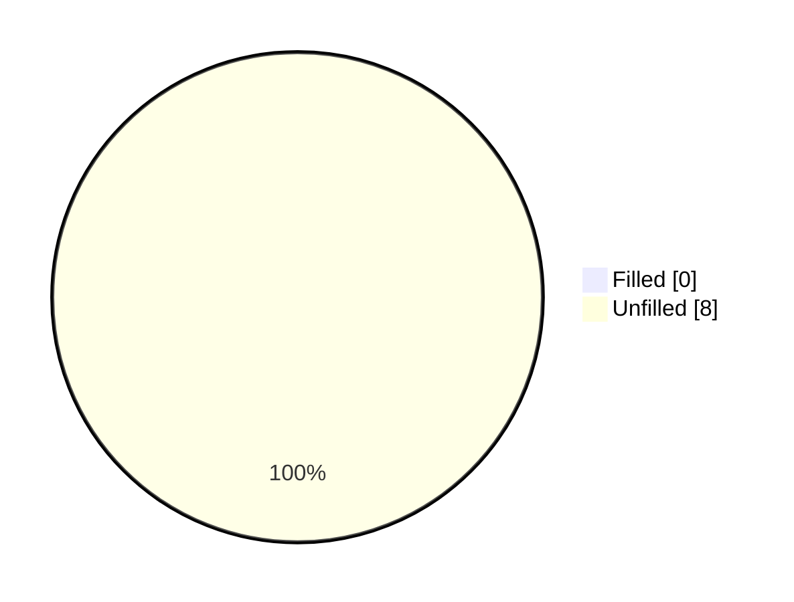
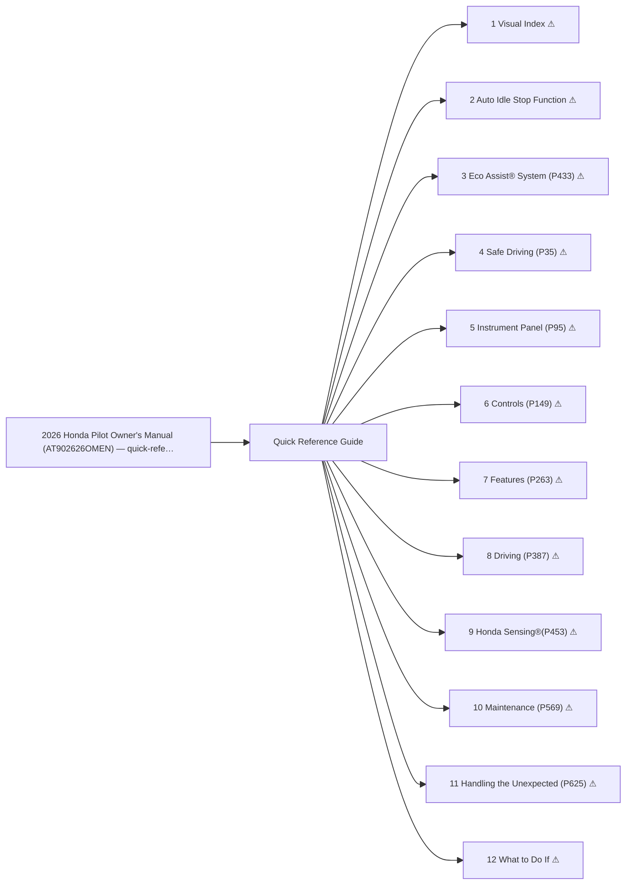

<!-- GENERATED:START index (generated; edits inside this block are overwritten by the next publish — write your own notes outside it) -->
# 2026 Honda Pilot Owner's Manual (AT902626OMEN) — quick-reference-guide — Presumed specification

> This is a machine-derived estimate, not an official requirements document. Numeric thresholds left blank could not be found in the manual and must be filled in by a tester with evidence.

| Field | Value |
|---|---|
| Maker / Model | Honda / Pilot 2026 |
| Scope | quick-reference-guide |
| Markets | US, CA |
| Profile | honda_v1 |
| Manual ID | honda/pilot-2026/ivi |

## Numeric thresholds

- Thresholds detected: **8**
- Filled: **0** / unfilled: **8**
- Test-ready functions: **0 / 12**

The manual states almost no numbers, so a tester fills the thresholds in. A function that still has an unfilled threshold cannot become a test specification (`is_test_ready=false`). Fill them in `overlay/thresholds.yaml` or on the screen.

## Figures in the manual

- Figures: **41** / images rendered: **41**

Each image is a rendering of the corresponding area of the original PDF. **Images are not kept in the repository** (they are copies of another company's manual); `publish` creates them under `../figures/` on the machine that runs it.

## Functions

| No. | Function | Area | Requirements | Figures | Unfilled thresholds | Test-ready |
|---|---|---|---|---|---|---|
| 1 | [Visual Index](/specifications/honda/pilot-2026/ivi/file/1-visual-index.md?chapter=quick-reference-guide) | Quick Reference Guide | 21 | 5 | 1 | - |
| 2 | [Auto Idle Stop Function](/specifications/honda/pilot-2026/ivi/file/2-auto-idle-stop-function.md?chapter=quick-reference-guide) | Quick Reference Guide | 11 | 0 | 0 | - |
| 3 | [Eco Assist® System (P433)](/specifications/honda/pilot-2026/ivi/file/3-eco-assist-system-p433.md?chapter=quick-reference-guide) | Quick Reference Guide | 5 | 3 | 0 | - |
| 4 | [Safe Driving (P35)](/specifications/honda/pilot-2026/ivi/file/4-safe-driving-p35.md?chapter=quick-reference-guide) | Quick Reference Guide | 14 | 1 | 0 | - |
| 5 | [Instrument Panel (P95)](/specifications/honda/pilot-2026/ivi/file/5-instrument-panel-p95.md?chapter=quick-reference-guide) | Quick Reference Guide | 13 | 1 | 1 | - |
| 6 | [Controls (P149)](/specifications/honda/pilot-2026/ivi/file/6-controls-p149.md?chapter=quick-reference-guide) | Quick Reference Guide | 57 | 13 | 3 | - |
| 7 | [Features (P263)](/specifications/honda/pilot-2026/ivi/file/7-features-p263.md?chapter=quick-reference-guide) | Quick Reference Guide | 14 | 3 | 0 | - |
| 8 | [Driving (P387)](/specifications/honda/pilot-2026/ivi/file/8-driving-p387.md?chapter=quick-reference-guide) | Quick Reference Guide | 40 | 7 | 1 | - |
| 9 | [Honda Sensing®(P453)](/specifications/honda/pilot-2026/ivi/file/9-honda-sensing-p453.md?chapter=quick-reference-guide) | Quick Reference Guide | 18 | 0 | 2 | - |
| 10 | [Maintenance (P569)](/specifications/honda/pilot-2026/ivi/file/10-maintenance-p569.md?chapter=quick-reference-guide) | Quick Reference Guide | 14 | 3 | 0 | - |
| 11 | [Handling the Unexpected (P625)](/specifications/honda/pilot-2026/ivi/file/11-handling-the-unexpected-p625.md?chapter=quick-reference-guide) | Quick Reference Guide | 8 | 4 | 0 | - |
| 12 | [What to Do If](/specifications/honda/pilot-2026/ivi/file/12-what-to-do-if.md?chapter=quick-reference-guide) | Quick Reference Guide | 27 | 1 | 0 | - |
<!-- GENERATED:END index -->

