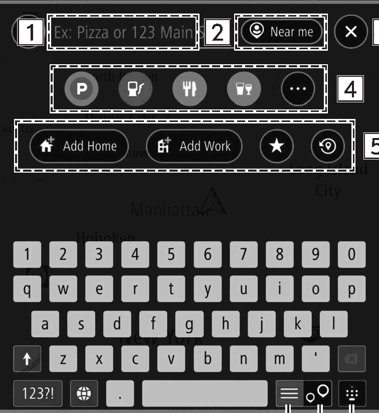
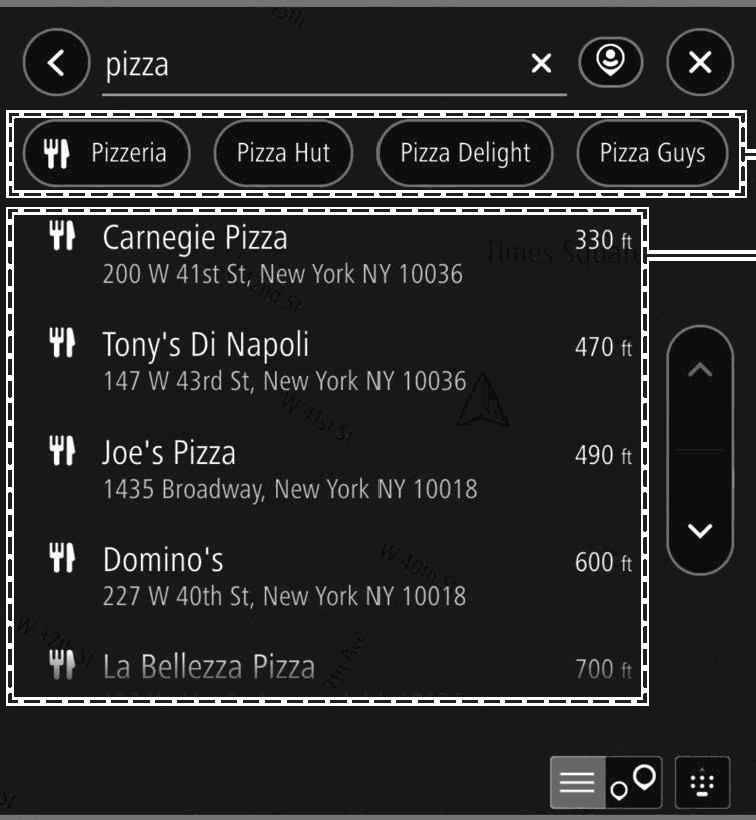

<!-- GENERATED:START function=998542289335 (generated; edits inside this block are overwritten by the next publish — write your own notes outside it) -->
# 10. Search Screen

<b>Function path:</b> Navigation System (If equipped) / Search Screen <b>Source:</b> printed page 167, 168, 169 <b>Test-ready:</b> no — procedure missing or thresholds unfilled

Every "Presumed requirement" row below is machine-derived from the Owner's Manual text by rule-based extraction — not AI-written — and traceable to the printed page in its Source column.

## Figures (areas of the original PDF; the OM has no figure numbers or captions)

- Figure 10-1 source: p.167
- (Copied from OM) Enter keyword(s) to search for a destination.

- Figure 10-2 source: p.168
- (Copied from OM) Select to narrow down the list by POI category.

## 10-2-1. Service overview

| # | Presumed requirement | Strength | Source |
|---|---|---|---|
| 1 | Search ScreenDestinations can be set by address, category, POI, etc. | capability | p.167 / text |
| 2 | Search ScreenBy entering three words hit by search using the “what3words” function, destinations can be set for places where postal address is not precisely allocated. | capability | p.167 / text |
| 3 | Search ScreenEnter keyword(s) to search for a destination. To use “what3words”, enter “ . ” in-between the three words. Search results screen will be displayed. (→P.168). | capability | p.167 / text |
| 4 | Search ScreenSelect to set the radius filter. Once the radius filter has been set, a search will only be performed for items within that radius. | capability | p.167 / text |
| 5 | Search ScreenSelect to display the current vehicle position. | capability | p.167 / text |
| 6 | Search ScreenSelect to select a POI category. Search will be performed within the radius filter set. Search results screen will be displayed. (→P.168). | capability | p.167 / text |

## 10-2-2. Service requirements

| # | Presumed requirement | Strength | Source |
|---|---|---|---|
| 1 | Step -Show Subcategories (Show Subcategories): Select to display more detailed categories. Select to display other POI categories. | capability | p.167 / bullet |
| 2 | Step -Browse Categories (Browse Categories): Select to display all of the POI categories. | capability | p.167 / bullet |
| 3 | Search Screen(Add Home): Select to register a point as home. (→P.171) Home (Home): Select to set the point registered as home as the destination. | capability | p.168 / text |
| 4 | Step -Go (Go ): Select to display the route calculation screen. (→P.172). | capability | p.168 / bullet |
| 5 | Step -: Select to display location menu pop-up. (→P.160). | capability | p.168 / bullet |
| 6 | Search Screen(Add Work): Select to register a point as work. (→P.171) Work (Work): Select to set the point registered as work as the destination. | capability | p.168 / text |
| 7 | Step -Go (Go ): Select to display the route calculation screen. (→P.172). | capability | p.168 / bullet |
| 8 | Step -: Select to display location menu pop-up. (→P.160). | capability | p.168 / bullet |
| 9 | Search Screen: Select to display the last set destination. | capability | p.168 / text |
| 10 | Step -Go (Go ): Select to display the route calculation screen. (→P.172). | capability | p.168 / bullet |
| 11 | Step -: Select to display location menu pop-up. (→P.160). | capability | p.168 / bullet |
| 12 | Search Screen: Select to display the favorite screen. (→P.169). | capability | p.168 / text |
| 13 | Search Screen: Select to display a list of recently set destinations. Then select a point from the list. Location menu pop-up for the point will be displayed on the map screen. (→P.160). | capability | p.168 / text |
| 14 | Step -Edit List (Edit List): Select to display the edit list screen. (→P.172). | capability | p.168 / bullet |
| 15 | Search Screenkeyboard. | capability | p.168 / text |
| 16 | Search ScreenSelect to display the search map screen. | capability | p.168 / text |
| 17 | Search ScreenSelect to display the search list screen. | capability | p.168 / text |
| 18 | Search ScreenSEARCH RESULTS SCREEN. | capability | p.168 / text |
| 19 | Search ScreenSelect to narrow down the list by POI category. | capability | p.168 / text |
| 20 | Search Screeninput characters. The location menu pop-up is displayed on the map screen when an item is selected. (→P.160) If a non-specific point is selected, such as a street name, the following items will be displayed. | constraint | p.169 / text |
| 21 | Step -Show on Map (Show on Map): Select to display the location menu pop-up on the map screen. (→P.160). | capability | p.169 / bullet |
| 22 | Step -Add Crossroad (Add Crossroad): Select to select an intersecting road and further refine the results. | capability | p.169 / bullet |
| 23 | Step -Go (Go ): Select to search for a route to the selected destination. (→P.172). | capability | p.169 / bullet |
| 24 | Search ScreenThe desired point can be registered as home, work, or favorite. The registered points can be set as a destination. Registered points can be added, changed and deleted on the. | capability | p.169 / text |
<!-- GENERATED:END function=998542289335 -->

