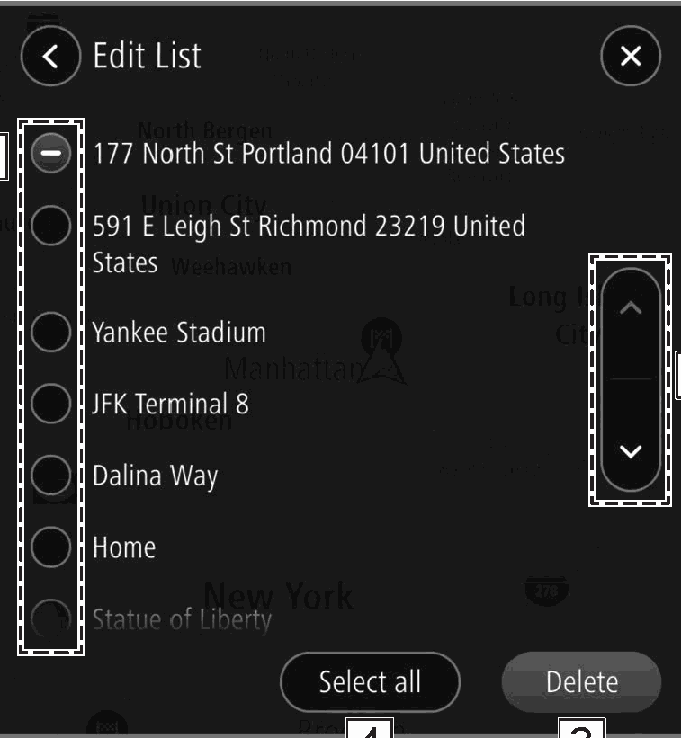

<!-- GENERATED:START function=87e88702083a (generated; edits inside this block are overwritten by the next publish — write your own notes outside it) -->
# 12. Edit List Screen

<b>Function path:</b> Navigation System (If equipped) / Edit List Screen <b>Source:</b> printed page 172 <b>Test-ready:</b> no — procedure missing or thresholds unfilled

Every "Presumed requirement" row below is machine-derived from the Owner's Manual text by rule-based extraction — not AI-written — and traceable to the printed page in its Source column.

## Figures (areas of the original PDF; the OM has no figure numbers or captions)

- Figure 12-1 source: p.172
- (Copied from OM) Select for the item you wish to delete.

## 12-2-1. Service overview

| # | Presumed requirement | Strength | Source |
|---|---|---|---|
| 1 | Edit List ScreenUnnecessary items can be deleted on the edit list screen. | capability | p.172 / text |
| 2 | Edit List ScreenSelect for the item you wish to delete. | capability | p.172 / text |
| 3 | Edit List ScreenSelect to skip to the next or previous page. | capability | p.172 / text |
| 4 | Edit List ScreenSelect to delete selected item(s). | capability | p.172 / text |
| 5 | Edit List ScreenSelect to select all items. Select again to deselect all items. | capability | p.172 / text |
<!-- GENERATED:END function=87e88702083a -->

