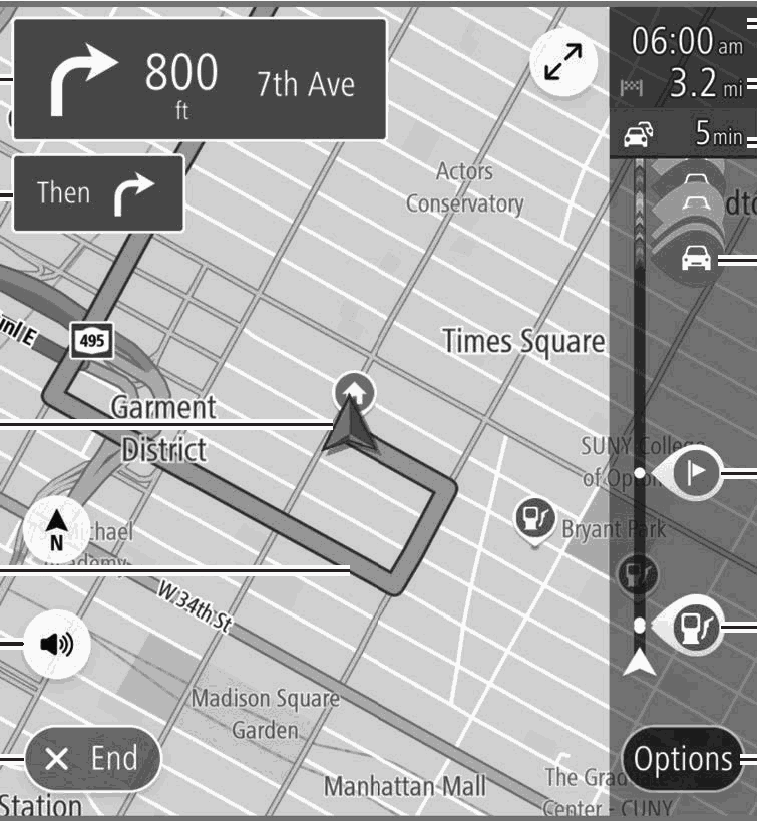
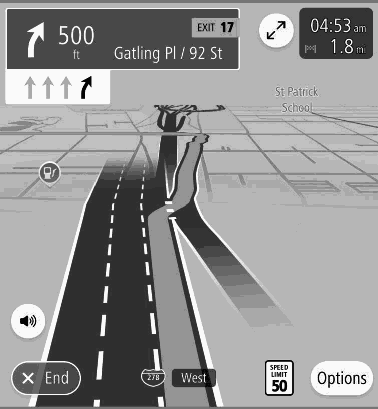
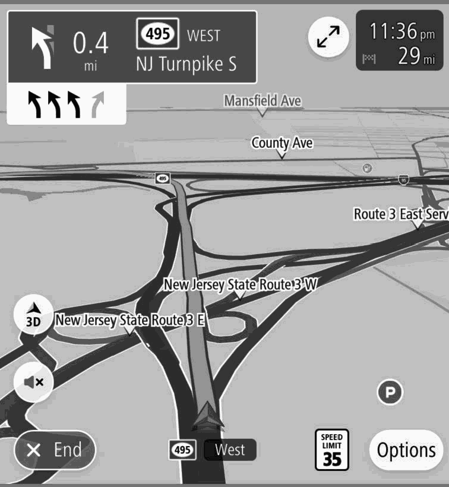
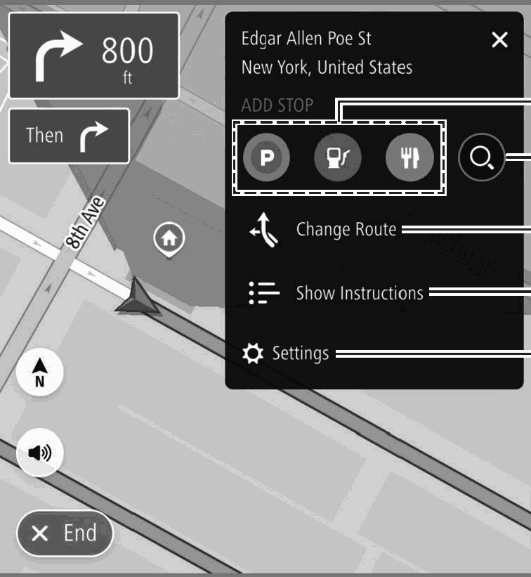

<!-- GENERATED:START function=0e54f7635911 (generated; edits inside this block are overwritten by the next publish — write your own notes outside it) -->
# 14. Route Guidance Screen

<b>Function path:</b> Navigation System (If equipped) / Route Guidance Screen <b>Source:</b> printed page 174, 175, 176 <b>Test-ready:</b> no — procedure missing or thresholds unfilled

Every "Presumed requirement" row below is machine-derived from the Owner's Manual text by rule-based extraction — not AI-written — and traceable to the printed page in its Source column.

## Figures (areas of the original PDF; the OM has no figure numbers or captions)

- Figure 14-1 source: p.174
- (Copied from OM) Current position

- Figure 14-2 source: p.175
- (Copied from OM) Navigation

- Figure 14-3 source: p.176
- (Copied from OM) Select to enable search for a parking place near the

- Figure 14-4 source: p.176
- (Copied from OM) Select to enable search for a parking place near the

## 14-2-1. Service overview

| # | Presumed requirement | Strength | Source |
|---|---|---|---|
| 1 | Route Guidance ScreenDuring route guidance, various types of guidance screens can be displayed depending on conditions. | capability | p.174 / text |
| 2 | Route Guidance ScreenSelect to stopping route guidance. | capability | p.174 / text |
| 3 | Route Guidance ScreenSelect to enable/disable voice guidance. (→P.158). | capability | p.174 / text |
| 4 | Route Guidance ScreenGuidance route To display the current route screen, select the guidance route then and Manage Route (Manage Route). (→P.177). | capability | p.174 / text |
| 5 | Route Guidance ScreenCurrent position. | capability | p.174 / text |
| 6 | Route Guidance ScreenGuidance display after next. | capability | p.174 / text |
| 7 | Route Guidance ScreenNext guidance display Displays the next street name, distance to the next turn, and an arrow indicating the turning direction. Select to display the route event list screen. | capability | p.174 / text |
| 8 | Route Guidance ScreenEstimated time of arrival Select to change the displayed information between a waypoint and the destination. | capability | p.174 / text |

## 14-2-2. Service requirements

| # | Presumed requirement | Strength | Source |
|---|---|---|---|
| 1 | Step -Select and hold to turn display of the route bar on/off. | capability | p.174 / bullet |
| 2 | Step -If “Auto-Hide Route Bar” on the navigation settings screen is turned on, the route bar will automatically be hidden and will only be displayed when new route information is available. | constraint | p.174 / bullet |
| 3 | Route Guidance ScreenRemaining distance and/or remaining time The displayed details can be changed on the navigation settings screen. (→P.181). | capability | p.174 / text |
| 4 | Route Guidance ScreenDisplays the amount of travel time to be changed due to the traffic information received. *. | capability | p.174 / text |
| 5 | Route Guidance ScreenSelect to display the traffic information pop-up. Avoid (Avoid): Select to avoid a section of the current route based on traffic information. * More Information (More Information): Select to display detailed information for the selected traffic information. | capability | p.175 / text |
| 6 | Route Guidance ScreenSelect to display the waypoint information pop-up. Delete This Stop (Delete This Stop) :Select to delete the selected waypoint from the route. | capability | p.175 / text |
| 7 | Route Guidance ScreenDisplays a POI on the route. Select a displayed icon to display the location menu pop-up. (→P.160). | capability | p.175 / text |
| 8 | Route Guidance ScreenSelect to display route option screen. (→P.176). | capability | p.175 / text |
| 9 | Route Guidance ScreenNOTE l During route guidance, if the Apple CarPlay/Android Auto maps app is operated for route guidance, the system’s route guidance will be canceled. | constraint | p.175 / text |
| 10 | Route Guidance ScreenWhen approaching an expressway exit or a complicated intersection, the map switches to a 3D display if the necessary information can be displayed. An arrow indicates the lane in which you should drive. Signs are also displayed if the information is available. | constraint | p.175 / text |
| 11 | Step -This function can be turned on/off on the navigation settings screen. (→P.181). | capability | p.175 / bullet |
| 12 | Route Guidance ScreenWhen approaching a turning point, the lane recommendation will be displayed automatically. | capability | p.176 / text |
| 13 | Route Guidance ScreenNOTE l If the vehicle goes off the guidance route, the route is searched again. l For some areas, the roads have not been completely digitized in our database. For this reason, the route guidance may select a road that should not be traveled on. | constraint | p.176 / text |
| 14 | Route Guidance ScreenSelect to enable search for a parking place near the destination or a gas station or restaurant along the route. | capability | p.176 / text |
| 15 | Route Guidance ScreenSelect to display the search screen. (→P.167). | capability | p.176 / text |
| 16 | Route Guidance ScreenSelect to display the change route screen. | capability | p.176 / text |
| 17 | Step -Show Alternatives (Show Alternatives): Displays up to 3 candidate routes searched according to conditions preset by the user. (→P.172). | capability | p.176 / bullet |
| 18 | Step -Avoid Part of Route (Avoid Part of Route): Select to display a list of sections of the current route. (→P.177). | capability | p.176 / bullet |
| 19 | Step -Reorder Stops (Reorder Stops): Select to change the order of the currently set destination and waypoints. (→P.177). | capability | p.176 / bullet |

## 14-5. Exception operation

| # | Presumed requirement | Strength | Source |
|---|---|---|---|
| 1 | Route Guidance Screen*: Use of this function may not be possible depending on country and vehicle. | capability | p.175 / text |
<!-- GENERATED:END function=0e54f7635911 -->

