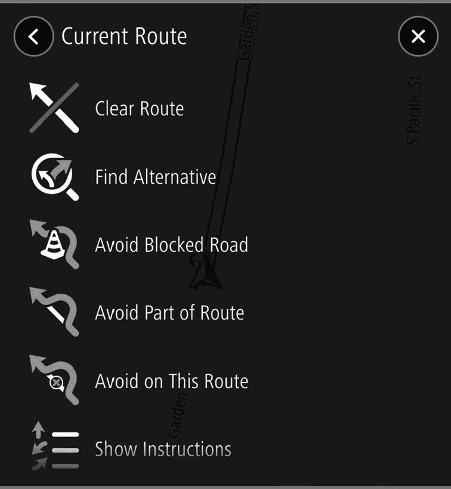
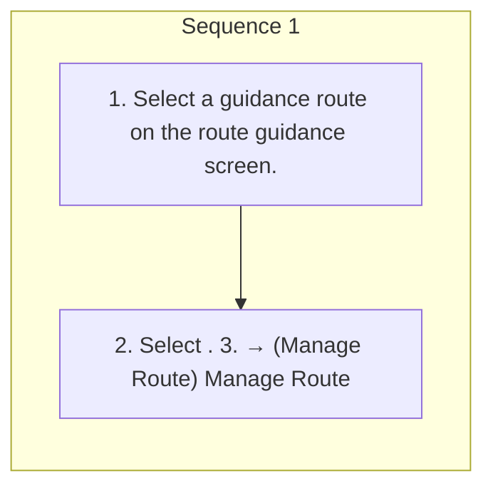

<!-- GENERATED:START function=d508f963e83c (generated; edits inside this block are overwritten by the next publish — write your own notes outside it) -->
# 15. Current Route Screen

<b>Function path:</b> Navigation System (If equipped) / Current Route Screen <b>Source:</b> printed page 177, 178 <b>Test-ready:</b> yes — no unfilled thresholds and a procedure is present

Every "Presumed requirement" row below is machine-derived from the Owner's Manual text by rule-based extraction — not AI-written — and traceable to the printed page in its Source column.

## Figures (areas of the original PDF; the OM has no figure numbers or captions)

- Figure 15-1 source: p.177
- (Copied from OM) (Manage Route)

## Procedure

| Seq | Step | Operation (Copied from OM) | Source |
|---|---|---|---|
| 1 | 1 | Select a guidance route on the route guidance screen. | p.177 / step |
| 1 | 2 | Select . 3. → (Manage Route) Manage Route | p.177 / step |

## 15-2-1. Service overview

| # | Presumed requirement | Strength | Source |
|---|---|---|---|
| 1 | Current Route ScreenSelect to display the route details confirmation screen. | capability | p.177 / text |
| 2 | Current Route ScreenSelect to display the navigation settings screen. (→P.181). | capability | p.177 / text |
| 3 | Current Route ScreenThe current route screen can be displayed using the following method:. | capability | p.177 / text |
| 4 | Current Route ScreenClear Route Select to stop the route guidance. (Clear Route). | capability | p.177 / text |
| 5 | Current Route ScreenSelect to display the alternate route screen and search for 3 Find Alternative additional routes to the selected (Find Alternative) destination. (→P.172). | capability | p.177 / text |
| 6 | Current Route Screenroute screen and search for 3 Avoid Blocked Road additional routes which avoid the (Avoid Blocked Road) current road. (→P.172). | capability | p.178 / text |
| 7 | Current Route ScreenSelect to display a list of sections of the current route. Select the Avoid Part of Route section you wish to avoid and (Avoid Part of Route) then select to search for a new route. | capability | p.178 / text |
| 8 | Current Route ScreenSelect to change the avoidance criteria for the current route and search for a different route. When avoidance criteria are changed and OK (OK) is selected, Avoid on This Route the route calculation screen will be (Avoid on This Route) displayed. (→P.172) This item can only be selected when the current route has a section which is included in the avoidance criteria. | constraint | p.178 / text |
| 9 | Current Route ScreenS e le c t to d is p l a y t h e route details Show Instructions co n fi r m a t io n s c re e n . (Show Instructions). | capability | p.178 / text |
| 10 | Current Route ScreenSelect to search for a waypoint on the map or search screen Add Stop to Route (→P.167) and then select (Add Stop to Route) to add it to the current route (→P.172). | capability | p.178 / text |
| 11 | Current Route ScreenSelect to name the current route Add to My Routes and register it to My Routes. (Add to My Routes). | capability | p.178 / text |
| 12 | Current Route Screenthe current route and search for a new route. Change Route Type When route types are changed, (Change Route Type) the route calculation screen will be displayed. (→P.172). | constraint | p.178 / text |
| 13 | Current Route ScreenSelect to change the order of the currently set destination and waypoints. Select a destination, select or to change its position in Reorder Stops the list, and then select Done (Reorder Stops) (Done) to confirm the change. Edit Stops (Edit Stops): Select to display the edit stops screen. To delete a waypoint, select then Delete (Delete). | capability | p.178 / text |
| 14 | Current Route ScreenPlay Route Preview (Play Route Preview): Select Play Route Preview t o e n t e r route preview mode. (Play Route Preview)/ (→ P .1 7 9 ) Stop Route Preview Stop Route Preview (Stop Route Preview) (Stop Route Preview): Select to exit route preview mode. | capability | p.178 / text |
<!-- GENERATED:END function=d508f963e83c -->

