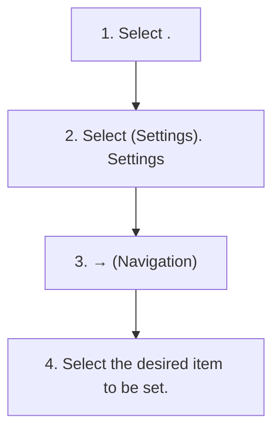

<!-- GENERATED:START function=f0cf986827e0 (generated; edits inside this block are overwritten by the next publish — write your own notes outside it) -->
# 18. Navigation Settings

<b>Function path:</b> Navigation System (If equipped) / Navigation Settings <b>Source:</b> printed page 181 <b>Test-ready:</b> yes — no unfilled thresholds and a procedure is present

## Procedure

| Seq | Step | Operation (Copied from OM) | Source |
|---|---|---|---|
| 1 | 1 | Select . | p.181 / step |
| 2 | 2 | Select (Settings). Settings | p.181 / step |
| 3 | 3 | → (Navigation) | p.181 / step |
| 4 | 4 | Select the desired item to be set. | p.181 / step |

<!-- GENERATED:END function=f0cf986827e0 -->

