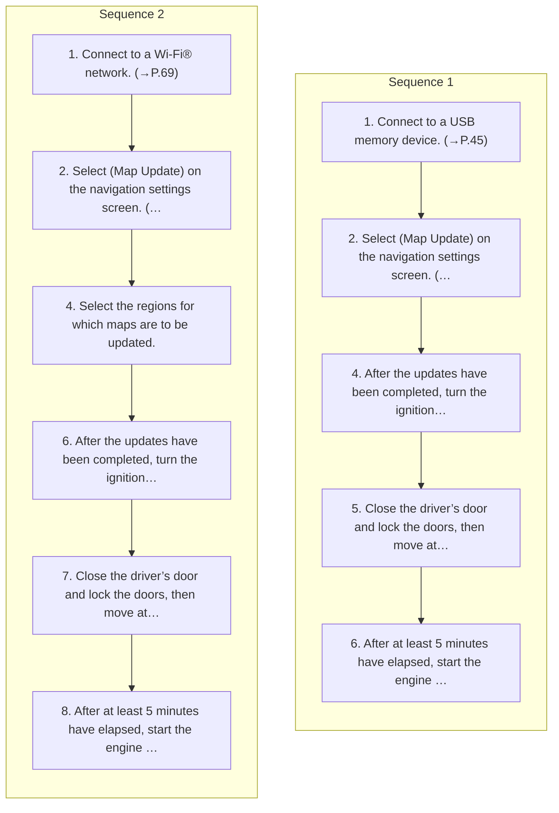

<!-- GENERATED:START function=5a5f0a20f2c8 (generated; edits inside this block are overwritten by the next publish — write your own notes outside it) -->
# 25. Using A USB Memory Device

<b>Function path:</b> Navigation System (If equipped) / Using A USB Memory Device <b>Source:</b> printed page 186, 187 <b>Test-ready:</b> yes — no unfilled thresholds and a procedure is present

Every "Presumed requirement" row below is machine-derived from the Owner's Manual text by rule-based extraction — not AI-written — and traceable to the printed page in its Source column.

## Figures (areas of the original PDF; the OM has no figure numbers or captions)

- Figure 25-1 source: p.187
- (Copied from OM) (Wi-Fi)

## Procedure (2 sequences; the manual restarts the numbering)

| Seq | Step | Operation (Copied from OM) | Source |
|---|---|---|---|
| 1 | 1 | Connect to a USB memory device. (→P.45) | p.186 / step |
| 1 | 2 | Select (Map Update) on the navigation settings screen. (→P.181) 3. → (USB) USB | p.186 / step |
| 1 | 4 | After the updates have been completed, turn the ignition switch to the “LOCK”/“OFF” position and exit the vehicle. | p.186 / step |
| 1 | 5 | Close the driver’s door and lock the doors, then move at least 10 feet (3 m) away from the vehicle to prevent the key from interfering. | p.186 / step |
| 1 | 6 | After at least 5 minutes have elapsed, start the engine again. | p.186 / step |
| 2 | 1 | Connect to a Wi-Fi® network. (→P.69) | p.187 / step |
| 2 | 2 | Select (Map Update) on the navigation settings screen. (→P.181) 3. → (Wi-Fi) Wi-Fi | p.187 / step |
| 2 | 4 | Select the regions for which maps are to be updated. | p.187 / step |
| 2 | 6 | After the updates have been completed, turn the ignition switch to the “LOCK”/“OFF” position and exit the vehicle. | p.187 / step |
| 2 | 7 | Close the driver’s door and lock the doors, then move at least 10 feet (3 m) away from the vehicle to prevent the key from interfering. | p.187 / step |
| 2 | 8 | After at least 5 minutes have elapsed, start the engine again. | p.187 / step |

## 25-2-1. Service overview

| # | Presumed requirement | Strength | Source |
|---|---|---|---|
| 1 | Using A USB Memory DeviceMaps can be updated using a USB memory device. | capability | p.186 / text |
| 2 | Using A USB Memory DeviceFor details and to download update data, refer to the following URL: https://subaru-maps.com/. | capability | p.186 / text |

## 25-2-2. Service requirements

| # | Presumed requirement | Strength | Source |
|---|---|---|---|
| 1 | Step -The new map data will be applied. | capability | p.186 / bullet |
| 2 | Using A USB Memory DeviceThe map data may also be updated via Wi-Fi® network. | capability | p.187 / text |
| 3 | Step -The update for the selected region will be automatically downloaded and installed. | capability | p.187 / bullet |
| 4 | Step -The new map data will be applied. | capability | p.187 / bullet |
<!-- GENERATED:END function=5a5f0a20f2c8 -->

