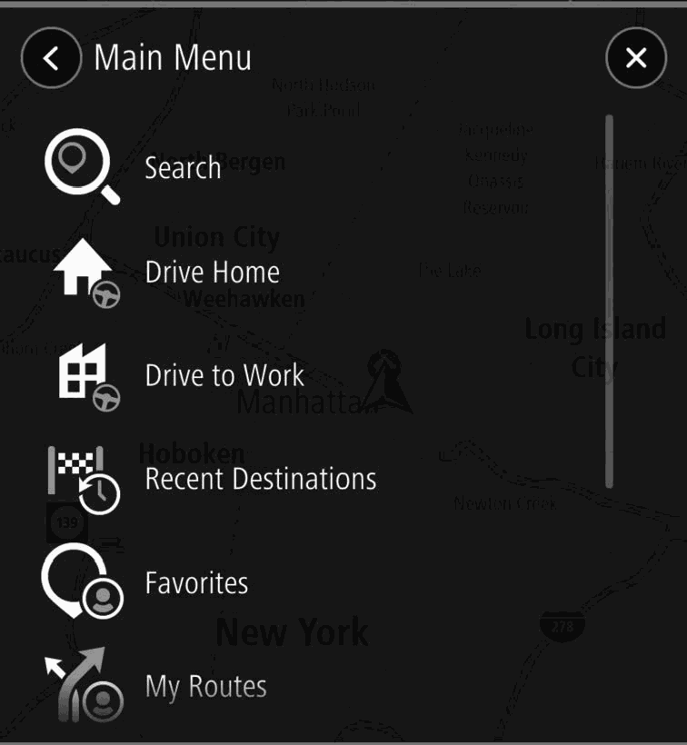
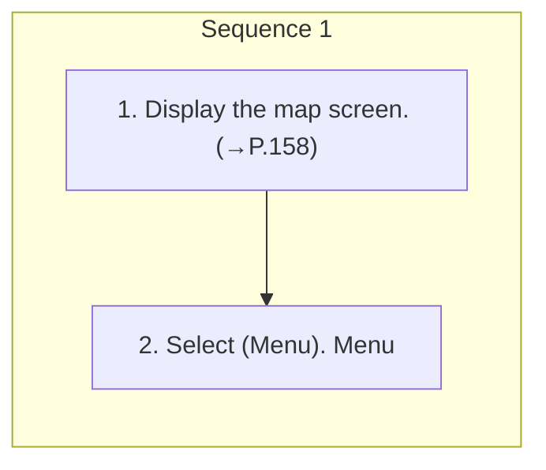

<!-- GENERATED:START function=c8141c83164d (generated; edits inside this block are overwritten by the next publish — write your own notes outside it) -->
# 9. Main Menu Screen Overview

<b>Function path:</b> Navigation System (If equipped) / Main Menu Screen Overview <b>Source:</b> printed page 165, 166 <b>Test-ready:</b> yes — no unfilled thresholds and a procedure is present

Every "Presumed requirement" row below is machine-derived from the Owner's Manual text by rule-based extraction — not AI-written — and traceable to the printed page in its Source column.

## Figures (areas of the original PDF; the OM has no figure numbers or captions)

- Figure 9-1 source: p.165
- (Copied from OM) Menu

## Procedure

| Seq | Step | Operation (Copied from OM) | Source |
|---|---|---|---|
| 1 | 1 | Display the map screen. (→P.158) | p.165 / step |
| 1 | 2 | Select (Menu). Menu | p.165 / step |

## 9-2-1. Service overview

| # | Presumed requirement | Strength | Source |
|---|---|---|---|
| 1 | Main Menu Screen OverviewThe main menu screen can be displayed using the following method:. | capability | p.165 / text |
| 2 | Main Menu Screen Overview(Search) (→P.167). | capability | p.165 / text |
| 3 | Main Menu Screen Overview(Add Home): Select to register a point as home. (→P.171) (Add Home)*1/ Drive Home (Drive Home): Select to Drive Home set the point registered as home as the (Drive Home)*2 destination. | capability | p.165 / text |
| 4 | Main Menu Screen Overview(Add Work): Select to register a point as work. (→P.171) (Add Work)*3/ Drive to Work (Drive to Work): Select Drive to Work to set the point registered as work as the (Drive to Work)*4 destination. | capability | p.165 / text |
| 5 | Main Menu Screen OverviewSelect to display a list of recently set destinations. Then select a point from the list. Location Recent Destinations menu pop-up for the point will be displayed on the map screen. (→P.160) (Recent Destinations). | capability | p.165 / text |

## 9-2-2. Service requirements

| # | Presumed requirement | Strength | Source |
|---|---|---|---|
| 1 | Step -Edit List (Edit List): Select to display the edit list screen. (→P.172). | capability | p.165 / bullet |
| 2 | Main Menu Screen OverviewSelect to display the favorite screen. Favorites (→P.169) (Favorites). | capability | p.165 / text |
| 3 | Main Menu Screen Overviewand register it so that it can be used repeatedly. (→P.177) My route name: Select a registered route My Routes to display the route calculation screen. (My Routes)*5 (→P.172) Edit List (Edit List): Select to display the edit list screen. (→P.172). | capability | p.166 / text |
| 4 | Main Menu Screen OverviewSelect to display the map update screen. Maps (Maps) (→P.187). | capability | p.166 / text |
| 5 | Main Menu Screen OverviewSelect to display the legal information Legal Information screen. (Legal Information). | capability | p.166 / text |
| 6 | Main Menu Screen OverviewSelecrt to display the navigation settings Settings (Settings) screen. (→P.181). | capability | p.166 / text |
| 7 | Main Menu Screen OverviewTo display frequently set destinations, select “Keep trip history on this device for optional features” and “Predict Privacy (Privacy) frequent destinations” to on then select Frequent destinations (Frequent destinations). | capability | p.166 / text |
| 8 | Main Menu Screen Overview*2: If a point has been registered as home. *3: If a point has not been registered as work. *4: If a point has been registered as work. *5: This item can only be selected when a route has been registered to My Routes. | constraint | p.166 / text |
<!-- GENERATED:END function=c8141c83164d -->

