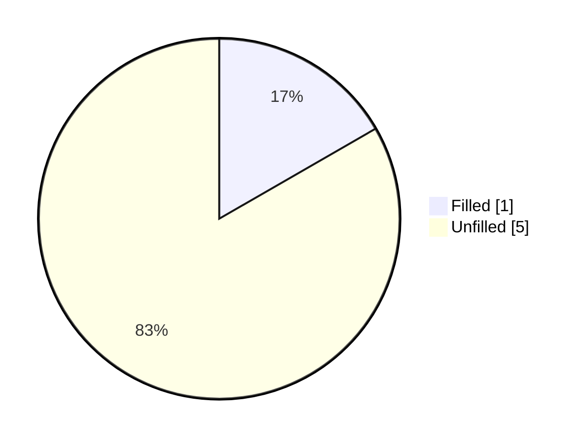
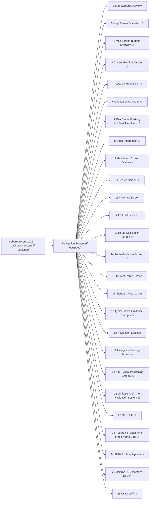

<!-- GENERATED:START index (generated; edits inside this block are overwritten by the next publish — write your own notes outside it) -->
# Subaru Ascent 2026 — navigation-system-if-equipped — Presumed specification

> This is a machine-derived estimate, not an official requirements document. Numeric thresholds left blank could not be found in the manual and must be filled in by a tester with evidence.

| Field | Value |
|---|---|
| Maker / Model | Subaru / Ascent 2026 |
| Scope | navigation-system-if-equipped |
| Markets | US, CA |
| Profile | subaru_chapter_toc_v1 |
| Manual ID | subaru/ascent-2026/ivi |

## Numeric thresholds
Filled: 1 / Unfilled: 5

## Figures in the manual

- Figures: **25** / images rendered: **25**

Each image is a rendering of the corresponding area of the original PDF. **Images are not kept in the repository** (they are copies of another company's manual); `publish` creates them under `../figures/` on the machine that runs it.

## Glossary (registered by a reviewer)

How wording in the manual maps to the in-house term. **The original text is not rewritten** — the mapping is only annotated here. Register terms on the Glossary screen. Evidence (why the mapping holds) is required.

| In-house term | Category | Wording in the manual | Hits | Evidence |
|---|---|---|---:|---|
| AA | abbreviation | `Android Auto` | 1 | Counted by string match over workspace/subaru/**/published/*.md (2026-09-01): outback-2026 31 / outback-2025 24 / ascent-2026 1. Always printed in full ("Android Auto") — no abbreviated form appears in the manual text; "AA" is an in-house-only abbreviation. |

## Headings not matched to body text
These bookmark entries could not be located in the extracted body text and were not turned into functions. Reported instead of silently dropped.
- Map Screen Operation
- Location Menu Pop-up
- Orientation Of The Map
- Other Information
- Search Screen
- Edit List Screen
- Current Route Screen
- Standard Map Icon
- Typical Voice Guidance Prompts
- Map Data

## Functions

| No. | Function | Area | Requirements | Figures | Unfilled thresholds | Test-ready |
|---|---|---|---|---|---|---|
| 1 | [Map Screen Overview](/specifications/subaru/ascent-2026/ivi/file/1-map-screen-overview.md?chapter=navigation-system-if-equipped) | Navigation System (If equipped) | 14 | 1 | 0 | o |
| 2 | [Map Screen Operation](/specifications/subaru/ascent-2026/ivi/file/2-map-screen-operation.md?chapter=navigation-system-if-equipped) | Navigation System (If equipped) | 2 | 0 | 0 | - |
| 3 | [Map Screen Buttons Overview](/specifications/subaru/ascent-2026/ivi/file/3-map-screen-buttons-overview.md?chapter=navigation-system-if-equipped) | Navigation System (If equipped) | 2 | 1 | 0 | - |
| 4 | [Current Position Display](/specifications/subaru/ascent-2026/ivi/file/4-current-position-display.md?chapter=navigation-system-if-equipped) | Navigation System (If equipped) | 2 | 0 | 1 | - |
| 5 | [Location Menu Pop-up](/specifications/subaru/ascent-2026/ivi/file/5-location-menu-pop-up.md?chapter=navigation-system-if-equipped) | Navigation System (If equipped) | 6 | 1 | 0 | o |
| 6 | [Orientation Of The Map](/specifications/subaru/ascent-2026/ivi/file/6-orientation-of-the-map.md?chapter=navigation-system-if-equipped) | Navigation System (If equipped) | 12 | 3 | 0 | o |
| 7 | [Gas Station/Parking Lot/Rest Area Icons](/specifications/subaru/ascent-2026/ivi/file/7-gas-station-parking-lot-rest-area-icons.md?chapter=navigation-system-if-equipped) | Navigation System (If equipped) | 5 | 2 | 0 | - |
| 8 | [Other Information](/specifications/subaru/ascent-2026/ivi/file/8-other-information.md?chapter=navigation-system-if-equipped) | Navigation System (If equipped) | 8 | 2 | 0 | - |
| 9 | [Main Menu Screen Overview](/specifications/subaru/ascent-2026/ivi/file/9-main-menu-screen-overview.md?chapter=navigation-system-if-equipped) | Navigation System (If equipped) | 13 | 1 | 0 | o |
| 10 | [Search Screen](/specifications/subaru/ascent-2026/ivi/file/10-search-screen.md?chapter=navigation-system-if-equipped) | Navigation System (If equipped) | 30 | 2 | 0 | - |
| 11 | [Favorites Screen](/specifications/subaru/ascent-2026/ivi/file/11-favorites-screen.md?chapter=navigation-system-if-equipped) | Navigation System (If equipped) | 14 | 2 | 0 | o |
| 12 | [Edit List Screen](/specifications/subaru/ascent-2026/ivi/file/12-edit-list-screen.md?chapter=navigation-system-if-equipped) | Navigation System (If equipped) | 5 | 1 | 0 | - |
| 13 | [Route Calculation Screen](/specifications/subaru/ascent-2026/ivi/file/13-route-calculation-screen.md?chapter=navigation-system-if-equipped) | Navigation System (If equipped) | 9 | 1 | 0 | - |
| 14 | [Route Guidance Screen](/specifications/subaru/ascent-2026/ivi/file/14-route-guidance-screen.md?chapter=navigation-system-if-equipped) | Navigation System (If equipped) | 28 | 4 | 0 | - |
| 15 | [Current Route Screen](/specifications/subaru/ascent-2026/ivi/file/15-current-route-screen.md?chapter=navigation-system-if-equipped) | Navigation System (If equipped) | 14 | 1 | 0 | o |
| 16 | [Standard Map Icon](/specifications/subaru/ascent-2026/ivi/file/16-standard-map-icon.md?chapter=navigation-system-if-equipped) | Navigation System (If equipped) | 13 | 1 | 0 | - |
| 17 | [Typical Voice Guidance Prompts](/specifications/subaru/ascent-2026/ivi/file/17-typical-voice-guidance-prompts.md?chapter=navigation-system-if-equipped) | Navigation System (If equipped) | 5 | 0 | 0 | - |
| 18 | [Navigation Settings](/specifications/subaru/ascent-2026/ivi/file/18-navigation-settings.md?chapter=navigation-system-if-equipped) | Navigation System (If equipped) | 0 | 0 | 0 | o |
| 19 | [Navigation Settings Screen](/specifications/subaru/ascent-2026/ivi/file/19-navigation-settings-screen.md?chapter=navigation-system-if-equipped) | Navigation System (If equipped) | 11 | 1 | 0 | - |
| 20 | [GPS (Global Positioning System)](/specifications/subaru/ascent-2026/ivi/file/20-gps-global-positioning-system.md?chapter=navigation-system-if-equipped) | Navigation System (If equipped) | 2 | 0 | 0 | - |
| 21 | [Limitations Of The Navigation System](/specifications/subaru/ascent-2026/ivi/file/21-limitations-of-the-navigation-system.md?chapter=navigation-system-if-equipped) | Navigation System (If equipped) | 31 | 0 | 3 | - |
| 22 | [Map Data](/specifications/subaru/ascent-2026/ivi/file/22-map-data.md?chapter=navigation-system-if-equipped) | Navigation System (If equipped) | 3 | 0 | 0 | - |
| 23 | [Regarding Roads And Place Name Data](/specifications/subaru/ascent-2026/ivi/file/23-regarding-roads-and-place-name-data.md?chapter=navigation-system-if-equipped) | Navigation System (If equipped) | 1 | 0 | 0 | - |
| 24 | [SUBARU Map Update](/specifications/subaru/ascent-2026/ivi/file/24-subaru-map-update.md?chapter=navigation-system-if-equipped) | Navigation System (If equipped) | 4 | 0 | 1 | - |
| 25 | [Using A USB Memory Device](/specifications/subaru/ascent-2026/ivi/file/25-using-a-usb-memory-device.md?chapter=navigation-system-if-equipped) | Navigation System (If equipped) | 7 | 1 | 0 | o |
| 26 | [Using Wi-Fi®](/specifications/subaru/ascent-2026/ivi/file/26-using-wi-fi.md?chapter=navigation-system-if-equipped) | Navigation System (If equipped) | 2 | 0 | 0 | o |
<!-- GENERATED:END index -->

