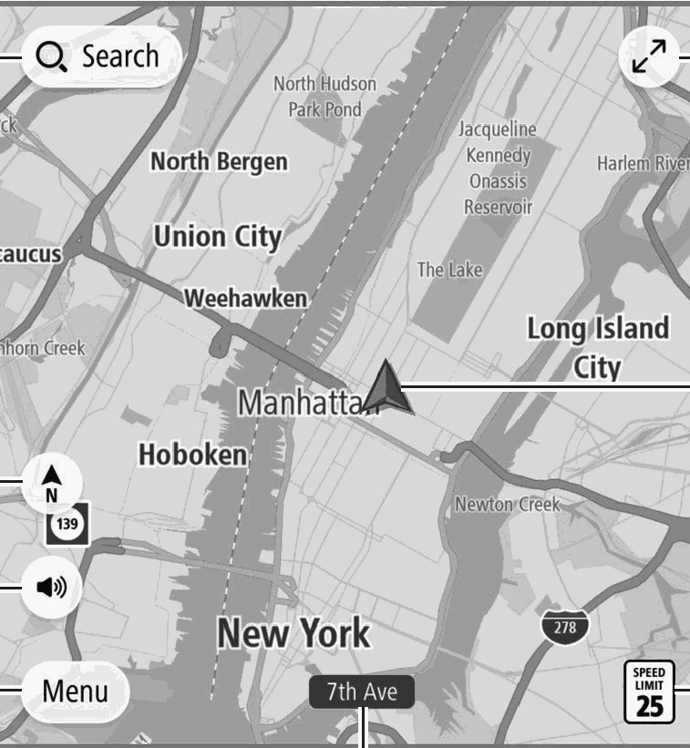
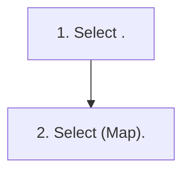

<!-- GENERATED:START function=9574fdd9e191 (generated; edits inside this block are overwritten by the next publish — write your own notes outside it) -->
# 1. Map Screen Overview

<b>Function path:</b> Navigation System (If equipped) / Map Screen Overview <b>Source:</b> printed page 196 <b>Test-ready:</b> yes — no unfilled thresholds and a procedure is present

Every "Presumed requirement" row below is machine-derived from the Owner's Manual text by rule-based extraction — not AI-written — and traceable to the printed page in its Source column.

## Figures (areas of the original PDF; the OM has no figure numbers or captions)

- Figure 1-1 source: p.196
- (Copied from OM) (Map).

## Procedure

| Seq | Step | Operation (Copied from OM) | Source |
|---|---|---|---|
| 1 | 1 | Select . | p.196 / step |
| 2 | 2 | Select (Map). | p.196 / step |

## 1-2-1. Service overview

| # | Presumed requirement | Strength | Source |
|---|---|---|---|
| 1 | Map Screen OverviewThe map screen can be displayed using the following method:. | capability | p.196 / text |
| 2 | Map Screen OverviewSelect to display the search screen. (→P.205). | capability | p.196 / text |
| 3 | Map Screen OverviewSelect to increase the size of the map screen. Select to reduce the size of the map screen. | capability | p.196 / text |
| 4 | Map Screen OverviewDisplays the current vehicle position. Select to display the following pop-up:. | capability | p.196 / text |

## 1-2-2. Service requirements

| # | Presumed requirement | Strength | Source |
|---|---|---|---|
| 1 | Step -Add to Favorites (Add to Favorites): Select to register your current location as a favorite. | capability | p.196 / bullet |
| 2 | Step -Avoid Blocked Road (Avoid Blocked Road)*: Select to display the alternate route screen and search for 3 additional routes to the selected destination. (→P.210). | capability | p.196 / bullet |
| 3 | Step -Current Location (Current Location): Select to display the current position information. | capability | p.196 / bullet |
| 4 | Map Screen OverviewDisplays the speed limit for the road currently being traveled on. | capability | p.196 / text |
| 5 | Map Screen OverviewDisplays the current street name. | capability | p.196 / text |
| 6 | Map Screen OverviewSelect to display the main menu screen. (→P.203). | capability | p.196 / text |
| 7 | Map Screen OverviewSelect to set a voice guidance. | capability | p.196 / text |
| 8 | Step -: Enables voice guidance. | capability | p.196 / bullet |
| 9 | Step -: Enables the voice guidance of alerts only. | capability | p.196 / bullet |
| 10 | Step -: Disables voice guidance. | capability | p.196 / bullet |
<!-- GENERATED:END function=9574fdd9e191 -->

