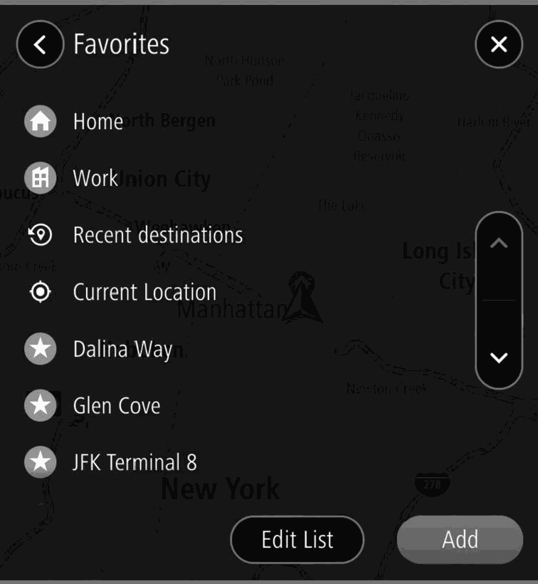
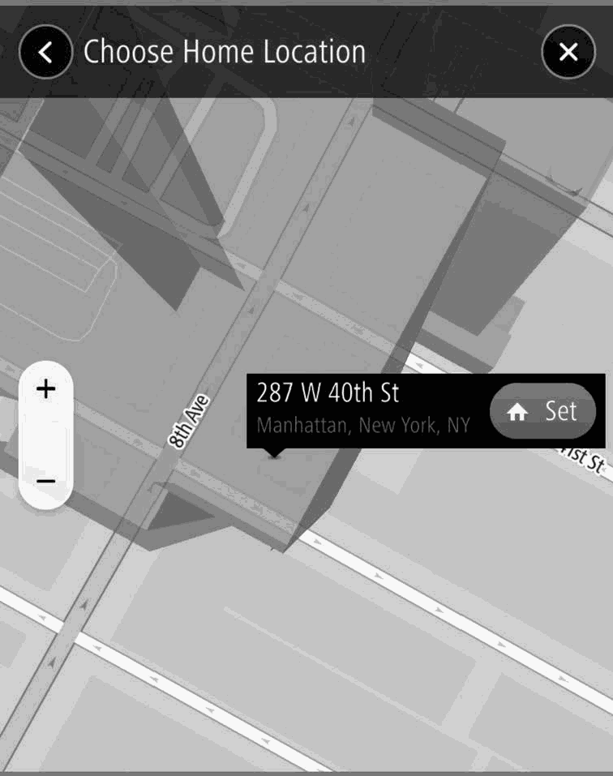
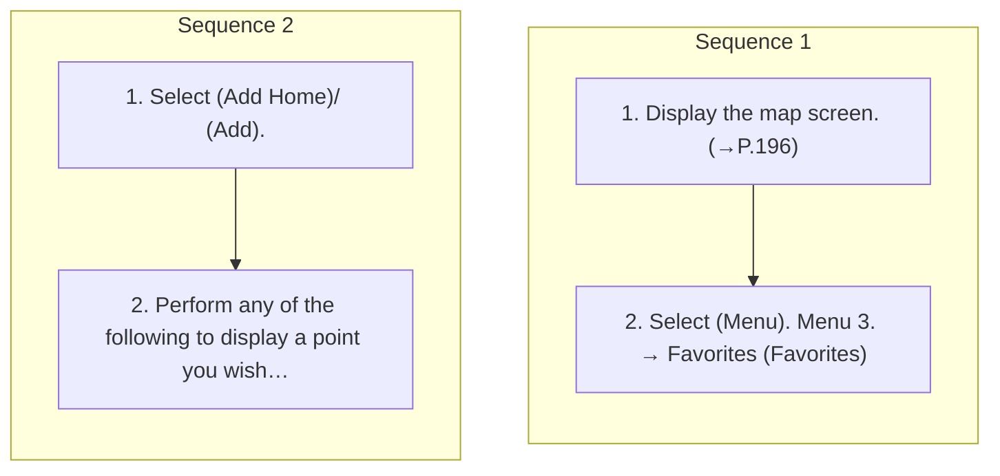

<!-- GENERATED:START function=528ffede5880 (generated; edits inside this block are overwritten by the next publish — write your own notes outside it) -->
# 11. Favorites Screen

<b>Function path:</b> Navigation System (If equipped) / Favorites Screen <b>Source:</b> printed page 207, 208, 209 <b>Test-ready:</b> yes — no unfilled thresholds and a procedure is present

Every "Presumed requirement" row below is machine-derived from the Owner's Manual text by rule-based extraction — not AI-written — and traceable to the printed page in its Source column.

## Figures (areas of the original PDF; the OM has no figure numbers or captions)

- Figure 11-1 source: p.207
- (Copied from OM) Menu

- Figure 11-2 source: p.209
- (Copied from OM) (Add Work)/

## Procedure (2 sequences; the manual restarts the numbering)

| Seq | Step | Operation (Copied from OM) | Source |
|---|---|---|---|
| 1 | 1 | Display the map screen. (→P.196) | p.207 / step |
| 1 | 2 | Select (Menu). Menu 3. → Favorites (Favorites) | p.207 / step |
| 2 | 1 | Select (Add Home)/ (Add). | p.209 / step |
| 2 | 2 | Perform any of the following to display a point you wish to register: | p.209 / step |

## 11-2-1. Service overview

| # | Presumed requirement | Strength | Source |
|---|---|---|---|
| 1 | Favorites ScreenThe favorites screen can be accessed with the following method:. | capability | p.207 / text |
| 2 | Favorites Screen(Add Home): Select to register the home. (→P.209) Home (Home): Select to display the location menu pop-up for the point registered as home on the map screen. (→P. 198). | capability | p.208 / text |
| 3 | Favorites Screen(Add Work): Select to register the work. (→P.209) Work (Work): Select to display the location menu pop-up for the point registered as work on the map screen. (→P. 198). | capability | p.208 / text |
| 4 | Favorites ScreenSelect to display the recent destination screen. Recent destinations: Select a recent destination to display the location menu pop-up for that point on the map screen. (→P. 198) Edit List (Edit List): Select to display the edit list screen to delete the recent destinations. (→P.210). | capability | p.208 / text |
| 5 | Favorites ScreenSelect to display information of the current location. | capability | p.208 / text |
| 6 | Favorites ScreenSelect a favorite to display the location menu pop-up for that point on the map screen. (→P. 198). | capability | p.208 / text |
| 7 | Favorites ScreenSelect to display the edit list screen to delete the Edit List favorites. (→P.210) (Edit List). | capability | p.208 / text |
| 8 | Favorites ScreenSelect to register the favorite. (→P.209) (Add). | capability | p.208 / text |

## 11-2-2. Service requirements

| # | Presumed requirement | Strength | Source |
|---|---|---|---|
| 1 | Step -Select and select the desired point from the destination history. | capability | p.209 / bullet |
| 2 | Step -Select Set from map (Set from map) and select the desired point on the map. | capability | p.209 / bullet |
| 3 | Step -Enter keyword(s) in the keyword entry section and select the desired point from the candidates list. | capability | p.209 / bullet |
| 4 | Favorites Screen(Add Work)/. | capability | p.209 / text |
| 5 | Favorites Screen3. → / /. | capability | p.209 / text |
| 6 | Step -To register a favorite, enter a name. | capability | p.209 / bullet |
| 7 | Step -Icons will be displayed on the map to indicate registered points. | capability | p.209 / bullet |
<!-- GENERATED:END function=528ffede5880 -->

