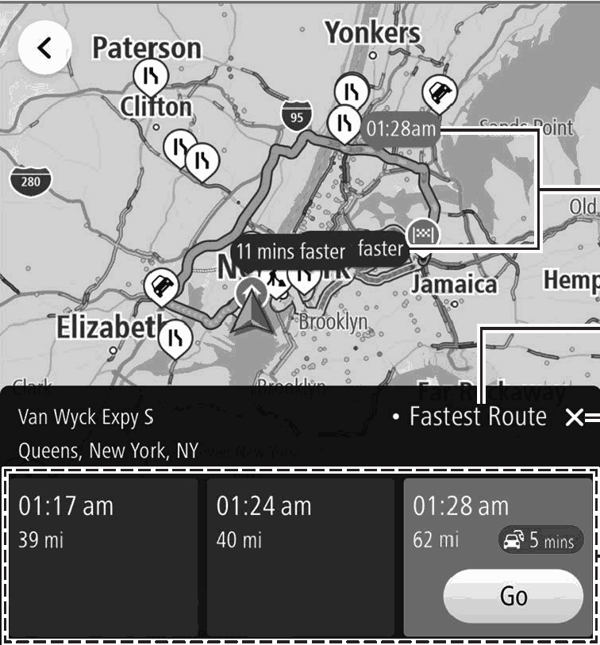

<!-- GENERATED:START function=48ded43b2503 (generated; edits inside this block are overwritten by the next publish — write your own notes outside it) -->
# 13. Route Calculation Screen

<b>Function path:</b> Navigation System (If equipped) / Route Calculation Screen <b>Source:</b> printed page 210, 211 <b>Test-ready:</b> no — procedure missing or thresholds unfilled

Every "Presumed requirement" row below is machine-derived from the Owner's Manual text by rule-based extraction — not AI-written — and traceable to the printed page in its Source column.

## Figures (areas of the original PDF; the OM has no figure numbers or captions)

- Figure 13-1 source: p.210
- (Copied from OM) Candidate route overview

## 13-2-1. Service overview

| # | Presumed requirement | Strength | Source |
|---|---|---|---|
| 1 | Route Calculation ScreenUp to 3 candidate routes searched are displayed according to conditions preset by the user. | capability | p.210 / text |
| 2 | Route Calculation ScreenCandidate route overview. | capability | p.210 / text |
| 3 | Route Calculation ScreenRoute search conditions A route search condition ( “Fastest Route”, “Shortest Route”, or “Most Eco-friendly Route”) can be pre-set on the navigation settings screen. (→P.219). | capability | p.210 / text |
| 4 | Route Calculation ScreenSelect to cancel route confirmation. | capability | p.210 / text |
| 5 | Route Calculation ScreenDisplays estimated time of arrival and remaining distance of each candidate route displayed. If traffic jam is detected on the route, expected delay time will also be displayed. Select Go (Go) to start route guidance. | constraint | p.211 / text |
| 6 | Route Calculation Screenl Be sure to obey traffic regulations and keep road conditions in mind while driving. If a traffic sign on the road has been changed, the route guidance may not indicate such changed information. | constraint | p.211 / text |
| 7 | Route Calculation ScreenNOTE l The route for returning may not be the same as that for going. l The route guidance to the destination may not be the shortest route or a route without traffic congestion. l Route guidance may not be available if there is no road data for the specified location. l If a destination that is not located on a road is set, the vehicle will be guided to the point on a road nearest to the destination. The road nearest to the selected point is set as the destination. | constraint | p.211 / text |
<!-- GENERATED:END function=48ded43b2503 -->

