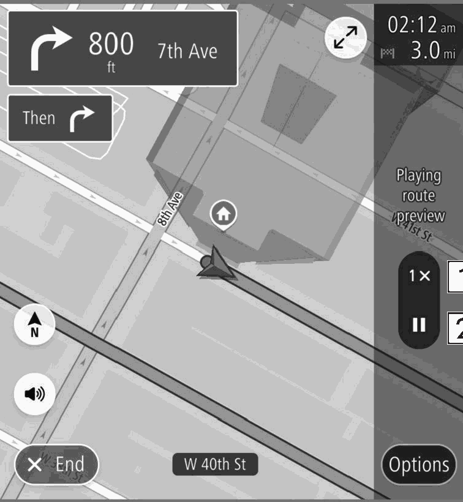

<!-- GENERATED:START function=6993b39cc921 (generated; edits inside this block are overwritten by the next publish — write your own notes outside it) -->
# 16. Standard Map Icon

<b>Function path:</b> Navigation System (If equipped) / Standard Map Icon <b>Source:</b> printed page 217 <b>Test-ready:</b> no — procedure missing or thresholds unfilled

Every "Presumed requirement" row below is machine-derived from the Owner's Manual text by rule-based extraction — not AI-written — and traceable to the printed page in its Source column.

## Figures (areas of the original PDF; the OM has no figure numbers or captions)

- Figure 16-1 source: p.217
- (Copied from OM) Select to change the preview speed to “1X”/“2X”/“4X”.

## 16-2-1. Service overview

| # | Presumed requirement | Strength | Source |
|---|---|---|---|
| 1 | Standard Map IconA selected route can be previewed. The speed of the preview can be changed. | capability | p.217 / text |
| 2 | Standard Map IconSelect to change the preview speed to “1X”/“2X”/“4X”. | capability | p.217 / text |
| 3 | Standard Map IconSelect to temporarily stop the preview. | capability | p.217 / text |
| 4 | Standard Map IconThe following table shows the most frequently displayed route events. | capability | p.217 / text |
| 5 | Standard Map IconTurn left/right. | capability | p.217 / text |
| 6 | Standard Map IconKeep left/right at the fork in the road. | capability | p.217 / text |
| 7 | Standard Map IconTurn left/right &amp; sharp curve. | capability | p.217 / text |
| 8 | Standard Map IconStay in the left/right lane. | capability | p.217 / text |
| 9 | Standard Map IconGo straight ahead at the intersection. | capability | p.217 / text |
| 10 | Standard Map IconExit the junction. | capability | p.217 / text |
| 11 | Standard Map IconRoundabout. | capability | p.217 / text |
| 12 | Standard Map IconYou have arrived at your destination. | capability | p.217 / text |
| 13 | Standard Map IconYou have arrived at your waypoint. | capability | p.217 / text |
<!-- GENERATED:END function=6993b39cc921 -->

