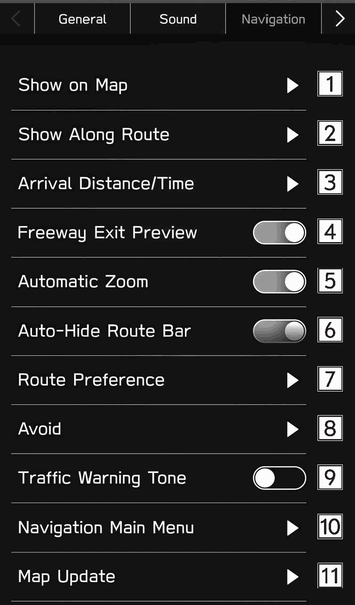

<!-- GENERATED:START function=8ee8a5144acc (generated; edits inside this block are overwritten by the next publish — write your own notes outside it) -->
# 19. Navigation Settings Screen

<b>Function path:</b> Navigation System (If equipped) / Navigation Settings Screen <b>Source:</b> printed page 219, 220 <b>Test-ready:</b> no — procedure missing or thresholds unfilled

Every "Presumed requirement" row below is machine-derived from the Owner's Manual text by rule-based extraction — not AI-written — and traceable to the printed page in its Source column.

## Figures (areas of the original PDF; the OM has no figure numbers or captions)

- Figure 19-1 source: p.219
- (Copied from OM) Navigation

## 19-2-1. Service overview

| # | Presumed requirement | Strength | Source |
|---|---|---|---|
| 1 | Navigation Settings ScreenPOI Icons on Map” is turned on and up to 5 POI icon types have been selected. | capability | p.220 / text |
| 2 | Navigation Settings ScreenSelect to turn the display for parking lots, gas stations and rest areas on/off for the route being traveled during route guidance. | capability | p.220 / text |
| 3 | Navigation Settings ScreenSelect to set the displays for the estimated remaining distance and estimated remaining time to the destination. (→P.212). | capability | p.220 / text |
| 4 | Navigation Settings ScreenSelect to turn the freeway exit preview on/off. | capability | p.220 / text |
| 5 | Navigation Settings ScreenSelect to set whether to automatically enlarge the map when approaching intersections or turning points during route guidance. | constraint | p.220 / text |
| 6 | Navigation Settings ScreenSelect to turn the route bar auto-hide function on/off. (→P.212). | capability | p.220 / text |
| 7 | Navigation Settings ScreenSelect to change the preferred route type when searching for a new route. | constraint | p.220 / text |
| 8 | Navigation Settings ScreenSelect to set avoidance criteria for the route calculation. | capability | p.220 / text |
| 9 | Navigation Settings ScreenSelect to turn the traffic alert sound on/off. | capability | p.220 / text |
| 10 | Navigation Settings ScreenDuring a route guidance: Select to display route option screen. (→P.214) Not during a route guidance: Select to display the main menu screen. (→P.203). | capability | p.220 / text |
| 11 | Navigation Settings ScreenSelect to set the updating of map data. (→P.223). | capability | p.220 / text |
<!-- GENERATED:END function=8ee8a5144acc -->

