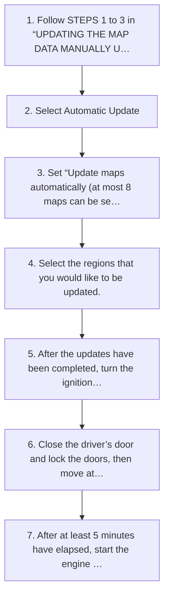

<!-- GENERATED:START function=08494f667ec0 (generated; edits inside this block are overwritten by the next publish — write your own notes outside it) -->
# 26. Using Wi-Fi®

<b>Function path:</b> Navigation System (If equipped) / Using Wi-Fi® <b>Source:</b> printed page 226 <b>Test-ready:</b> yes — no unfilled thresholds and a procedure is present

Every "Presumed requirement" row below is machine-derived from the Owner's Manual text by rule-based extraction — not AI-written — and traceable to the printed page in its Source column.

## Procedure

| Seq | Step | Operation (Copied from OM) | Source |
|---|---|---|---|
| 1 | 1 | Follow STEPS 1 to 3 in “UPDATING THE MAP DATA MANUALLY USING Wi-Fi®”. (→P.225) | p.226 / step |
| 2 | 2 | Select Automatic Update | p.226 / step |
| 3 | 3 | Set “Update maps automatically (at most 8 maps can be selected)”. | p.226 / step |
| 4 | 4 | Select the regions that you would like to be updated. | p.226 / step |
| 5 | 5 | After the updates have been completed, turn the ignition switch to the “LOCK”/“OFF” position and exit the vehicle. | p.226 / step |
| 6 | 6 | Close the driver’s door and lock the doors, then move at least 10 feet (3 m) away from the vehicle to prevent the key from interfering. | p.226 / step |
| 7 | 7 | After at least 5 minutes have elapsed, start the engine again. | p.226 / step |

## 26-2-2. Service requirements

| # | Presumed requirement | Strength | Source |
|---|---|---|---|
| 1 | Step -The new map data will be applied. | capability | p.226 / bullet |
| 2 | Using Wi-Fi®(Automatic Update). | capability | p.226 / text |
<!-- GENERATED:END function=08494f667ec0 -->

