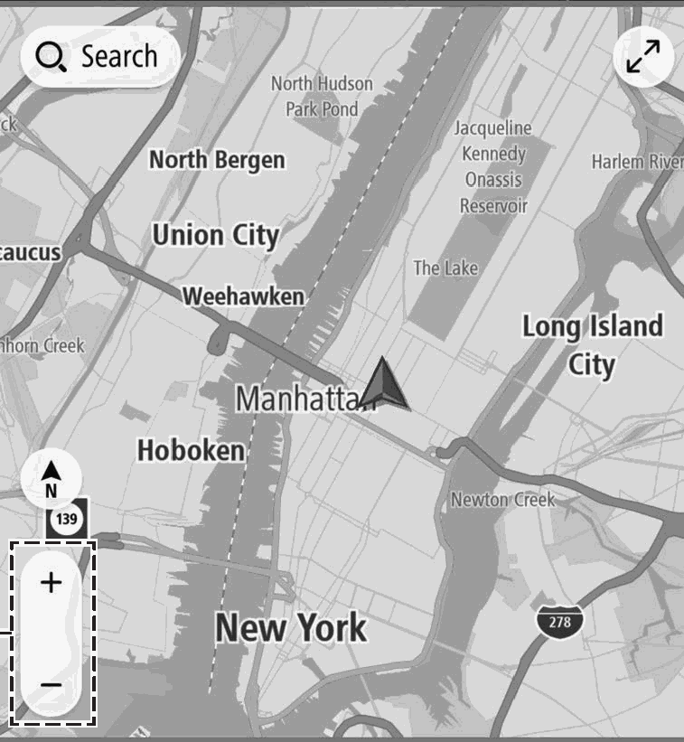

<!-- GENERATED:START function=866fa052f11d (generated; edits inside this block are overwritten by the next publish — write your own notes outside it) -->
# 3. Map Screen Buttons Overview

<b>Function path:</b> Navigation System (If equipped) / Map Screen Buttons Overview <b>Source:</b> printed page 197 <b>Test-ready:</b> no — procedure missing or thresholds unfilled

Every "Presumed requirement" row below is machine-derived from the Owner's Manual text by rule-based extraction — not AI-written — and traceable to the printed page in its Source column.

## Figures (areas of the original PDF; the OM has no figure numbers or captions)

- Figure 3-1 source: p.197
- (Copied from OM) Select to change the scale of the map screen. (→P.198)

## 3-2-1. Service overview

| # | Presumed requirement | Strength | Source |
|---|---|---|---|
| 1 | Map Screen Buttons OverviewThe map screen buttons can be accessed by selecting any point on the map. | capability | p.197 / text |
| 2 | Map Screen Buttons OverviewSelect to change the scale of the map screen. (→P.198). | capability | p.197 / text |
<!-- GENERATED:END function=866fa052f11d -->

