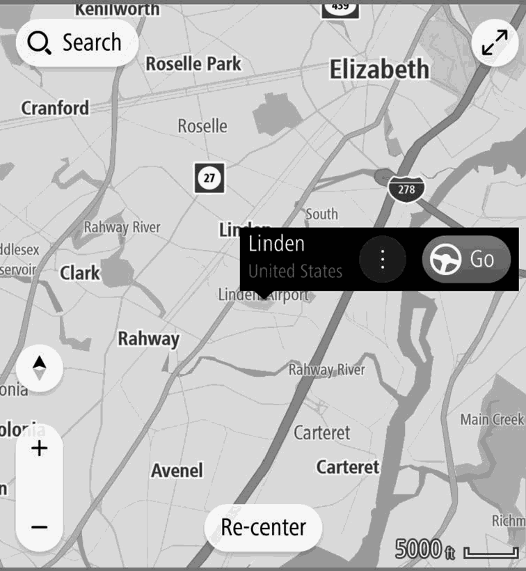
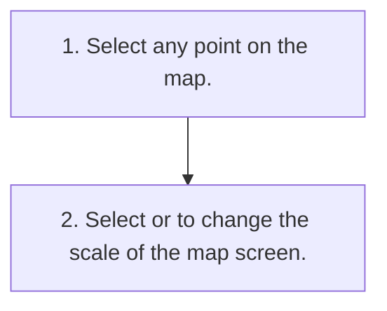

<!-- GENERATED:START function=23fdbf986932 (generated; edits inside this block are overwritten by the next publish — write your own notes outside it) -->
# 5. Location Menu Pop-up

<b>Function path:</b> Navigation System (If equipped) / Location Menu Pop-up <b>Source:</b> printed page 198 <b>Test-ready:</b> yes — no unfilled thresholds and a procedure is present

Every "Presumed requirement" row below is machine-derived from the Owner's Manual text by rule-based extraction — not AI-written — and traceable to the printed page in its Source column.

## Figures (areas of the original PDF; the OM has no figure numbers or captions)

- Figure 5-1 source: p.198
- (Copied from OM) adjusted manually during route guidance. To reenable the automatic

## Procedure

| Seq | Step | Operation (Copied from OM) | Source |
|---|---|---|---|
| 1 | 1 | Select any point on the map. | p.198 / step |
| 2 | 2 | Select or to change the scale of the map screen. | p.198 / step |

## 5-2-2. Service requirements

| # | Presumed requirement | Strength | Source |
|---|---|---|---|
| 1 | Step -When the automatic zoom function is on (→P.219) during route guidance, the map is zoomed in automatically when approaching intersections or turning points. | constraint | p.198 / bullet |
| 2 | Location Menu Pop-upThe location menu pop-up can be displayed using the following methods:. | capability | p.198 / text |
| 3 | Step -Select and hold any point on the map. Select a point from a list. ● ● Select a POI icon. | capability | p.198 / bullet |
| 4 | Location Menu Pop-upSelect Go (Go) to search for a route to the selected point and display the route calculation screen. (→P.210). | capability | p.198 / text |
| 5 | Location Menu Pop-upDuring a route guidance, selecting Add Stop (Add Stop) will add a waypoint. | capability | p.198 / text |

## 5-5. Exception operation

| # | Presumed requirement | Strength | Source |
|---|---|---|---|
| 1 | Location Menu Pop-upNOTE l The scale of the map screen can also be changed with the double touch or pinch operation. (→P.71) l If the map scale has been changed after moving the map, the map scale will return to previous scale when the map is returned to the current position. l The automatic zoom function may not operate if the map scale is adjusted manually during route guidance. To reenable the automatic zoom function, change the orientation of the map screen. (→P.199). | constraint | p.198 / text |
<!-- GENERATED:END function=23fdbf986932 -->

