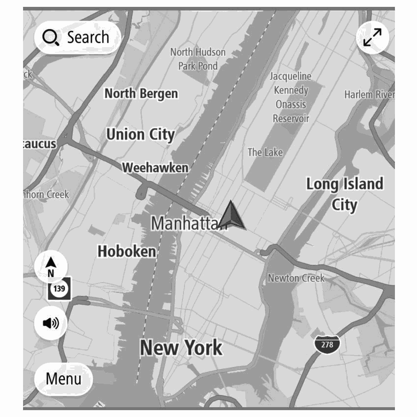
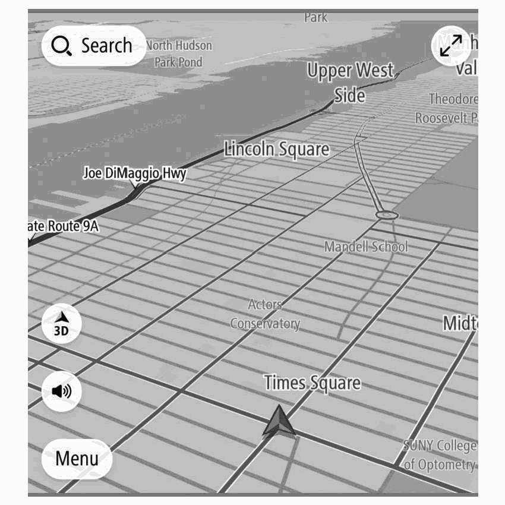
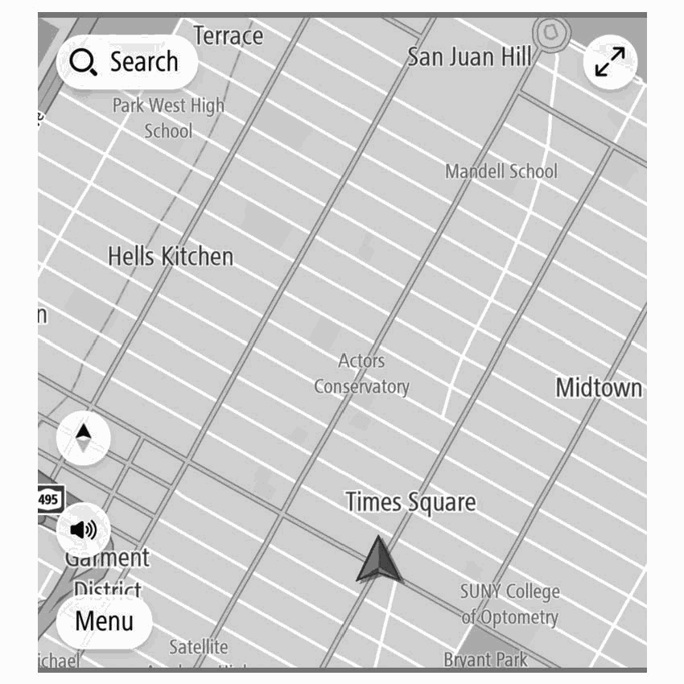
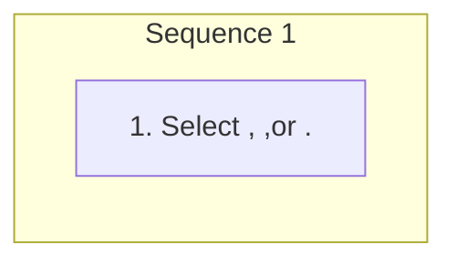

<!-- GENERATED:START function=aef19ba52346 (generated; edits inside this block are overwritten by the next publish — write your own notes outside it) -->
# 6. Orientation Of The Map

<b>Function path:</b> Navigation System (If equipped) / Orientation Of The Map <b>Source:</b> printed page 199, 200 <b>Test-ready:</b> yes — no unfilled thresholds and a procedure is present

Every "Presumed requirement" row below is machine-derived from the Owner's Manual text by rule-based extraction — not AI-written — and traceable to the printed page in its Source column.

## Figures (areas of the original PDF; the OM has no figure numbers or captions)

- Figure 6-1 source: p.199
- (Copied from OM) always up.

- Figure 6-2 source: p.200
- (Copied from OM) ● The direction of vehicle travel is always up.

- Figure 6-3 source: p.200
- (Copied from OM) ● The direction of vehicle travel is always up.

## Procedure

| Seq | Step | Operation (Copied from OM) | Source |
|---|---|---|---|
| 1 | 1 | Select , ,or . | p.199 / step |

## 6-2-1. Service overview

| # | Presumed requirement | Strength | Source |
|---|---|---|---|
| 1 | Orientation Of The MapSelect to register the selected point as Add to Favorites a favorite. (Add to Favorites). | capability | p.199 / text |
| 2 | Orientation Of The MapSelect to search for a route to the selected point and display the route Go (Go) calculation screen. (→P.210). | capability | p.199 / text |
| 3 | Orientation Of The MapSelect to display the search screen Search Near Here and search near the selected point. (Search Near Here) (→P.205). | capability | p.199 / text |
| 4 | Orientation Of The MapSelect to display detailed information about the selected point or POI. : Select to call the registered More Information phone number of POI. (More Information) : Select to search for a route to the selected point or POI and display the route calculation screen. (→P.210). | capability | p.199 / text |
| 5 | Orientation Of The MapSelect to edit the point registered as Edit Location home/work. (Edit Location). | capability | p.199 / text |
| 6 | Orientation Of The MapSelect to erase the point registered as Remove Location home/work. (Remove Location). | capability | p.199 / text |
| 7 | Orientation Of The MapSelect to change the name of a registered favorite. (Rename). | capability | p.199 / text |
| 8 | Orientation Of The MapThe orientation of the map can be changed between 2D northup, 2D heading-up, and 3D heading-up. | capability | p.199 / text |

## 6-2-2. Service requirements

| # | Presumed requirement | Strength | Source |
|---|---|---|---|
| 1 | Step -Each time the symbol is selected, the orientation of the map changes. X 2D north-up. | capability | p.199 / bullet |
| 2 | Step -Regardless of the direction of vehicle travel, north is always up. | capability | p.199 / bullet |
| 3 | Step -The direction of vehicle travel is always up. | capability | p.200 / bullet |
| 4 | Step -The direction of vehicle travel is always up. | capability | p.200 / bullet |
<!-- GENERATED:END function=aef19ba52346 -->

