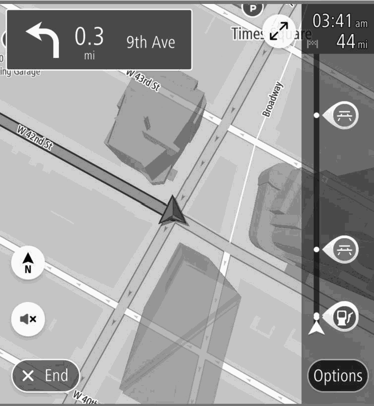
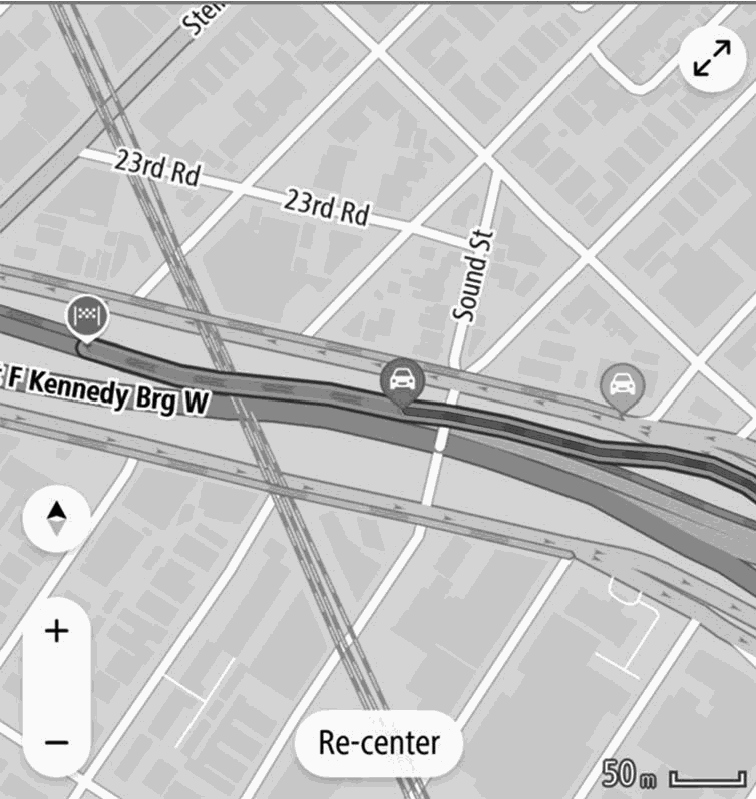

<!-- GENERATED:START function=705ccca6f718 (generated; edits inside this block are overwritten by the next publish — write your own notes outside it) -->
# 7. Gas Station/Parking Lot/Rest Area Icons

<b>Function path:</b> Navigation System (If equipped) / Gas Station/Parking Lot/Rest Area Icons <b>Source:</b> printed page 201 <b>Test-ready:</b> no — procedure missing or thresholds unfilled

Every "Presumed requirement" row below is machine-derived from the Owner's Manual text by rule-based extraction — not AI-written — and traceable to the printed page in its Source column.

## Figures (areas of the original PDF; the OM has no figure numbers or captions)

- Figure 7-1 source: p.201
- (Copied from OM) To receive the data service information in the vehicle, a

- Figure 7-2 source: p.201
- (Copied from OM) System

## 7-2-1. Service overview

| # | Presumed requirement | Strength | Source |
|---|---|---|---|
| 1 | Gas Station/Parking Lot/Rest Area IconsGas stations, parking lots and rest areas can be displayed on the route. Their location can also be set as a destination. | capability | p.201 / text |

## 7-2-2. Service requirements

| # | Presumed requirement | Strength | Source |
|---|---|---|---|
| 1 | Step -The display of gas station/parking lots/rest area icons can be turned on/off. (→P.219). | capability | p.201 / bullet |
| 2 | Gas Station/Parking Lot/Rest Area IconsThis feature is available at certain map scales. | capability | p.201 / text |
| 3 | Gas Station/Parking Lot/Rest Area IconsTo receive the data service information in the vehicle, a subscription to the SiriusXM® Radio Service is necessary following a free trial. (→P.161). | capability | p.201 / text |

## 7-5. Exception operation

| # | Presumed requirement | Strength | Source |
|---|---|---|---|
| 1 | Gas Station/Parking Lot/Rest Area Icons*: Use of this function may not be possible depending on country and vehicle. Road sections affected by traffic conditions are displayed in a different color on the map, and a small icon representing the type of traffic condition is displayed above the road. | capability | p.201 / text |
<!-- GENERATED:END function=705ccca6f718 -->

