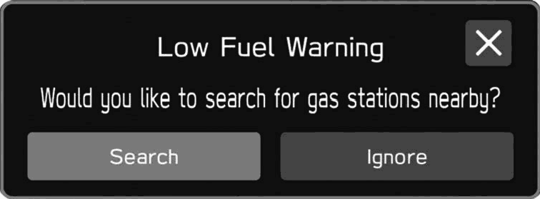
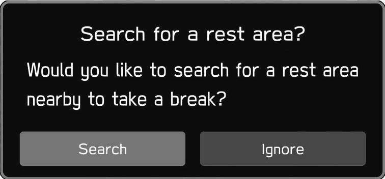

<!-- GENERATED:START function=64f1d00089a4 (generated; edits inside this block are overwritten by the next publish — write your own notes outside it) -->
# 8. Other Information

<b>Function path:</b> Navigation System (If equipped) / Other Information <b>Source:</b> printed page 202 <b>Test-ready:</b> no — procedure missing or thresholds unfilled

Every "Presumed requirement" row below is machine-derived from the Owner's Manual text by rule-based extraction — not AI-written — and traceable to the printed page in its Source column.

## Figures (areas of the original PDF; the OM has no figure numbers or captions)

- Figure 8-1 source: p.202
- (Copied from OM) (Search): Select to search for gas stations.

- Figure 8-2 source: p.202
- (Copied from OM) (Search): Select to search for rest areas.

## 8-2-1. Service overview

| # | Presumed requirement | Strength | Source |
|---|---|---|---|
| 1 | Other InformationA pop-up screen will be displayed based on the driving situation, etc. | capability | p.202 / text |
| 2 | Other InformationX Low fuel warning. | capability | p.202 / text |
| 3 | Other InformationWhen the fuel level is low, a warning message will pop up on the screen. | capability | p.202 / text |
| 4 | Other Information(Search): Select to search for gas stations. | capability | p.202 / text |

## 8-2-2. Service requirements

| # | Presumed requirement | Strength | Source |
|---|---|---|---|
| 1 | Step -(Ignore): Select to delete the message. | capability | p.202 / bullet |
| 2 | Other InformationIf the system determines, based on the driver’s condition, that a rest may be necessary, a pop-up message will be displayed on the screen. | capability | p.202 / text |
| 3 | Other Information(Search): Select to search for rest areas. | capability | p.202 / text |
| 4 | Step -(Ignore): Select to delete the message. ● ● Pop-up screens can be turned on/off using the “Periodic Rest Notification” setting on the general settings screen. (→P.94). | capability | p.202 / bullet |
<!-- GENERATED:END function=64f1d00089a4 -->

