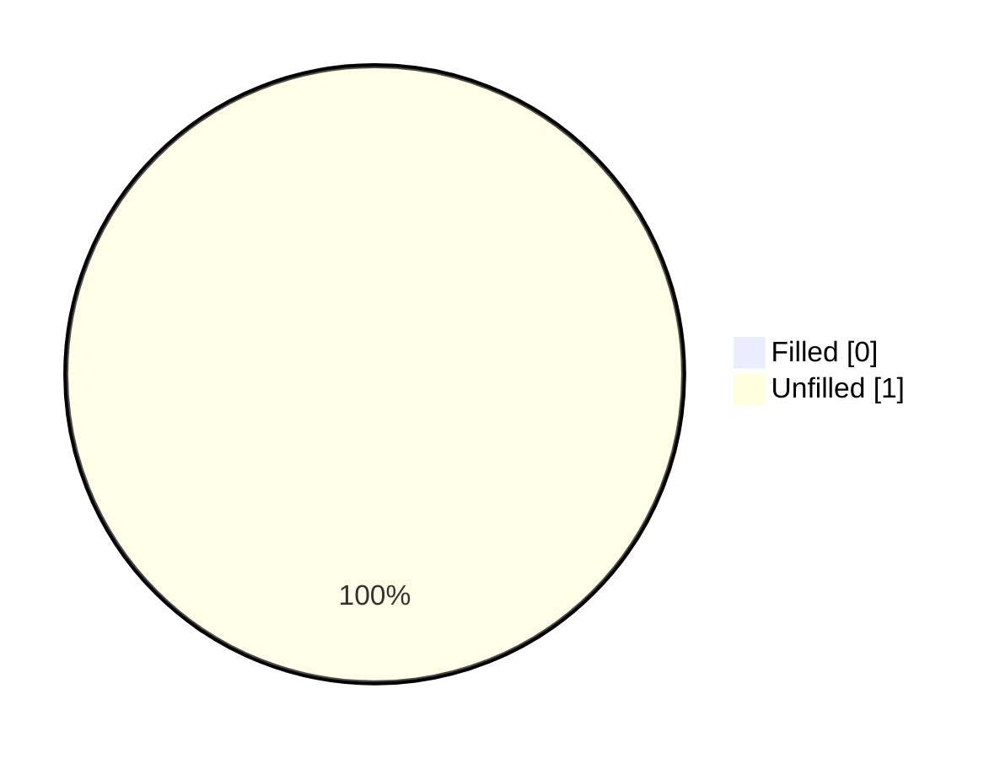
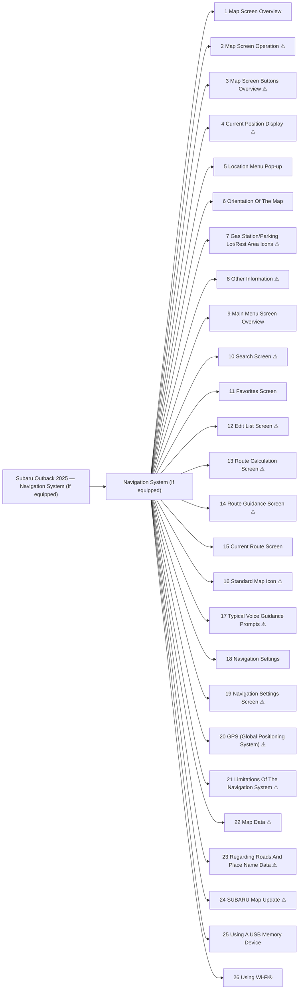

<!-- GENERATED:START index (generated; edits inside this block are overwritten by the next publish — write your own notes outside it) -->
# Subaru Outback 2025 — Navigation System (If equipped) — Presumed specification

> This is a machine-derived estimate, not an official requirements document. Numeric thresholds left blank could not be found in the manual and must be filled in by a tester with evidence.

| Field | Value |
|---|---|
| Maker / Model | Subaru / Outback 2025 |
| Scope | Navigation System (If equipped) |
| Markets | US, CA |
| Profile | subaru_chapter_toc_v1 |
| Manual ID | subaru/outback-2025/ivi |

## Numeric thresholds
Filled: 0 / Unfilled: 1

## Figures in the manual
25 figure area(s) detected.

## Headings not matched to body text
These bookmark entries could not be located in the extracted body text and were not turned into functions. Reported instead of silently dropped.
- Map Screen Operation
- Location Menu Pop-up
- Orientation Of The Map
- Other Information
- Search Screen
- Edit List Screen
- Current Route Screen
- Standard Map Icon
- Typical Voice Guidance Prompts
- Map Data

## Functions

| No. | Function | Area | Requirements | Figures | Unfilled thresholds | Test-ready |
|---|---|---|---|---|---|---|
| 1 | Map Screen Overview | Navigation System (If equipped) | 14 | 1 | 0 | o |
| 2 | Map Screen Operation | Navigation System (If equipped) | 2 | 0 | 0 | - |
| 3 | Map Screen Buttons Overview | Navigation System (If equipped) | 2 | 1 | 0 | - |
| 4 | Current Position Display | Navigation System (If equipped) | 2 | 0 | 0 | - |
| 5 | Location Menu Pop-up | Navigation System (If equipped) | 6 | 1 | 0 | o |
| 6 | Orientation Of The Map | Navigation System (If equipped) | 12 | 3 | 0 | o |
| 7 | Gas Station/Parking Lot/Rest Area Icons | Navigation System (If equipped) | 5 | 2 | 0 | - |
| 8 | Other Information | Navigation System (If equipped) | 8 | 2 | 0 | - |
| 9 | Main Menu Screen Overview | Navigation System (If equipped) | 13 | 1 | 0 | o |
| 10 | Search Screen | Navigation System (If equipped) | 30 | 2 | 0 | - |
| 11 | Favorites Screen | Navigation System (If equipped) | 14 | 2 | 0 | o |
| 12 | Edit List Screen | Navigation System (If equipped) | 5 | 1 | 0 | - |
| 13 | Route Calculation Screen | Navigation System (If equipped) | 7 | 1 | 0 | - |
| 14 | Route Guidance Screen | Navigation System (If equipped) | 26 | 4 | 0 | - |
| 15 | Current Route Screen | Navigation System (If equipped) | 14 | 1 | 0 | o |
| 16 | Standard Map Icon | Navigation System (If equipped) | 13 | 1 | 0 | - |
| 17 | Typical Voice Guidance Prompts | Navigation System (If equipped) | 5 | 0 | 0 | - |
| 18 | Navigation Settings | Navigation System (If equipped) | 0 | 0 | 0 | o |
| 19 | Navigation Settings Screen | Navigation System (If equipped) | 11 | 1 | 0 | - |
| 20 | GPS (Global Positioning System) | Navigation System (If equipped) | 2 | 0 | 0 | - |
| 21 | Limitations Of The Navigation System | Navigation System (If equipped) | 31 | 0 | 0 | - |
| 22 | Map Data | Navigation System (If equipped) | 3 | 0 | 0 | - |
| 23 | Regarding Roads And Place Name Data | Navigation System (If equipped) | 1 | 0 | 0 | - |
| 24 | SUBARU Map Update | Navigation System (If equipped) | 4 | 0 | 1 | - |
| 25 | Using A USB Memory Device | Navigation System (If equipped) | 7 | 1 | 0 | o |
| 26 | Using Wi-Fi® | Navigation System (If equipped) | 2 | 0 | 0 | o |
<!-- GENERATED:END index -->

