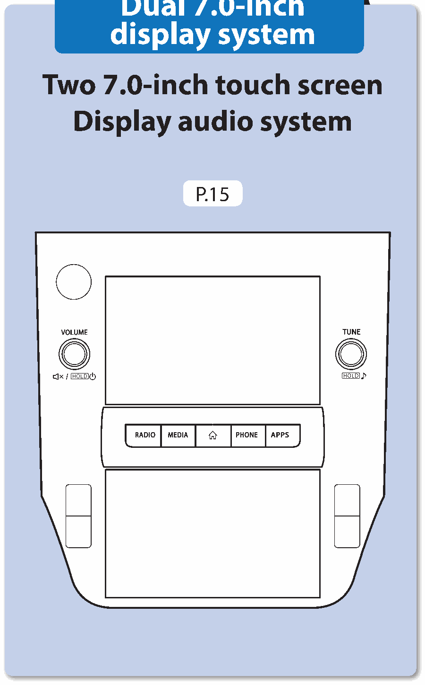

<!-- GENERATED:START function=1c76ddd23a2e (generated; edits inside this block are overwritten by the next publish — write your own notes outside it) -->
# 1. This Owner’s Manual describes the following three types of system. Dual 7.0-inch display system Two 7.0-inch touch screen Display audio system

<b>Function path:</b> Quick Guide / This Owner’s Manual describes the following three types of system. Dual 7.0-inch display system Two 7.0-inch touch screen Display audio system <b>Source:</b> printed page 14 <b>Test-ready:</b> no — procedure missing or thresholds unfilled

Every "Presumed requirement" row below is machine-derived from the Owner's Manual text by rule-based extraction — not AI-written — and traceable to the printed page in its Source column.

## Figures (areas of the original PDF; the OM has no figure numbers or captions)

- Figure 1-1 source: p.14
- (Copied from OM) Two 7.0-inch touch screen Display audio system

## 1-2-1. Service overview

| # | Presumed requirement | Strength | Source |
|---|---|---|---|
| 1 | This Owner’s Manual describes the following three types of system. Dual 7.0-inch display system Two 7.0-inch touch screen Display audio systemDual 7.0-inch display system. | capability | p.14 / text |
| 2 | This Owner’s Manual describes the following three types of system. Dual 7.0-inch display system Two 7.0-inch touch screen Display audio systemTwo 7.0-inch touch screen Display audio system. | capability | p.14 / text |
<!-- GENERATED:END function=1c76ddd23a2e -->
