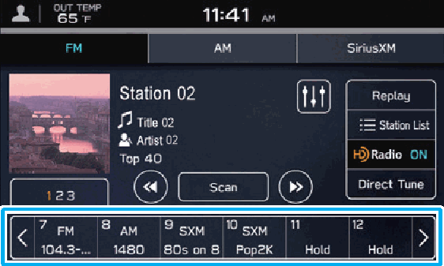

<!-- GENERATED:START function=51ff53923268 (generated; edits inside this block are overwritten by the next publish — write your own notes outside it) -->
# 10. Useful SiriusXM® Radio Functions

<b>Function path:</b> Quick Guide / Useful SiriusXM® Radio Functions <b>Source:</b> printed page 33 <b>Test-ready:</b> no — procedure missing or thresholds unfilled

Every "Presumed requirement" row below is machine-derived from the Owner's Manual text by rule-based extraction — not AI-written — and traceable to the printed page in its Source column.

## Figures (areas of the original PDF; the OM has no figure numbers or captions)

- Figure 10-1 source: p.33
- (Copied from OM) Mix preset function

## 10-2-2. Service requirements

| # | Presumed requirement | Strength | Source |
|---|---|---|---|
| 1 | Step -For you: Displays content suggestions based on the registered descriptions of driver profile and history of SiriusXM contents access. P.159. | capability | p.33 / bullet |
| 2 | Step -Categories: Displays a channel list by category. P.159. | capability | p.33 / bullet |
| 3 | Step -Related: Display a list of contents related to the current content you are listening to. P.159. | capability | p.33 / bullet |
| 4 | Useful SiriusXM® Radio FunctionsRegister the radio station. | capability | p.33 / text |
| 5 | Useful SiriusXM® Radio FunctionsMix preset function Multiple stations can be registered as presets. (AM, FM or SiriusXM® Radio) P.154,163. | capability | p.33 / text |
| 6 | Useful SiriusXM® Radio FunctionsSelect and hold one of the preset buttons. | capability | p.33 / text |
<!-- GENERATED:END function=51ff53923268 -->

