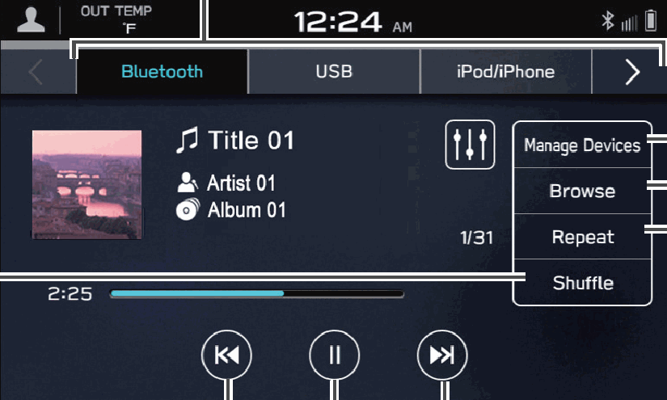

<!-- GENERATED:START function=211f8d68a425 (generated; edits inside this block are overwritten by the next publish — write your own notes outside it) -->
# 11. Media Screen

<b>Function path:</b> Quick Guide / Media Screen <b>Source:</b> printed page 34 <b>Test-ready:</b> no — procedure missing or thresholds unfilled

Every "Presumed requirement" row below is machine-derived from the Owner's Manual text by rule-based extraction — not AI-written — and traceable to the printed page in its Source column.

## Figures (areas of the original PDF; the OM has no figure numbers or captions)

- Figure 11-1 source: p.34
- (Copied from OM) Repeat all tracks → repeat

## 11-2-1. Service overview

| # | Presumed requirement | Strength | Source |
|---|---|---|---|
| 1 | Media ScreenChange to other Bluetooth audio device/ register new device (Bluetooth audio) Change media source. | capability | p.34 / text |
| 2 | Media ScreenPlayback tracks and programs, etc. in a variety of playback modes Random playback on/off Audio CDs*1: Repeat all tracks → repeat current track → cancel repeat Media other than audio Change tracks Change tracks CDs: Select and hold to fast rewind Select and hold Repeat all tracks*2 → repeat to fast forward current album/folder → repeat current track → cancel Pause/play repeat. | capability | p.34 / text |
| 3 | Media ScreenCD*1 P.187 USB/iPod/iPhone P.190 Bluetooth audio P.81. | capability | p.34 / text |
| 4 | Media Screen*1: If equipped with a CD player *2: Operable when USB Audio is used and Folders (Folders) is selected from (Browse). | constraint | p.34 / text |
<!-- GENERATED:END function=211f8d68a425 -->

