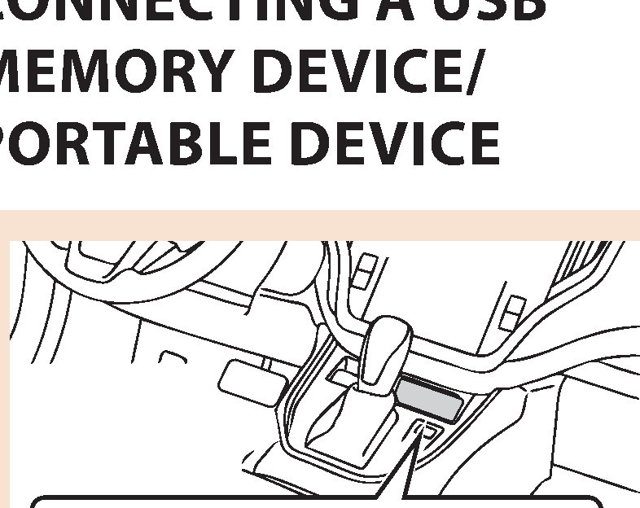
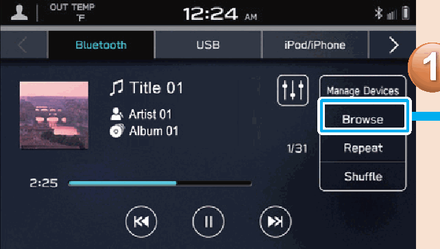

<!-- GENERATED:START function=e919a6179f2b (generated; edits inside this block are overwritten by the next publish — write your own notes outside it) -->
# 12. Loading And Unloading A Disc

<b>Function path:</b> Quick Guide / Loading And Unloading A Disc <b>Source:</b> printed page 35 <b>Test-ready:</b> no — procedure missing or thresholds unfilled

Every "Presumed requirement" row below is machine-derived from the Owner's Manual text by rule-based extraction — not AI-written — and traceable to the printed page in its Source column.

## Figures (areas of the original PDF; the OM has no figure numbers or captions)

- Figure 12-1 source: p.35
- (Copied from OM) MEMORY DEVICE/

- Figure 12-2 source: p.35
- (Copied from OM) Display the playback mode list.

## 12-2-1. Service overview

| # | Presumed requirement | Strength | Source |
|---|---|---|---|
| 1 | Loading And Unloading A DiscLoading a disc. | capability | p.35 / text |
| 2 | Loading And Unloading A DiscInsert the disc with the label side facing the rear of the vehicle. | capability | p.35 / text |
| 3 | Loading And Unloading A Disc- Operation Flow: Using Playback Modes -. | capability | p.35 / text |
| 4 | Loading And Unloading A DiscDisplay the playback mode list. | capability | p.35 / text |
| 5 | Loading And Unloading A DiscMEMORY DEVICE/ Unloading a disc. | capability | p.35 / text |
<!-- GENERATED:END function=e919a6179f2b -->

