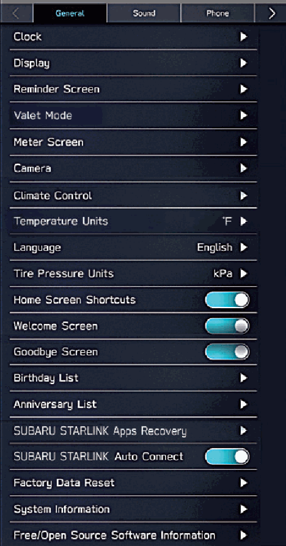
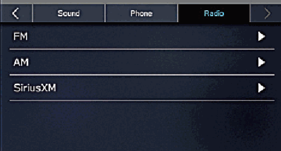
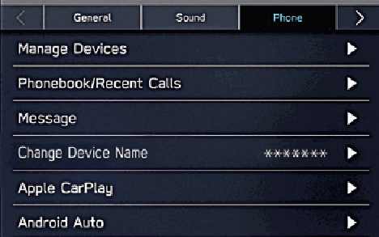
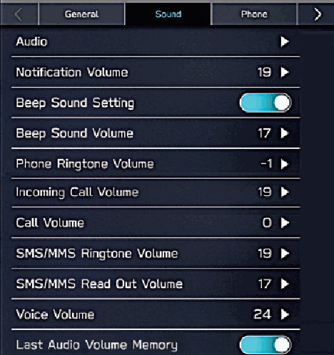
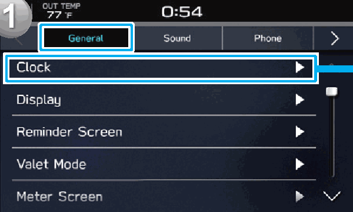
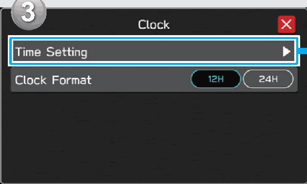
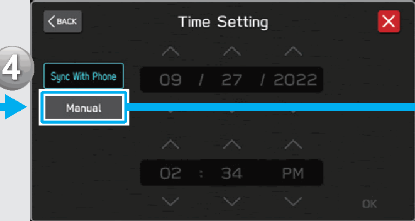
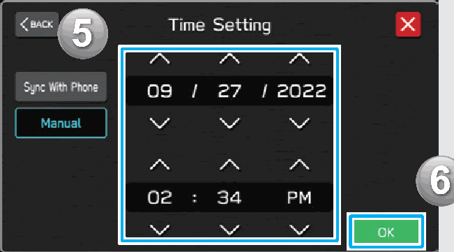
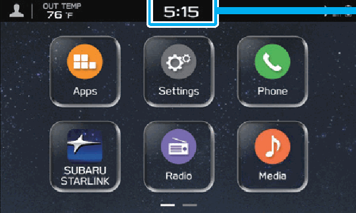

<!-- GENERATED:START function=5dba5365b523 (generated; edits inside this block are overwritten by the next publish — write your own notes outside it) -->
# 14. Settings Screen

<b>Function path:</b> Quick Guide / Settings Screen <b>Source:</b> printed page 36, 37 <b>Test-ready:</b> no — procedure missing or thresholds unfilled

Every "Presumed requirement" row below is machine-derived from the Owner's Manual text by rule-based extraction — not AI-written — and traceable to the printed page in its Source column.

## Figures (areas of the original PDF; the OM has no figure numbers or captions)

- Figure 14-1 source: p.36
- (Copied from OM) LLORCS

- Figure 14-2 source: p.36
- (Copied from OM) P.102

- Figure 14-3 source: p.36
- (Copied from OM) LLORCS

- Figure 14-4 source: p.36
- (Copied from OM) LLORCS

- Figure 14-5 source: p.37
- (Copied from OM) Adjust the clock.

- Figure 14-6 source: p.37
- (Copied from OM) DISPLAY

- Figure 14-7 source: p.37
- (Copied from OM) Select the manual mode.

- Figure 14-8 source: p.37
- (Copied from OM) Adjust the clock.

- Figure 14-9 source: p.37
- (Copied from OM) Display the clock settings screen.

## 14-2-1. Service overview

| # | Presumed requirement | Strength | Source |
|---|---|---|---|
| 1 | Settings ScreenGeneral Sound P.94. | capability | p.36 / text |
| 2 | Settings ScreenPhone Radio P.100 P.83 P.102. | capability | p.36 / text |
| 3 | Settings ScreenUnder normal conditions, when a Bluetooth phone is connected to the system, the clock will be adjusted automatically. If the clock is not adjusted automatically or a Bluetooth phone is not connected, it is necessary to adjust the clock manually. | constraint | p.37 / text |
| 4 | Settings ScreenSelect the manual mode. | capability | p.37 / text |
| 5 | Settings ScreenDisplay the clock settings screen. | capability | p.37 / text |
| 6 | Settings ScreenAdjust the clock. | capability | p.37 / text |
<!-- GENERATED:END function=5dba5365b523 -->

