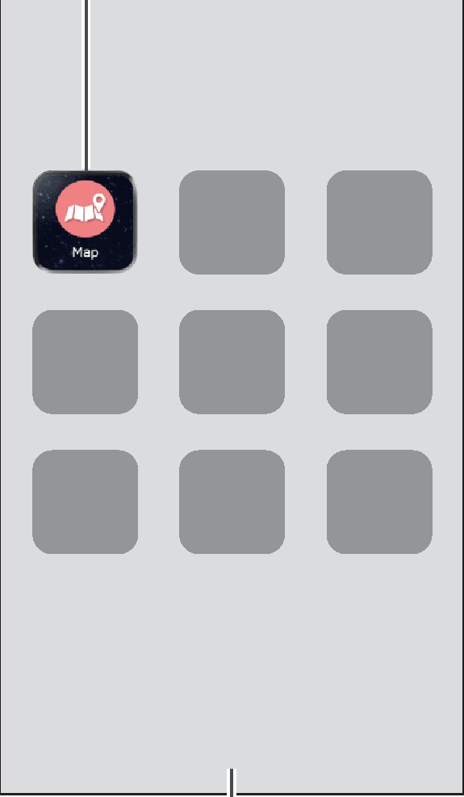
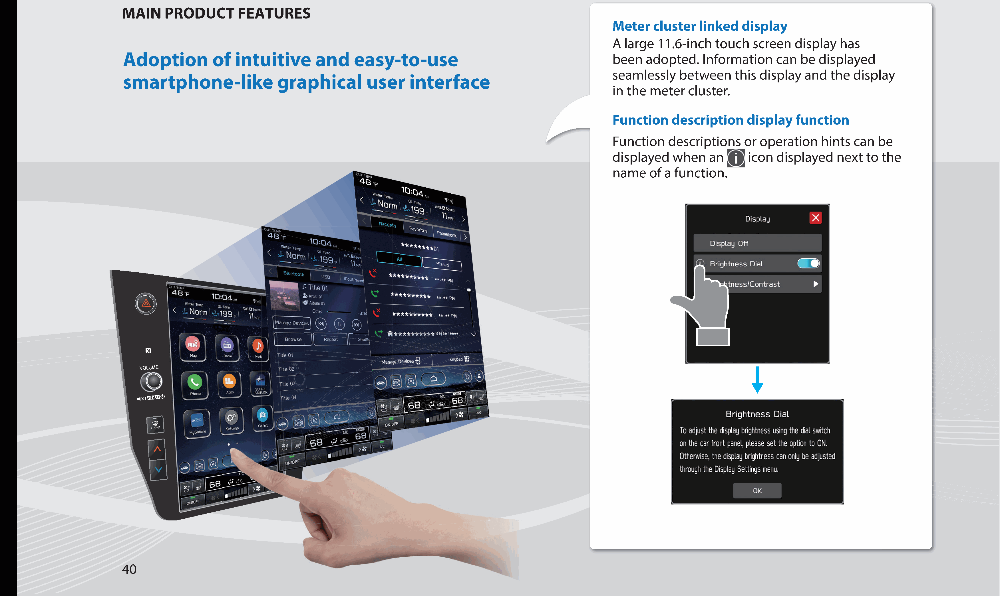
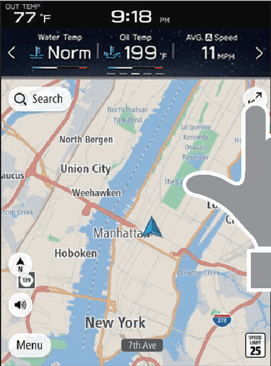
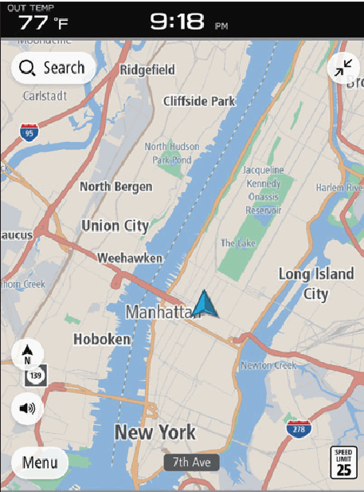
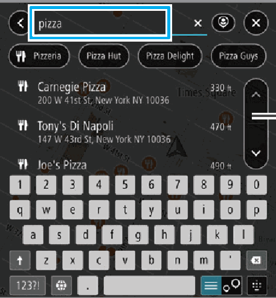
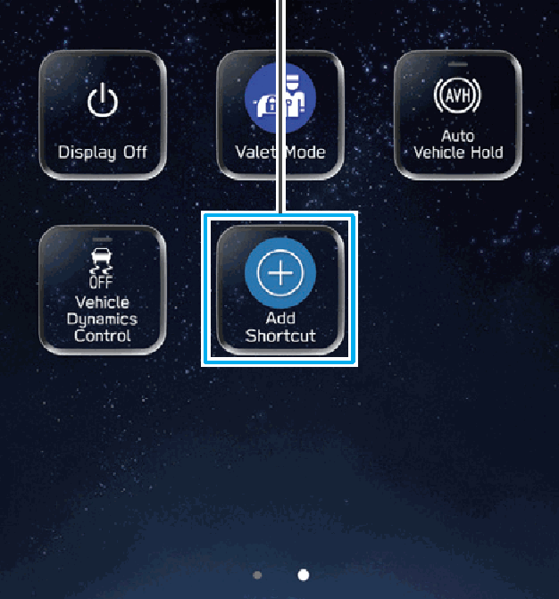
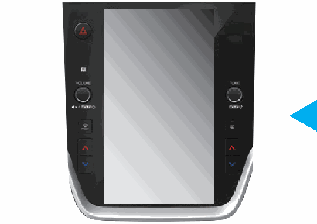
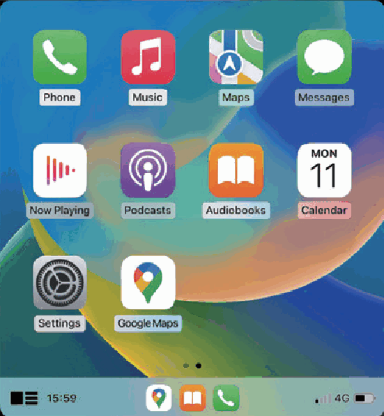
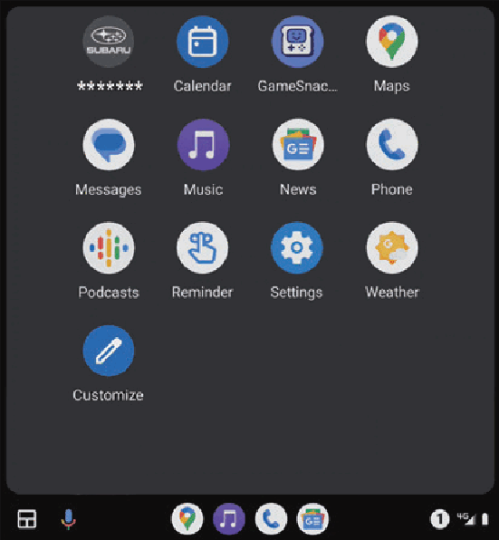
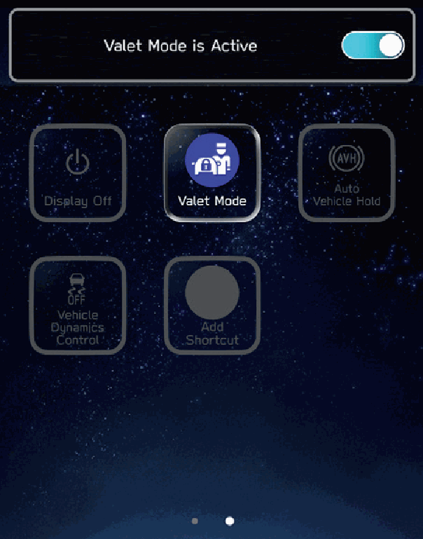

<!-- GENERATED:START function=200b388acc33 (generated; edits inside this block are overwritten by the next publish — write your own notes outside it) -->
# 15. Steering Wheel Controls

<b>Function path:</b> Quick Guide / Steering Wheel Controls <b>Source:</b> printed page 38, 39, 40, 41, 42 <b>Test-ready:</b> no — procedure missing or thresholds unfilled

Every "Presumed requirement" row below is machine-derived from the Owner's Manual text by rule-based extraction — not AI-written — and traceable to the printed page in its Source column.

## Figures (areas of the original PDF; the OM has no figure numbers or captions)

- Figure 15-1 source: p.39
- (Copied from OM) Features: - 11.6-inch touch screen

- Figure 15-2 source: p.39
- (Copied from OM) 11.6-inch touch screen

- Figure 15-3 source: p.40
- (Copied from OM) Adoption of intuitive and easy-to-use

- Figure 15-4 source: p.41
- (Copied from OM) display.

- Figure 15-5 source: p.41
- (Copied from OM) Displays search prediction

- Figure 15-6 source: p.41
- (Copied from OM) “what3words”.

- Figure 15-7 source: p.41
- (Copied from OM) Guide

- Figure 15-8 source: p.42
- (Copied from OM) Apple CarPlay/Android Auto can be used wirelessly.

- Figure 15-9 source: p.42
- (Copied from OM) P.129

- Figure 15-10 source: p.42
- (Copied from OM) P.133

- Figure 15-11 source: p.42
- (Copied from OM) Apple CarPlay/Android Auto can be used wirelessly.

## 15-2-1. Service overview

| # | Presumed requirement | Strength | Source |
|---|---|---|---|
| 1 | Steering Wheel ControlsRADIO Some parts of the audio system Press: Preset station/channel up/down can be controlled using Press and hold: Scan and stop at the the steering wheel controls. first received station when the switch is P.183 released. | constraint | p.38 / text |
| 2 | Steering Wheel ControlsMEDIA Press: Change a track/file Press and hold: Fast forward/rewind. | capability | p.38 / text |
| 3 | Steering Wheel ControlsPress: End a call (during a call) or turn mute on/off (while in audio system mode) P.110,183 Press: Receive a call P.110. | capability | p.38 / text |
| 4 | Steering Wheel ControlsPress: Volume up/down Press and hold: Volume up/down continuously. | capability | p.38 / text |
| 5 | Steering Wheel ControlsPress: Turn on the audio system or change the audio source mode Press and hold: Turn off the audio system. | capability | p.38 / text |
| 6 | Steering Wheel ControlsPress: Start the voice recognition system P.228 Press and hold: Start the Apple CarPlay/ Android Auto voice recognition function. | capability | p.38 / text |
| 7 | Steering Wheel ControlsFUNCTION OVERVIEW. | capability | p.39 / text |
| 8 | Steering Wheel ControlsFeatures: - 11.6-inch touch screen (Map) button*1*2 -. | capability | p.39 / text |
| 9 | Steering Wheel Controls(Map) button*1*2. | capability | p.39 / text |
| 10 | Steering Wheel Controls11.6-inch touch screen. | capability | p.39 / text |
| 11 | Steering Wheel ControlsMAIN FUNCTIONS. | capability | p.39 / text |
| 12 | Steering Wheel ControlsPairing (Bluetooth 5.0) P.46. | capability | p.39 / text |
| 13 | Steering Wheel ControlsNavigation system*1 P.54. | capability | p.39 / text |
| 14 | Steering Wheel ControlsApps P.60. | capability | p.39 / text |
| 15 | Steering Wheel ControlsApple CarPlay P.129. | capability | p.39 / text |
| 16 | Steering Wheel ControlsAndroid Auto P.133. | capability | p.39 / text |
| 17 | Steering Wheel ControlsAM/FM radio P.56. | capability | p.39 / text |
| 18 | Steering Wheel ControlsHD Radio receiver P.155. | capability | p.39 / text |
| 19 | Steering Wheel ControlsSiriusXM® radio P.57. | capability | p.39 / text |
| 20 | Steering Wheel ControlsCD*3: P.165 USB: P.167 iPod/iPhone: P.169 Media operation Bluetooth audio: P.172 AUX: P.176. | capability | p.39 / text |
| 21 | Steering Wheel ControlsPhone P.50. | capability | p.39 / text |
| 22 | Steering Wheel ControlsVoice recognition system P.228. | capability | p.39 / text |
| 23 | Steering Wheel ControlsNFC P.46. | capability | p.39 / text |
| 24 | Steering Wheel ControlsValet mode P.42. | capability | p.39 / text |
| 25 | Steering Wheel ControlsSteering wheel controls P.65. | capability | p.39 / text |
| 26 | Steering Wheel ControlsRear view camera. | capability | p.39 / text |
| 27 | Steering Wheel ControlsCar settings/informations Refer to the vehicle Owner’s Manual. | capability | p.39 / text |
| 28 | Steering Wheel ControlsClimate controls. | capability | p.39 / text |
| 29 | Steering Wheel Controls*1: If equipped *2: Displayed position may differ *3: If equipped with a CD player 39. | constraint | p.39 / text |
| 30 | Steering Wheel ControlsAdoption of intuitive and easy-to-use smartphone-like graphical user interface. | capability | p.40 / text |
| 31 | Steering Wheel ControlsA large 11.6-inch touch screen display has been adopted. Information can be displayed seamlessly between this display and the display in the meter cluster. | capability | p.40 / text |
| 32 | Steering Wheel ControlsFunction description display function Function descriptions or operation hints can be displayed when an icon displayed next to the name of a function. | constraint | p.40 / text |
| 33 | Steering Wheel ControlsThe map screen can be expanded to fill more of the display. | capability | p.41 / text |
| 34 | Steering Wheel ControlsRough destination search function* P.205. | capability | p.41 / text |
| 35 | Steering Wheel ControlsStart a search with a variety of words such as addresses, facility names, intersection names, latitude/longitude, or “what3words”. | capability | p.41 / text |
| 36 | Steering Wheel ControlsFrequently used functions and operations can be added to the home screen. | capability | p.41 / text |
| 37 | Steering Wheel ControlsExample: For calling specific phone numbers, listening to FM radio stations, etc. | capability | p.41 / text |
| 38 | Steering Wheel ControlsThe position of screen buttons can be changed by selecting Displays search prediction and holding it, then dragging it to the desired position. · Search results are predicted and candidates displayed even if only partial words are known · Searches can even be performed with multiple keywords. | constraint | p.41 / text |
| 39 | Steering Wheel Controls*: If equipped. | constraint | p.41 / text |
| 40 | Steering Wheel ControlsFunctions such as hands-free and applications can be used by connecting the system with Bluetooth phones/devices wirelessly. | capability | p.42 / text |
| 41 | Steering Wheel ControlsApple CarPlay/Android Auto. | capability | p.42 / text |
| 42 | Steering Wheel ControlsApple CarPlay/Android Auto can be used wirelessly. | capability | p.42 / text |
| 43 | Steering Wheel ControlsValet mode restricts operations of the system when valet parking is used, to prevent unwanted access to personal information stored in the system. To enable/disable valet mode, enter a password preset by the user. Refer to the vehicle Owner’s Manual. | constraint | p.42 / text |
<!-- GENERATED:END function=200b388acc33 -->

