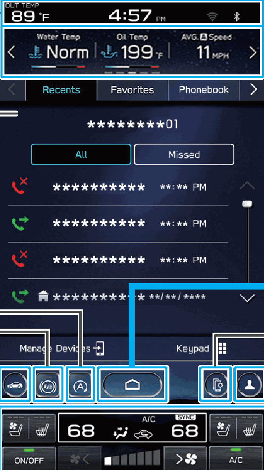

<!-- GENERATED:START function=9ba4dbfb5bfe (generated; edits inside this block are overwritten by the next publish — write your own notes outside it) -->
# 16. Overview

<b>Function path:</b> Quick Guide / Overview <b>Source:</b> printed page 43 <b>Test-ready:</b> no — procedure missing or thresholds unfilled

Every "Presumed requirement" row below is machine-derived from the Owner's Manual text by rule-based extraction — not AI-written — and traceable to the printed page in its Source column.

## Figures (areas of the original PDF; the OM has no figure numbers or captions)

- Figure 16-1 source: p.43
- (Copied from OM) Car settings icon*

## 16-2-1. Service overview

| # | Presumed requirement | Strength | Source |
|---|---|---|---|
| 1 | OverviewStatus bar P.76 TOUCH SCREEN Operations are performed by touching the touch screen directly with your finger. P.71. | capability | p.43 / text |
| 2 | OverviewTurn the knob to adjust the volume. Press the knob to turn the volume mute on/off. Press and hold the knob to turn the audio system off. To turn the audio system on, press and hold the knob again or touch the screen to display and select it. Press and hold the knob for 10 seconds or longer to reset the system if the touch screen becomes unresponsive during operation or if Car settings icon* any other system error occurs. | constraint | p.43 / text |
| 3 | OverviewAuto Vehicle Hold (AVH) ON/OFF icon*. | capability | p.43 / text |
| 4 | OverviewAuto Start Stop ON/OFF icon*. | capability | p.43 / text |
| 5 | OverviewInformation bar* Touch to display the operation screen of the selected category. | capability | p.43 / text |
| 6 | OverviewTurn the knob to select a radio station or skip to the next or previous track/file. Press and hold the knob to display the sound customization screen. P.149 SYSTEM/11.6-INCH. | capability | p.43 / text |
| 7 | OverviewDisplay the home screen. | capability | p.43 / text |
| 8 | OverviewDisplay the manage devices screen. P.46,47. | capability | p.43 / text |
| 9 | OverviewSet a driver profile P.48,92. | capability | p.43 / text |
| 10 | OverviewClimate control screen*. | capability | p.43 / text |
| 11 | Overview*: Refer to the vehicle Owner’s Manual. 43. | capability | p.43 / text |
<!-- GENERATED:END function=9ba4dbfb5bfe -->

