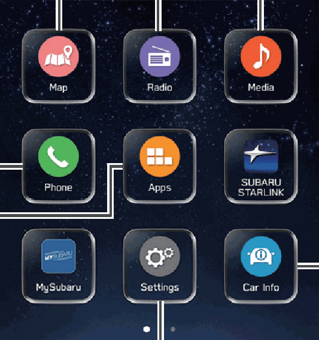
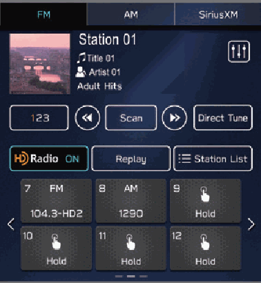
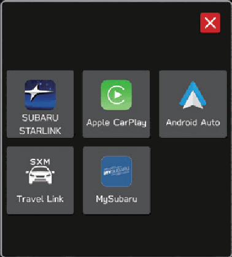
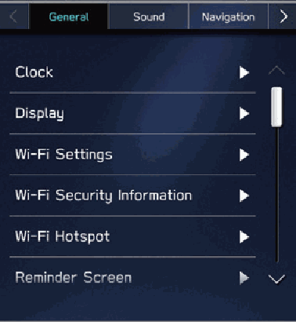
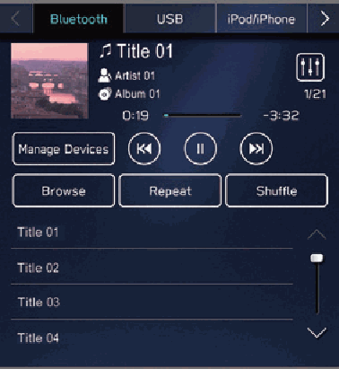
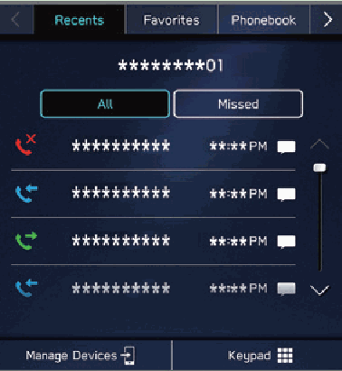
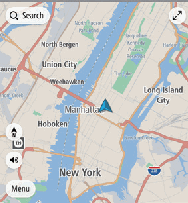
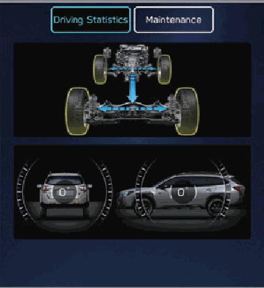
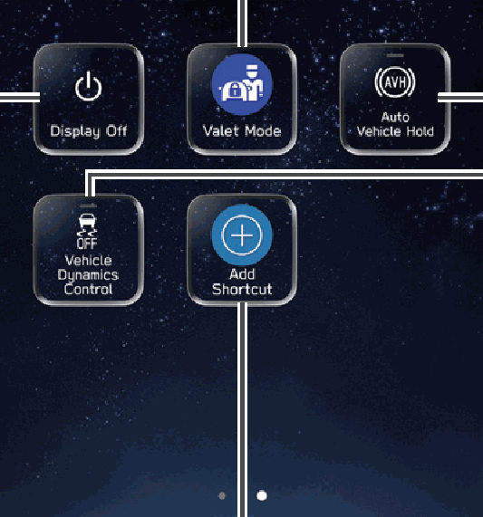
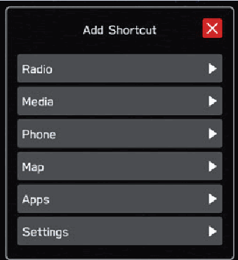

<!-- GENERATED:START function=1173e3d1d4a6 (generated; edits inside this block are overwritten by the next publish — write your own notes outside it) -->
# 17. Home Screen

<b>Function path:</b> Quick Guide / Home Screen <b>Source:</b> printed page 44, 45 <b>Test-ready:</b> no — procedure missing or thresholds unfilled

Every "Presumed requirement" row below is machine-derived from the Owner's Manual text by rule-based extraction — not AI-written — and traceable to the printed page in its Source column.

## Figures (areas of the original PDF; the OM has no figure numbers or captions)

- Figure 17-1 source: p.44
- (Copied from OM) Settings SCREEN

- Figure 17-2 source: p.44
- (Copied from OM) P.56

- Figure 17-3 source: p.44
- (Copied from OM) Apps SCREEN

- Figure 17-4 source: p.44
- (Copied from OM) P.63

- Figure 17-5 source: p.44
- (Copied from OM) Media SCREEN

- Figure 17-6 source: p.44
- (Copied from OM) P.50

- Figure 17-7 source: p.44
- (Copied from OM) **:: IIff eeqquuiippppeedd

- Figure 17-8 source: p.44
- (Copied from OM) P.49

- Figure 17-9 source: p.45
- (Copied from OM) Turn the Auto Vehicle Hold (AVH)

- Figure 17-10 source: p.45
- (Copied from OM) Frequently used functions and operations can be added to

## 17-2-1. Service overview

| # | Presumed requirement | Strength | Source |
|---|---|---|---|
| 1 | Home ScreenMap SCREEN* Radio SCREEN **:: IIff eeqquuiippppeedd. | capability | p.44 / text |
| 2 | Home ScreenPhone SCREEN. | capability | p.44 / text |
| 3 | Home ScreenApps SCREEN Settings SCREEN. | capability | p.44 / text |
| 4 | Home ScreenMedia SCREEN. | capability | p.44 / text |
| 5 | Home ScreenP.58 P.56. | capability | p.44 / text |
| 6 | Home ScreenCar information SCREEN. | capability | p.44 / text |
| 7 | Home ScreenWhile Apple CarPlay or Android Auto is being used, an Apple CarPlay or Android Auto icon will be displayed on the home screen. P.129,133. | capability | p.44 / text |
| 8 | Home ScreenValet Mode. | capability | p.45 / text |
| 9 | Home ScreenRefer to the vehicle Owner’s Manual. | capability | p.45 / text |
| 10 | Home ScreenTurn the display off. To turn the display on, press and hold the “ ” knob or touch the screen to display and select it. | capability | p.45 / text |
| 11 | Home ScreenAdd Shortcut. | capability | p.45 / text |
| 12 | Home ScreenFrequently used functions and operations can be added to the home screen. P.77 Button positions can be changed freely. P.78. | capability | p.45 / text |
| 13 | Home ScreenTurn the Auto Vehicle Hold (AVH) system on/off. Refer to the vehicle Owner’s Manual. | capability | p.45 / text |
| 14 | Home ScreenTurn the Vehicle Dynamics Control system on/off. Refer to the vehicle Owner’s Manual. | capability | p.45 / text |
<!-- GENERATED:END function=1173e3d1d4a6 -->

