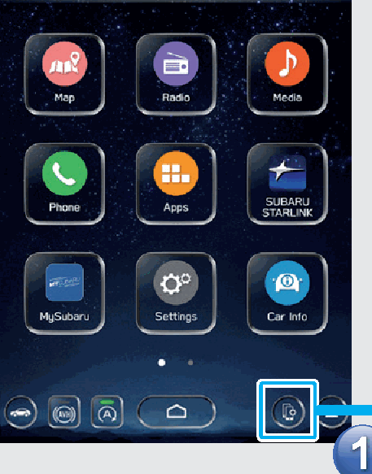
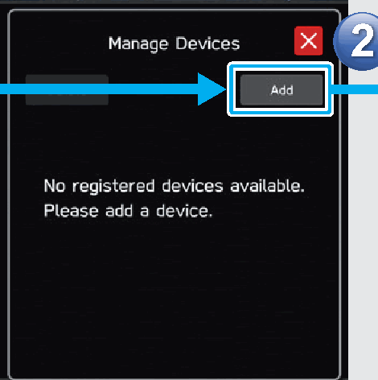
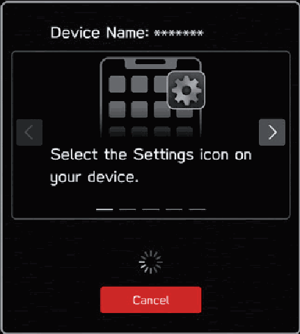
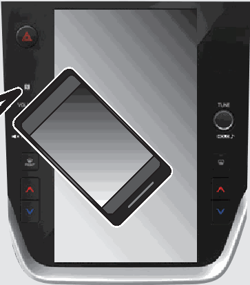

<!-- GENERATED:START function=f7cb3194f8a8 (generated; edits inside this block are overwritten by the next publish — write your own notes outside it) -->
# 18. With A Bluetooth Phone/Device

<b>Function path:</b> Quick Guide / With A Bluetooth Phone/Device <b>Source:</b> printed page 46 <b>Test-ready:</b> no — procedure missing or thresholds unfilled

Every "Presumed requirement" row below is machine-derived from the Owner's Manual text by rule-based extraction — not AI-written — and traceable to the printed page in its Source column.

## Figures (areas of the original PDF; the OM has no figure numbers or captions)

- Figure 18-1 source: p.46
- (Copied from OM) Prepare the

- Figure 18-2 source: p.46
- (Copied from OM) Operate the Bluetooth phone/device.

- Figure 18-3 source: p.46
- (Copied from OM) Follow instructions

- Figure 18-4 source: p.46
- (Copied from OM) When using an NFC compatible device, it is not necessary to perform the above

## 18-2-1. Service overview

| # | Presumed requirement | Strength | Source |
|---|---|---|---|
| 1 | With A Bluetooth Phone/DeviceDisplay the manage Operate the Bluetooth phone/device. devices screen. | capability | p.46 / text |
| 2 | With A Bluetooth Phone/DeviceFollow instructions displayed to operate the Prepare the Bluetooth phone/device. Bluetooth phone/ device to be paired. | capability | p.46 / text |
| 3 | With A Bluetooth Phone/DeviceWhen using an NFC compatible device, it is not necessary to perform the above procedure. Pairing can be performed by holding the device against the NFC logo of the audio system with the NFC setting on. | capability | p.46 / text |
| 4 | With A Bluetooth Phone/DeviceRegister the Bluetooth phone/ device. If a confirmation message appears asking whether to transfer the phone’s contact data to the system, select the appropriate button. | constraint | p.46 / text |
| 5 | With A Bluetooth Phone/DeviceIf unable to pair, check whether your Bluetooth phone/device is compatible with the system. | capability | p.46 / text |
<!-- GENERATED:END function=f7cb3194f8a8 -->

