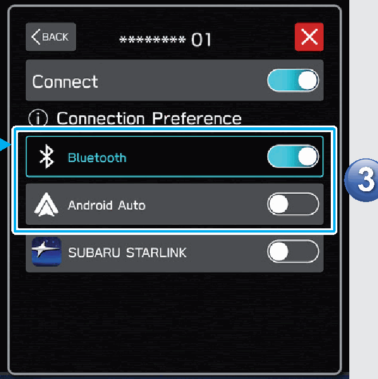
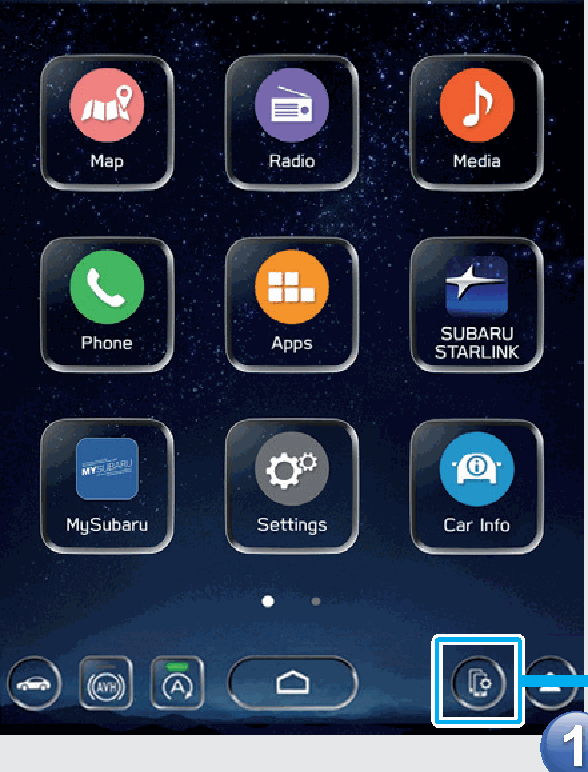
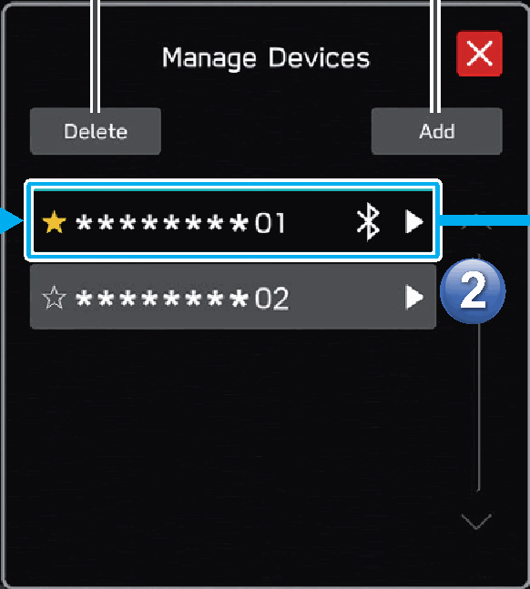

<!-- GENERATED:START function=19219705fa35 (generated; edits inside this block are overwritten by the next publish — write your own notes outside it) -->
# 19. Managing A Bluetooth Phone/Device

<b>Function path:</b> Quick Guide / Managing A Bluetooth Phone/Device <b>Source:</b> printed page 47 <b>Test-ready:</b> no — procedure missing or thresholds unfilled

Every "Presumed requirement" row below is machine-derived from the Owner's Manual text by rule-based extraction — not AI-written — and traceable to the printed page in its Source column.

## Figures (areas of the original PDF; the OM has no figure numbers or captions)

- Figure 19-1 source: p.47
- (Copied from OM) function.

- Figure 19-2 source: p.47
- (Copied from OM) screen.

- Figure 19-3 source: p.47
- (Copied from OM) Delete the device

## 19-2-1. Service overview

| # | Presumed requirement | Strength | Source |
|---|---|---|---|
| 1 | Managing A Bluetooth Phone/DeviceDisplay the manage devices screen. | capability | p.47 / text |
| 2 | Managing A Bluetooth Phone/DeviceSelect a device Select to enable/disable the function. | capability | p.47 / text |
| 3 | Managing A Bluetooth Phone/DeviceDelete the device Add the device. | capability | p.47 / text |
<!-- GENERATED:END function=19219705fa35 -->

