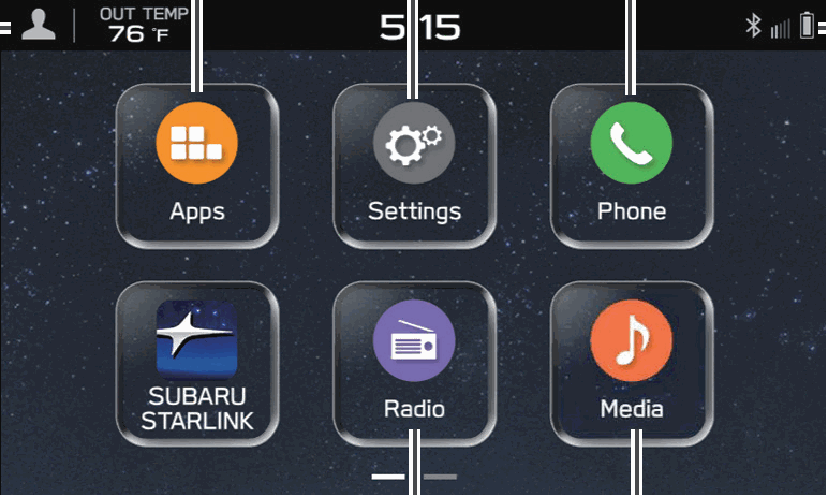
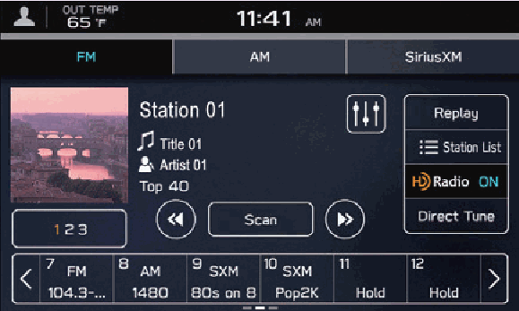
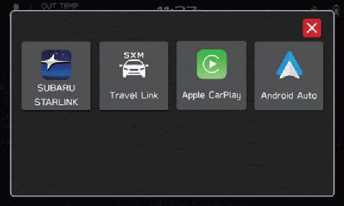
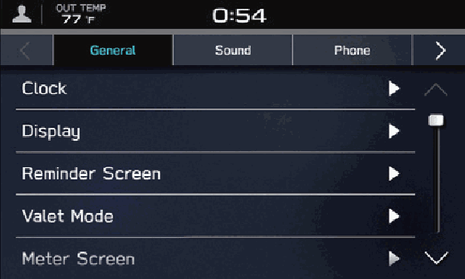
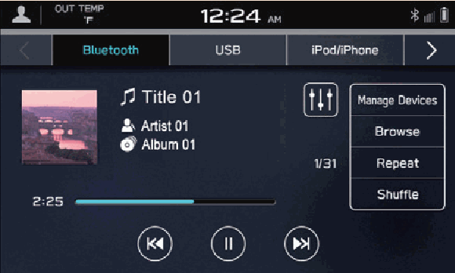
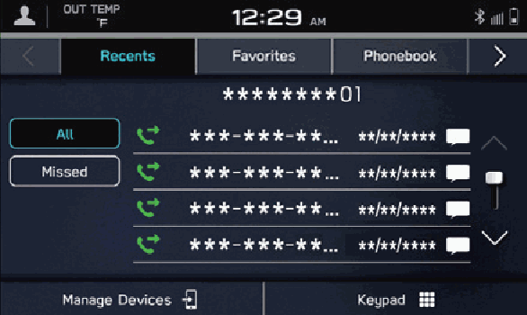
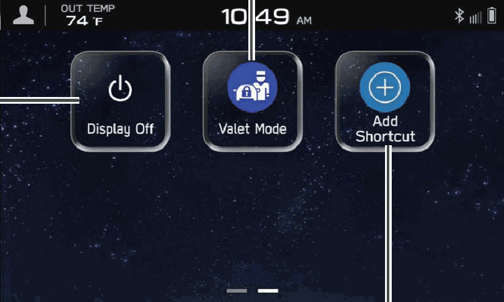
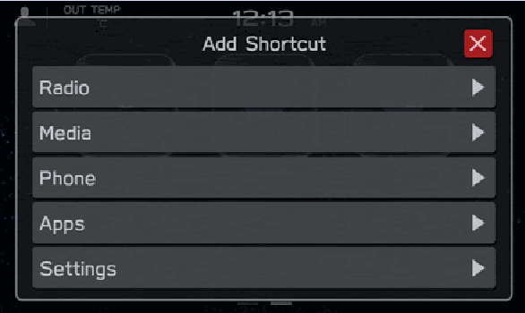

<!-- GENERATED:START function=1173e3d1d4a6 (generated; edits inside this block are overwritten by the next publish — write your own notes outside it) -->
# 2. Home Screen

<b>Function path:</b> Quick Guide / Home Screen <b>Source:</b> printed page 20, 21 <b>Test-ready:</b> no — procedure missing or thresholds unfilled

Every "Presumed requirement" row below is machine-derived from the Owner's Manual text by rule-based extraction — not AI-written — and traceable to the printed page in its Source column.

## Figures (areas of the original PDF; the OM has no figure numbers or captions)

- Figure 2-1 source: p.20
- (Copied from OM) Status bar P.76

- Figure 2-2 source: p.20
- (Copied from OM) P.32

- Figure 2-3 source: p.20
- (Copied from OM) P.29

- Figure 2-4 source: p.20
- (Copied from OM) P.36

- Figure 2-5 source: p.20
- (Copied from OM) P.34

- Figure 2-6 source: p.20
- (Copied from OM) P.26

- Figure 2-7 source: p.21
- (Copied from OM) Refer to the vehicle Owner’s Manual.

- Figure 2-8 source: p.21
- (Copied from OM) Frequently used functions and operations can be added to the home screen. P.77

## 2-2-1. Service overview

| # | Presumed requirement | Strength | Source |
|---|---|---|---|
| 1 | Home ScreenApps SCREEN Settings SCREEN Phone SCREEN. | capability | p.20 / text |
| 2 | Home ScreenP.29 P.36. | capability | p.20 / text |
| 3 | Home ScreenSet a driver profile Status bar P.76 P.25,92. | capability | p.20 / text |
| 4 | Home ScreenRadio SCREEN Media SCREEN While Apple CarPlay or Android Auto is being used, an Apple CarPlay or Android Auto icon will be displayed on the home screen. P.129,133. | capability | p.20 / text |
| 5 | Home ScreenP.32 P.34. | capability | p.20 / text |
| 6 | Home ScreenTurn the display off. To turn the display on, press and hold the “ ” knob or press. | capability | p.21 / text |
| 7 | Home ScreenAdd Shortcut. | capability | p.21 / text |
| 8 | Home ScreenValet Mode. | capability | p.21 / text |
| 9 | Home ScreenRefer to the vehicle Owner’s Manual. | capability | p.21 / text |
| 10 | Home ScreenFrequently used functions and operations can be added to the home screen. P.77 Button positions can be changed freely. P.78. | capability | p.21 / text |
<!-- GENERATED:END function=1173e3d1d4a6 -->

