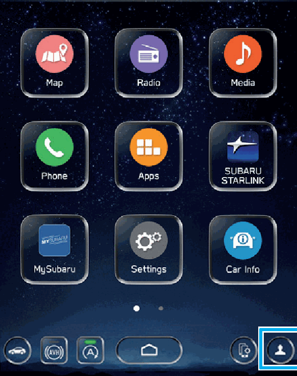
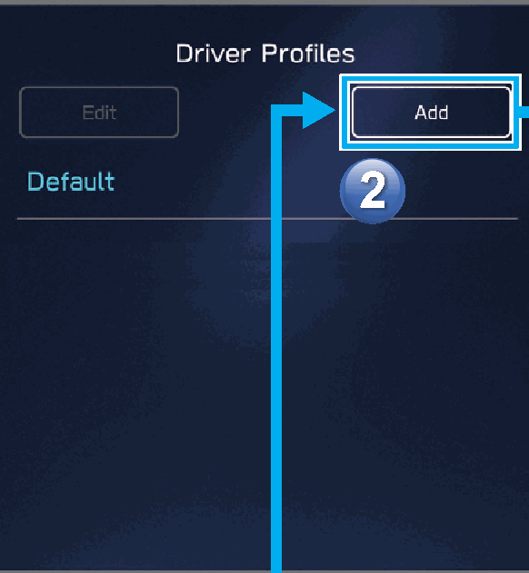
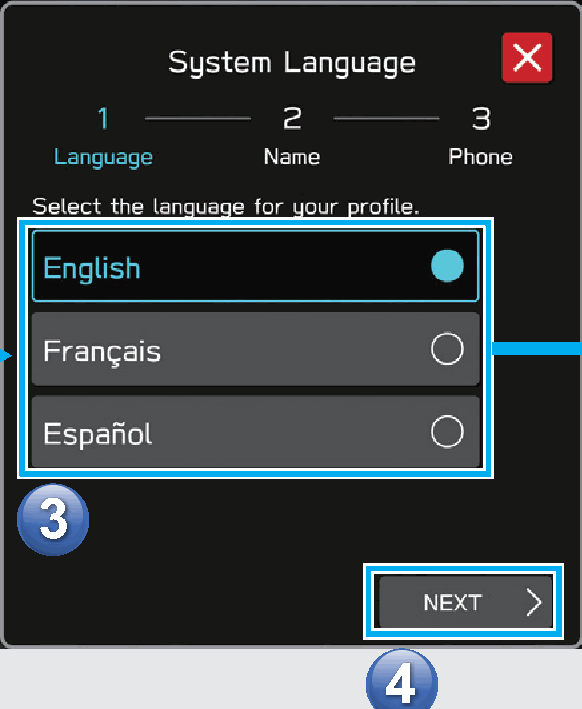
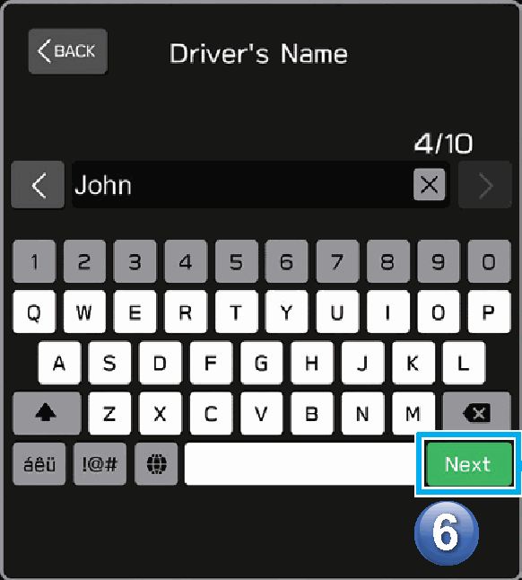
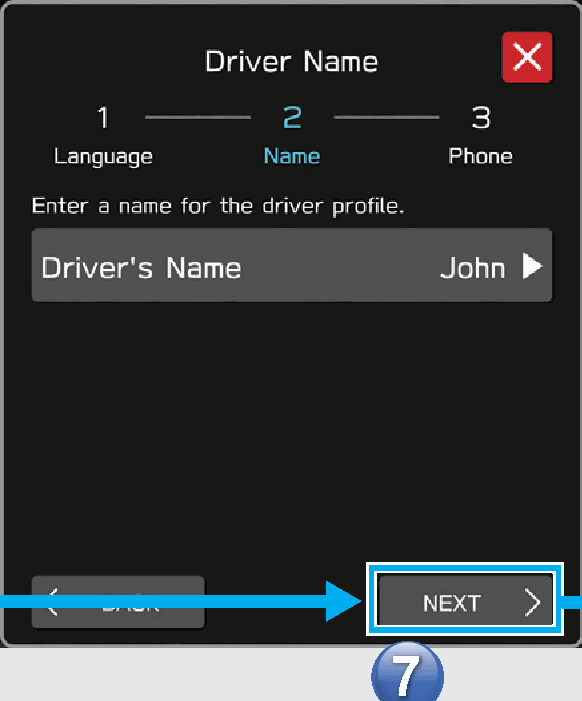
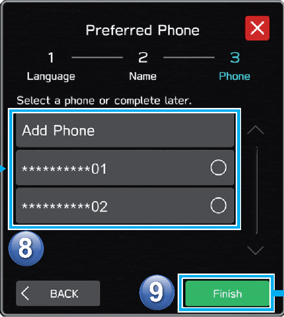
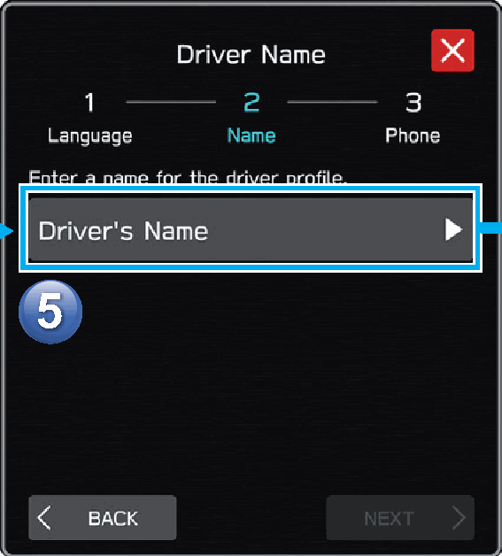

<!-- GENERATED:START function=2832a4dfdb0f (generated; edits inside this block are overwritten by the next publish — write your own notes outside it) -->
# 20. Create A Driver Profile

<b>Function path:</b> Quick Guide / Create A Driver Profile <b>Source:</b> printed page 48 <b>Test-ready:</b> no — procedure missing or thresholds unfilled

Every "Presumed requirement" row below is machine-derived from the Owner's Manual text by rule-based extraction — not AI-written — and traceable to the printed page in its Source column.

## Figures (areas of the original PDF; the OM has no figure numbers or captions)

- Figure 20-1 source: p.48
- (Copied from OM) Add a new profile.

- Figure 20-2 source: p.48
- (Copied from OM) Registering a Bluetooth phone

- Figure 20-3 source: p.48
- (Copied from OM) Select a language.

- Figure 20-4 source: p.48
- (Copied from OM) Enter a name.

- Figure 20-5 source: p.48
- (Copied from OM) Registering a Bluetooth phone

- Figure 20-6 source: p.48
- (Copied from OM) Procedure complete.

- Figure 20-7 source: p.48
- (Copied from OM) Procedure complete.

## 20-2-1. Service overview

| # | Presumed requirement | Strength | Source |
|---|---|---|---|
| 1 | Create A Driver ProfileAdd a new profile. | capability | p.48 / text |
| 2 | Create A Driver ProfileEnter a name. | capability | p.48 / text |
| 3 | Create A Driver ProfileSelect a language. | capability | p.48 / text |
| 4 | Create A Driver ProfileRegistering a Bluetooth phone. | capability | p.48 / text |
| 5 | Create A Driver ProfileProcedure complete. | capability | p.48 / text |
<!-- GENERATED:END function=2832a4dfdb0f -->

