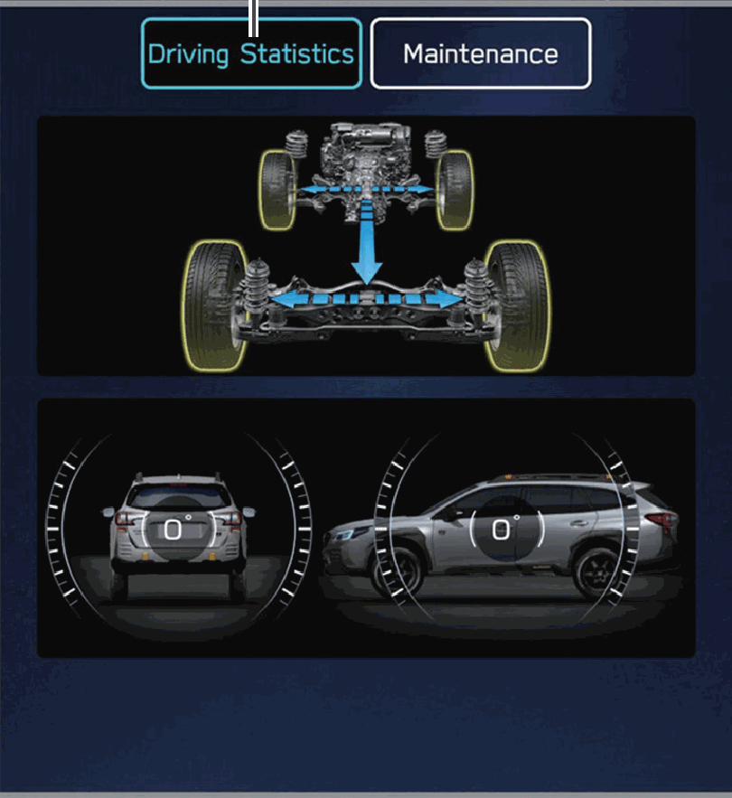
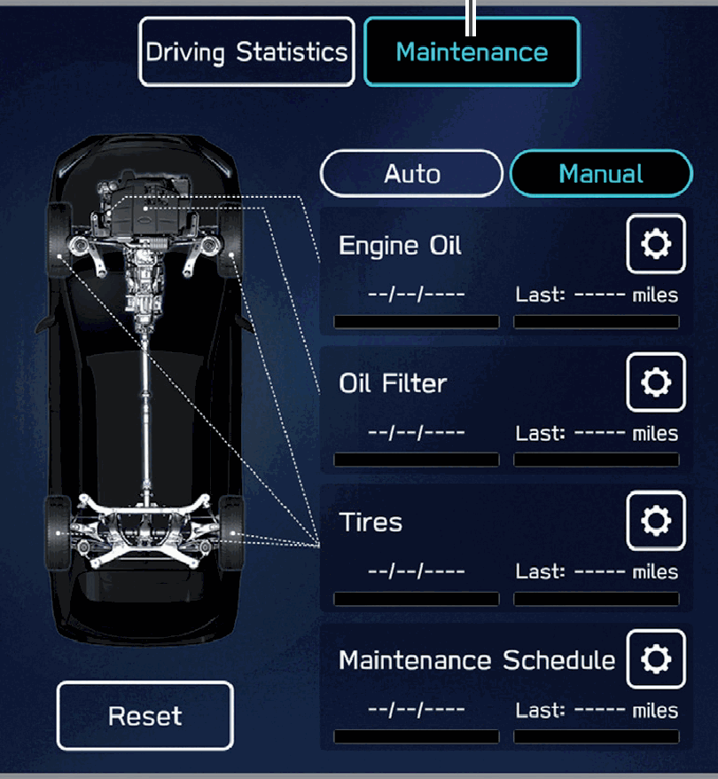

<!-- GENERATED:START function=0b641309a1c2 (generated; edits inside this block are overwritten by the next publish — write your own notes outside it) -->
# 21. Car Information Screen

<b>Function path:</b> Quick Guide / Car Information Screen <b>Source:</b> printed page 49 <b>Test-ready:</b> no — procedure missing or thresholds unfilled

Every "Presumed requirement" row below is machine-derived from the Owner's Manual text by rule-based extraction — not AI-written — and traceable to the printed page in its Source column.

## Figures (areas of the original PDF; the OM has no figure numbers or captions)

- Figure 21-1 source: p.49
- (Copied from OM) Refer to the vehicle Owner’s Manual.

- Figure 21-2 source: p.49
- (Copied from OM) Refer to the vehicle Owner’s Manual.

## 21-2-1. Service overview

| # | Presumed requirement | Strength | Source |
|---|---|---|---|
| 1 | Car Information ScreenDisplays the operating status of vehicle functions, vehicle status, and vehicle inclination. Refer to the vehicle Owner’s Manual. | capability | p.49 / text |
| 2 | Car Information ScreenSetup and display vehicle part replacement intervals. Refer to the vehicle Owner’s Manual. | capability | p.49 / text |
<!-- GENERATED:END function=0b641309a1c2 -->

