<!-- GENERATED:START function=8bf55f4a280a (generated; edits inside this block are overwritten by the next publish — write your own notes outside it) -->
# 25. Map SCREEN*

<b>Function path:</b> Quick Guide / Map SCREEN* <b>Source:</b> printed page 54, 55 <b>Test-ready:</b> no — procedure missing or thresholds unfilled

Every "Presumed requirement" row below is machine-derived from the Owner's Manual text by rule-based extraction — not AI-written — and traceable to the printed page in its Source column.

## Figures (areas of the original PDF; the OM has no figure numbers or captions)
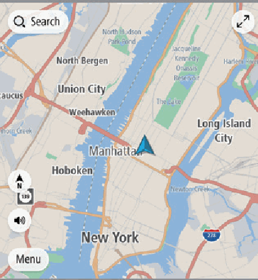
- Figure 25-1 source: p.54
- (Copied from OM) 2D North-up screen

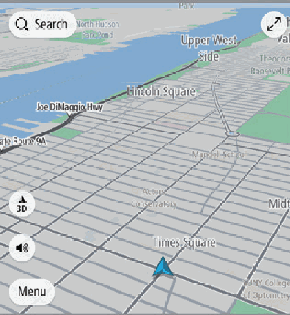
- Figure 25-2 source: p.54
- (Copied from OM) 3D Heading-up screen 2D Heading-up screen

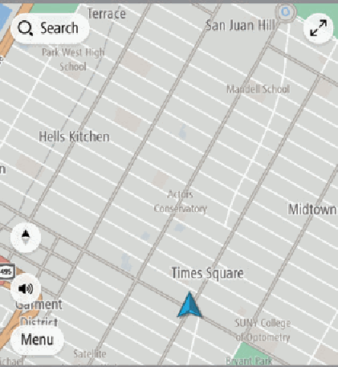
- Figure 25-3 source: p.54
- (Copied from OM) Speed limit

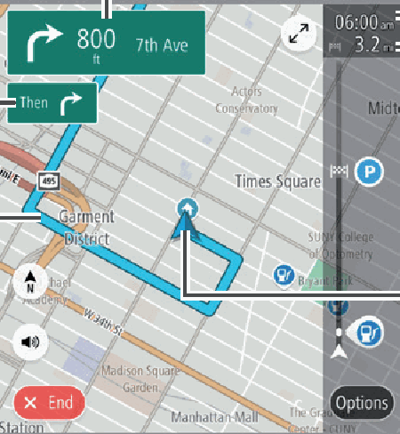
- Figure 25-4 source: p.54
- (Copied from OM) Remaining distance and/ or remaining time Current position

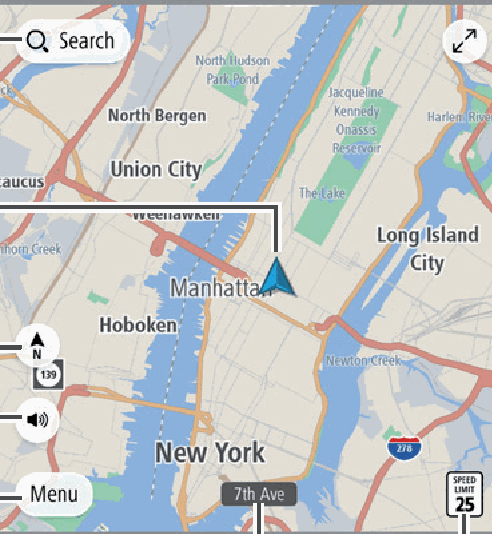
- Figure 25-5 source: p.54
- (Copied from OM) Current street

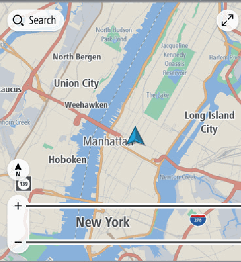
- Figure 25-6 source: p.54
- (Copied from OM) Touch screen to display

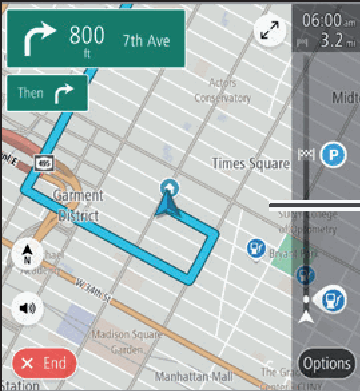
- Figure 25-7 source: p.55
- (Copied from OM) The travel route is displayed,

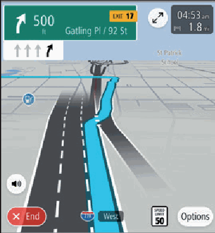
- Figure 25-8 source: p.55
- (Copied from OM) JUNCTION SCREEN

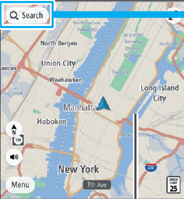
- Figure 25-9 source: p.55
- (Copied from OM) search menu.

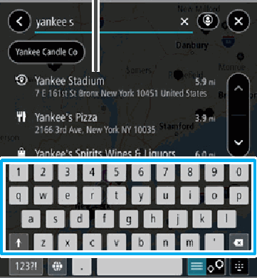
- Figure 25-10 source: p.55
- (Copied from OM) Route guidance starts.

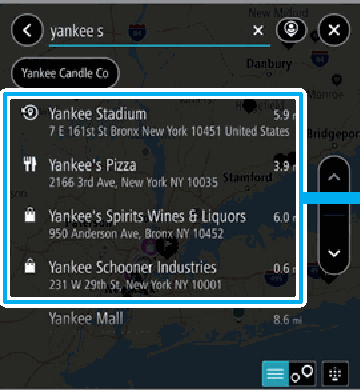
- Figure 25-11 source: p.55
- (Copied from OM) Destinations matching the

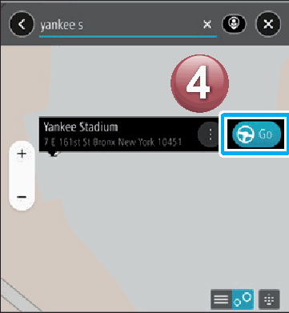
- Figure 25-12 source: p.55
- (Copied from OM) Start driving.

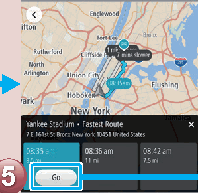
- Figure 25-13 source: p.55
- (Copied from OM) POI, etc.

## 25-2-1. Service overview

| # | Presumed requirement | Strength | Source |
|---|---|---|---|
| 1 | Map SCREEN*CURRENT POSITION MAP Search by address, category, POI, etc. | capability | p.54 / text |
| 2 | Map SCREEN*Current vehicle position (facing direction of travel). | capability | p.54 / text |
| 3 | Map SCREEN*Voice guidance enable/disable Menu button Touch screen to display Current street automatically hidden Speed limit buttons. P.197. | capability | p.54 / text |
| 4 | Map SCREEN*ROUTE GUIDANCE SCREEN The orientation of the map can be changed between 2D north-up, 3D heading-up and 2D heading-up. P.199 Distance to the next turn, an arrow indicating the turning direction and next street name. | capability | p.54 / text |
| 5 | Map SCREEN*Guidance display after next Guidance route. | capability | p.54 / text |
| 6 | Map SCREEN*3D Heading-up screen 2D Heading-up screen 2D North-up screen. | capability | p.54 / text |
| 7 | Map SCREEN*Zoom in Zoom out. | capability | p.54 / text |
| 8 | Map SCREEN**: If equipped. | constraint | p.54 / text |
| 9 | Map SCREEN*Estimated time of arrival. | capability | p.54 / text |
| 10 | Map SCREEN*Remaining distance and/ or remaining time. | capability | p.54 / text |
| 11 | Map SCREEN*Current position. | capability | p.54 / text |
| 12 | Map SCREEN*Route guidance P.212. | capability | p.54 / text |
| 13 | Map SCREEN*Display the destination search menu. | capability | p.55 / text |
| 14 | Map SCREEN*Destinations can also be set directly from the Map screen by selecting and holding at the desired position until is displayed. | capability | p.55 / text |
| 15 | Map SCREEN*Start driving. | capability | p.55 / text |
| 16 | Map SCREEN*Search for your destination. Select your destination. | capability | p.55 / text |
| 17 | Map SCREEN*Predicted search results will automatically appear as you type. | capability | p.55 / text |
| 18 | Map SCREEN*Start a search by typing an address, category, Destinations matching the POI, etc. search words are displayed in a list. | capability | p.55 / text |
| 19 | Map SCREEN*The screen display Route guidance starts. automatically changes to display travel lanes at expressway junctions, etc. P.213 JUNCTION SCREEN RETURNING HOME If you register an address as Home, it The travel route is displayed, can be quickly set as a destination. and voice guidance starts. | constraint | p.55 / text |
| 20 | Map SCREEN*Register an address as Home P.209 Setting Home as the destination P.205 55. | capability | p.55 / text |
<!-- GENERATED:END function=8bf55f4a280a -->

