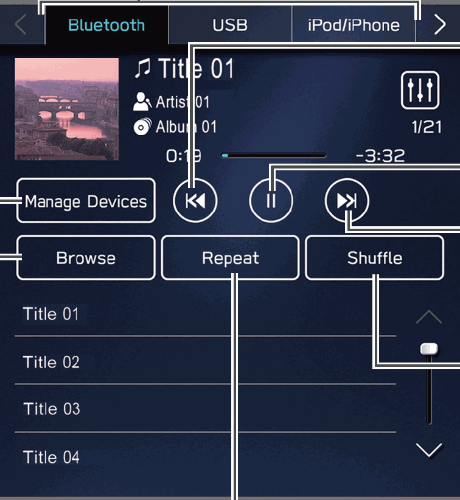

<!-- GENERATED:START function=211f8d68a425 (generated; edits inside this block are overwritten by the next publish — write your own notes outside it) -->
# 26. Media Screen

<b>Function path:</b> Quick Guide / Media Screen <b>Source:</b> printed page 58 <b>Test-ready:</b> no — procedure missing or thresholds unfilled

Every "Presumed requirement" row below is machine-derived from the Owner's Manual text by rule-based extraction — not AI-written — and traceable to the printed page in its Source column.

## Figures (areas of the original PDF; the OM has no figure numbers or captions)

- Figure 26-1 source: p.58
- (Copied from OM) Change tracks

## 26-2-1. Service overview

| # | Presumed requirement | Strength | Source |
|---|---|---|---|
| 1 | Media ScreenChange media source Change to other Bluetooth audio device/ register new device Change tracks (Bluetooth audio) Select and hold to fast rewind. | capability | p.58 / text |
| 2 | Media ScreenPause/play. | capability | p.58 / text |
| 3 | Media ScreenChange tracks Playback tracks and Select and hold to fast programs, etc. in a forward variety of playback modes Random playback on/off. | capability | p.58 / text |
| 4 | Media ScreenAudio CDs*1: Repeat all tracks → repeat current track → cancel repeat Media other than audio CDs: Repeat all tracks*2 → repeat current album/ folder → repeat current track → cancel repeat. | capability | p.58 / text |
| 5 | Media ScreenCD*1 P.187 USB/iPod/iPhone P.190 Bluetooth audio P.81. | capability | p.58 / text |
| 6 | Media Screen*1: If equipped with a CD player *2: Operable when USB Audio is used and Folders (Folders) is selected from (Browse). | constraint | p.58 / text |
<!-- GENERATED:END function=211f8d68a425 -->

