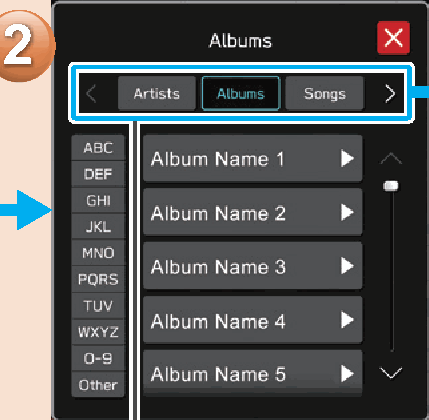
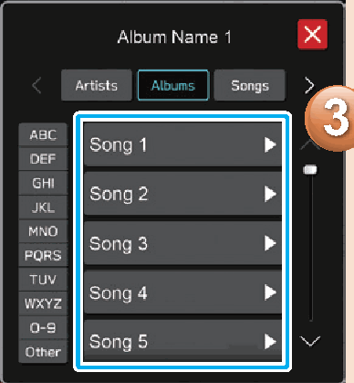

<!-- GENERATED:START function=c7354a95c02b (generated; edits inside this block are overwritten by the next publish — write your own notes outside it) -->
# 28. Portable Device

<b>Function path:</b> Quick Guide / Portable Device <b>Source:</b> printed page 59 <b>Test-ready:</b> no — procedure missing or thresholds unfilled

Every "Presumed requirement" row below is machine-derived from the Owner's Manual text by rule-based extraction — not AI-written — and traceable to the printed page in its Source column.

## Figures (areas of the original PDF; the OM has no figure numbers or captions)

- Figure 28-1 source: p.59
- (Copied from OM) Select the playback mode.

- Figure 28-2 source: p.59
- (Copied from OM) DISPLAY

## 28-2-1. Service overview

| # | Presumed requirement | Strength | Source |
|---|---|---|---|
| 1 | Portable Device*: If equipped with a CD player. | constraint | p.59 / text |
| 2 | Portable DeviceSelect the playback mode. Play a track. | capability | p.59 / text |
| 3 | Portable DeviceDepending on the audio source, several items from these categories are displayed in a list. | capability | p.59 / text |
<!-- GENERATED:END function=c7354a95c02b -->

