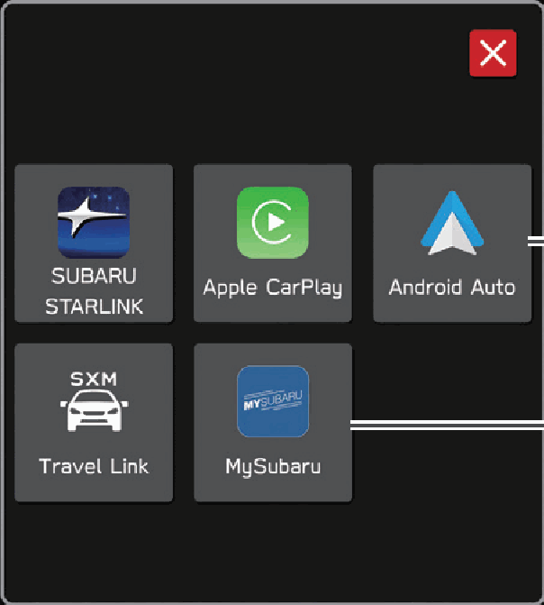
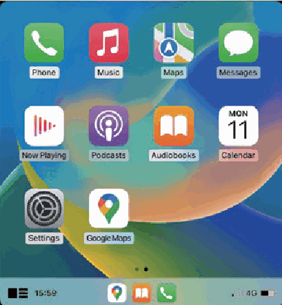
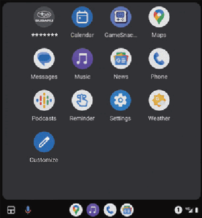
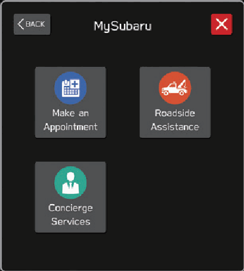
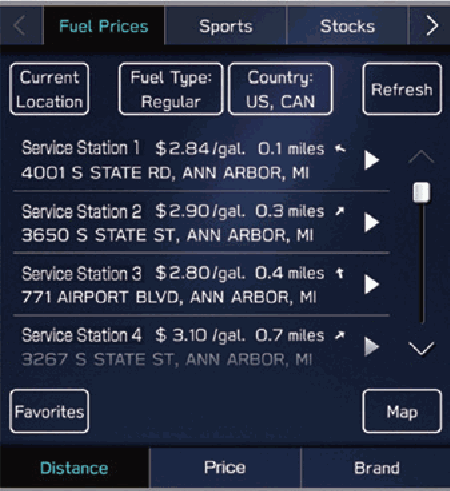
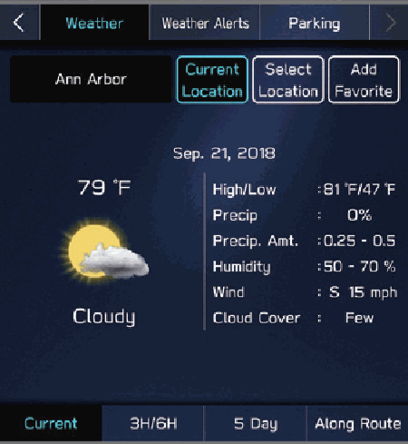
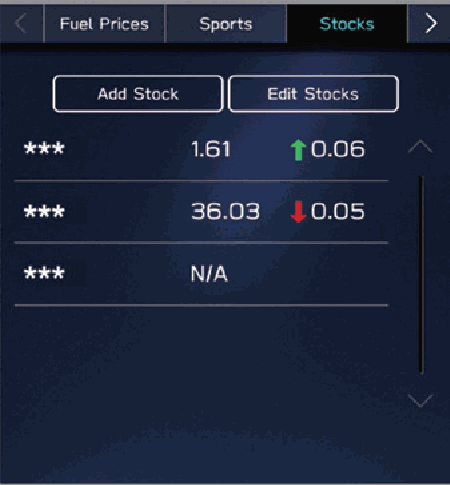
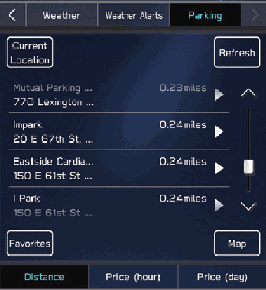
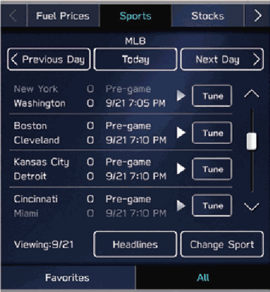
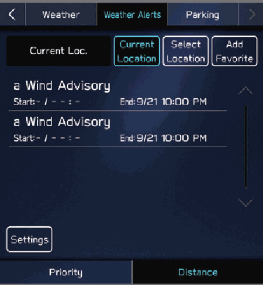

<!-- GENERATED:START function=ff44f90fa2b7 (generated; edits inside this block are overwritten by the next publish — write your own notes outside it) -->
# 29. Apps Screen

<b>Function path:</b> Quick Guide / Apps Screen <b>Source:</b> printed page 60, 61, 62 <b>Test-ready:</b> no — procedure missing or thresholds unfilled

Every "Presumed requirement" row below is machine-derived from the Owner's Manual text by rule-based extraction — not AI-written — and traceable to the printed page in its Source column.

## Figures (areas of the original PDF; the OM has no figure numbers or captions)

- Figure 29-1 source: p.60
- (Copied from OM) Usable

- Figure 29-2 source: p.60
- (Copied from OM) Apple CarPlay

- Figure 29-3 source: p.61
- (Copied from OM) MySubaru

- Figure 29-4 source: p.61
- (Copied from OM) MySubaru

- Figure 29-5 source: p.62
- (Copied from OM) Fuel prices

- Figure 29-6 source: p.62
- (Copied from OM) Weather

- Figure 29-7 source: p.62
- (Copied from OM) Stocks

- Figure 29-8 source: p.62
- (Copied from OM) Parking

- Figure 29-9 source: p.62
- (Copied from OM) Sports

- Figure 29-10 source: p.62
- (Copied from OM) Weather alerts

## 29-2-1. Service overview

| # | Presumed requirement | Strength | Source |
|---|---|---|---|
| 1 | Apps ScreenApple CarPlay. | capability | p.60 / text |
| 2 | Apps ScreenApple CarPlay can be used to view Apple Maps, play music, and place calls by connecting an Apple CarPlay device to the system. Supported applications can also be run. | capability | p.60 / text |
| 3 | Apps ScreenTo use the Apple CarPlay application, connect an Apple CarPlay device to the system wirelessly. P.129. | capability | p.60 / text |
| 4 | Apps ScreenFor details on the services or the operations, check the Apple CarPlay site (https://www.apple.com/ios/carplay/). | capability | p.60 / text |
| 5 | Apps ScreenUsable applications. | capability | p.60 / text |
| 6 | Apps ScreenMySubaru. | capability | p.61 / text |
| 7 | Apps ScreenAndroid Auto can be used to view Google Maps, play music, and place calls by connecting an Android Auto device to the system. Supported applications can also be run. | capability | p.61 / text |
| 8 | Apps ScreenTo use the Android Auto application, connect an Android Auto device to the system wirelessly. P.133. | capability | p.61 / text |
| 9 | Apps ScreenFor details on the services or the operations, check the Android Auto site (https://www.android.com/auto/) and (https://support.google.com/androidauto/). | capability | p.61 / text |
| 10 | Apps ScreenAccess MySubaru from “SUBARU STARLINK Safety and Security” for a variety of remote services. | capability | p.61 / text |
| 11 | Apps ScreenRefer to the Owner’s Manual supplement for “SUBARU STARLINK Safety and Security” for details. | capability | p.61 / text |
| 12 | Apps ScreenSiriusXM Travel Link is a service provided by SiriusXM® Radio, and can be used to view information on fuel prices, sports, stocks, weather, weather alerts and parking. P.137 To receive the data service information in the vehicle, a subscription to the SiriusXM® Radio Service is necessary following a free trial. P.161. | capability | p.62 / text |
| 13 | Apps ScreenFuel prices Sports. | capability | p.62 / text |
| 14 | Apps ScreenWeather Weather alerts. | capability | p.62 / text |
<!-- GENERATED:END function=ff44f90fa2b7 -->

