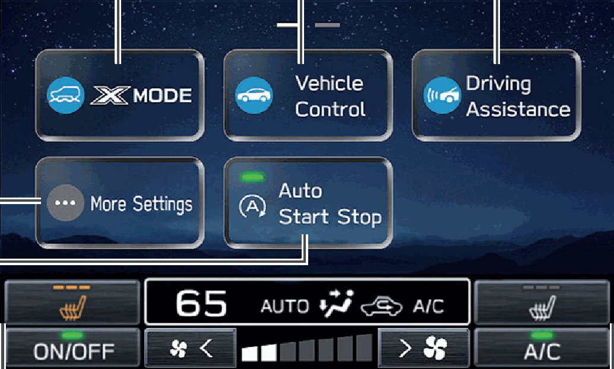
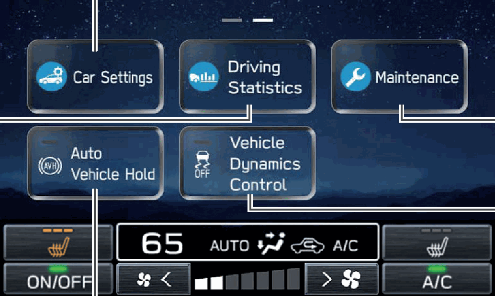

<!-- GENERATED:START function=3a27b00af556 (generated; edits inside this block are overwritten by the next publish — write your own notes outside it) -->
# 3. Car Information/Climate Control Screen

<b>Function path:</b> Quick Guide / Car Information/Climate Control Screen <b>Source:</b> printed page 22 <b>Test-ready:</b> no — procedure missing or thresholds unfilled

Every "Presumed requirement" row below is machine-derived from the Owner's Manual text by rule-based extraction — not AI-written — and traceable to the printed page in its Source column.

## Figures (areas of the original PDF; the OM has no figure numbers or captions)

- Figure 3-1 source: p.22
- (Copied from OM) Displays the operating status of

- Figure 3-2 source: p.22
- (Copied from OM) Turn the Auto Vehicle Hold (AVH) system on/off.

## 3-2-1. Service overview

| # | Presumed requirement | Strength | Source |
|---|---|---|---|
| 1 | Car Information/Climate Control ScreenThe settings of driving related functions etc. can be changed. Refer to the vehicle Owner’s Manual. | capability | p.22 / text |
| 2 | Car Information/Climate Control ScreenDisplays the operating status of climate control. Refer to the vehicle Owner’s Manual. | capability | p.22 / text |
| 3 | Car Information/Climate Control ScreenTurn the Auto Start Stop system on/off. Refer to the vehicle Owner’s Manual. | capability | p.22 / text |
| 4 | Car Information/Climate Control ScreenThe settings of various vehicle related functions can be changed. For settings related to EyeSight, refer to the Owner’s Manual supplement for the EyeSight system. For all other functions and settings, refer to the vehicle Owner’s Manual. | capability | p.22 / text |
| 5 | Car Information/Climate Control ScreenTurn the Auto Vehicle Hold (AVH) system on/off. Refer to the vehicle Owner’s Manual. | capability | p.22 / text |
| 6 | Car Information/Climate Control ScreenTurn the Vehicle Dynamics Control system on/off. Refer to the vehicle Owner’s Manual. | capability | p.22 / text |
| 7 | Car Information/Climate Control ScreenSetup and display vehicle part replacement intervals. Refer to the vehicle Owner’s Manual. | capability | p.22 / text |
| 8 | Car Information/Climate Control ScreenDisplays the operating status of vehicle functions, vehicle status, and vehicle inclination. Refer to the vehicle Owner’s Manual. | capability | p.22 / text |
<!-- GENERATED:END function=3a27b00af556 -->

