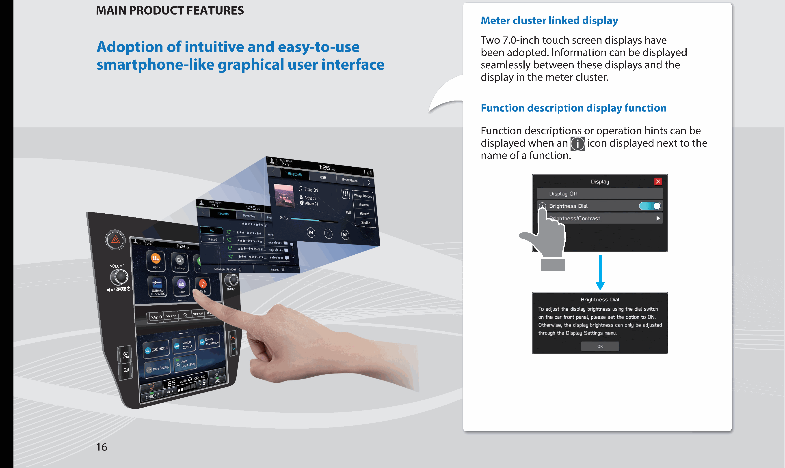

<!-- GENERATED:START function=72c89a57d747 (generated; edits inside this block are overwritten by the next publish — write your own notes outside it) -->
# 3. FUNCTION OVERVIEW

<b>Function path:</b> Quick Guide / FUNCTION OVERVIEW <b>Source:</b> printed page 15 <b>Test-ready:</b> no — procedure missing or thresholds unfilled

Every "Presumed requirement" row below is machine-derived from the Owner's Manual text by rule-based extraction — not AI-written — and traceable to the printed page in its Source column.

## Figures (areas of the original PDF; the OM has no figure numbers or captions)

- Figure 3-1 source: p.15
- (Copied from OM) Features: - Two 7.0-inch touch screens

- Figure 3-2 source: p.16
- (Copied from OM) Adoption of intuitive and easy-to-use smartphone-like graphical user interface name of a function. Two 7.0-inch touch screen displays have been adopted. Information can be displayed seamlessly between these displays and the display in the meter cluster. Function description display function Function descriptions or operation hints can be displayed when an

## 3-2-1. Service overview

| # | Presumed requirement | Strength | Source |
|---|---|---|---|
| 1 | FUNCTION OVERVIEWFeatures: - Two 7.0-inch touch screens. | capability | p.15 / text |
| 2 | FUNCTION OVERVIEW7.0-inch touch screen. | capability | p.15 / text |
| 3 | FUNCTION OVERVIEW7.0-inch touch screen. | capability | p.15 / text |
| 4 | FUNCTION OVERVIEWMAIN FUNCTIONS. | capability | p.15 / text |
| 5 | FUNCTION OVERVIEWP.23 Pairing (Bluetooth 4.2). | capability | p.15 / text |
| 6 | FUNCTION OVERVIEWP.29 Apps. | capability | p.15 / text |
| 7 | FUNCTION OVERVIEWP.129 Apple CarPlay. | capability | p.15 / text |
| 8 | FUNCTION OVERVIEWP.133 Android Auto. | capability | p.15 / text |
| 9 | FUNCTION OVERVIEWAM/FM radio P.32. | capability | p.15 / text |
| 10 | FUNCTION OVERVIEWHD Radio receiver P.155. | capability | p.15 / text |
| 11 | FUNCTION OVERVIEWSiriusXM® radio P.33. | capability | p.15 / text |
| 12 | FUNCTION OVERVIEWCD*: P.165 USB: P.167 iPod/iPhone: P.169 Media operation Bluetooth audio: P.172 AUX: P.176. | capability | p.15 / text |
| 13 | FUNCTION OVERVIEWPhone P.26. | capability | p.15 / text |
| 14 | FUNCTION OVERVIEWVoice recognition system P.228. | capability | p.15 / text |
| 15 | FUNCTION OVERVIEWValet mode P.18. | capability | p.15 / text |
| 16 | FUNCTION OVERVIEWSteering wheel controls P.38. | capability | p.15 / text |
| 17 | FUNCTION OVERVIEWRear view camera. | capability | p.15 / text |
| 18 | FUNCTION OVERVIEWCar settings/informations Refer to the vehicle Owner’s Manual. | capability | p.15 / text |
| 19 | FUNCTION OVERVIEWClimate controls. | capability | p.15 / text |
| 20 | FUNCTION OVERVIEW*: If equipped with a CD player 15. | constraint | p.15 / text |
<!-- GENERATED:END function=72c89a57d747 -->

