<!-- GENERATED:START function=5dba5365b523 (generated; edits inside this block are overwritten by the next publish — write your own notes outside it) -->
# 30. Settings Screen

<b>Function path:</b> Quick Guide / Settings Screen <b>Source:</b> printed page 63, 64 <b>Test-ready:</b> no — procedure missing or thresholds unfilled

Every "Presumed requirement" row below is machine-derived from the Owner's Manual text by rule-based extraction — not AI-written — and traceable to the printed page in its Source column.

## Figures (areas of the original PDF; the OM has no figure numbers or captions)
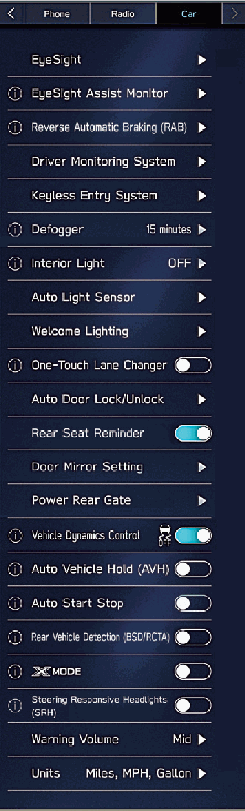
- Figure 30-1 source: p.63
- (Copied from OM) LLORCS
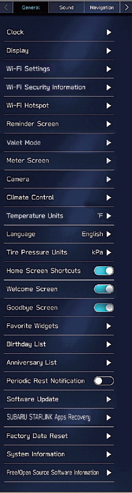
- Figure 30-2 source: p.63
- (Copied from OM) LLORCS
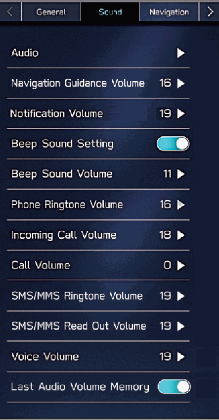
- Figure 30-3 source: p.63
- (Copied from OM) LLORCS
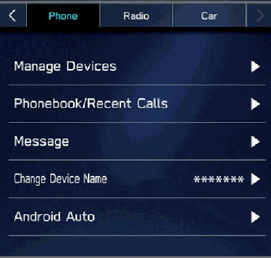
- Figure 30-4 source: p.63
- (Copied from OM) P.83
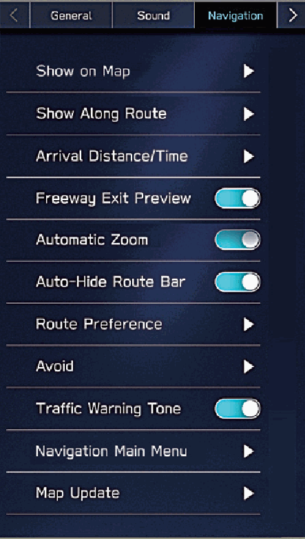
- Figure 30-5 source: p.63
- (Copied from OM) LLORCS
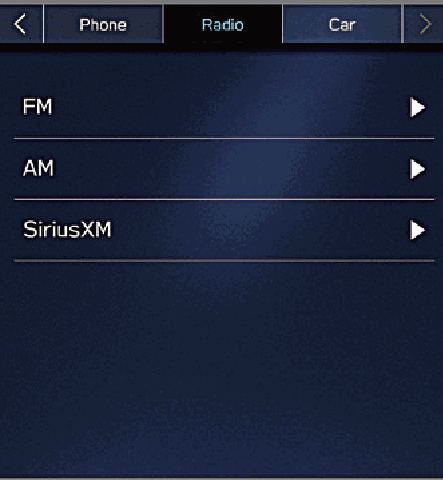
- Figure 30-6 source: p.63
- (Copied from OM) P.102
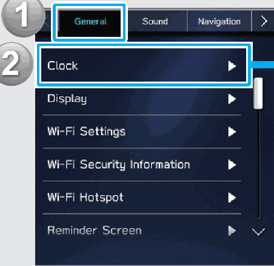
- Figure 30-7 source: p.64
- (Copied from OM) Adjust the clock.
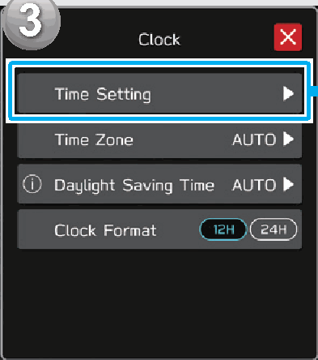
- Figure 30-8 source: p.64
- (Copied from OM) *1: 11.6-inch display with Navi system
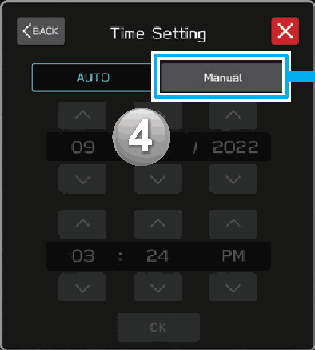
- Figure 30-9 source: p.64
- (Copied from OM) Display the clock settings screen.
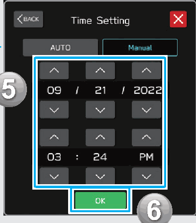
- Figure 30-10 source: p.64
- (Copied from OM) *2: 11.6-inch display system with SUBARU
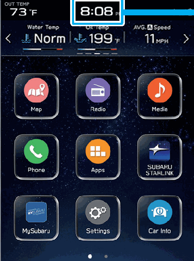
- Figure 30-11 source: p.64
- (Copied from OM) Adjust the clock.

## 30-2-1. Service overview

| # | Presumed requirement | Strength | Source |
|---|---|---|---|
| 1 | Settings ScreenGeneral Sound Navigation P.219 Car* P.94 P.100. | capability | p.63 / text |
| 2 | Settings ScreenLLORCS LLORCS. | capability | p.63 / text |
| 3 | Settings ScreenPhone Radio P.83 P.102. | capability | p.63 / text |
| 4 | Settings Screen*: For settings related to EyeSight, refer to the Owner’s Manual supplement for the EyeSight system. For all other functions and settings, refer to the vehicle Owner’s Manual. | capability | p.63 / text |
| 5 | Settings ScreenDisplay the clock settings screen. Under normal conditions, the clock is adjusted automatically when the system receives GPS signals*1/DCM (Data Communication Module) signals*2 or when a Bluetooth phone is connected to the system*3. If the clock is not adjusted automatically, it is necessary to adjust the clock manually. | constraint | p.64 / text |
| 6 | Settings ScreenSelect the manual mode. Adjust the clock. | capability | p.64 / text |
| 7 | Settings Screen*1: 11.6-inch display with Navi system *2: 11.6-inch display system with SUBARU STARLINK Safety and Security *3: 11.6-inch display system without SUBARU STARLINK Safety and Security. | capability | p.64 / text |
<!-- GENERATED:END function=5dba5365b523 -->

