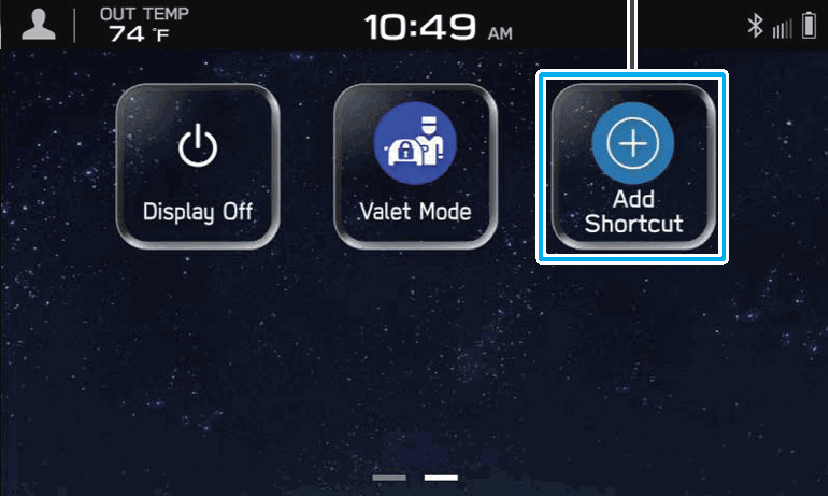
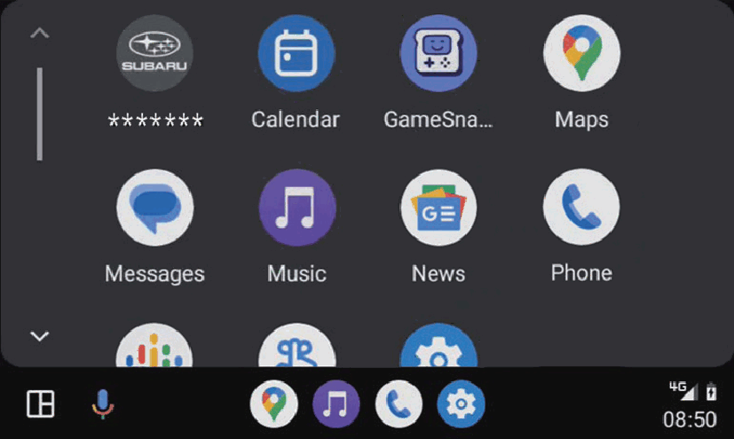
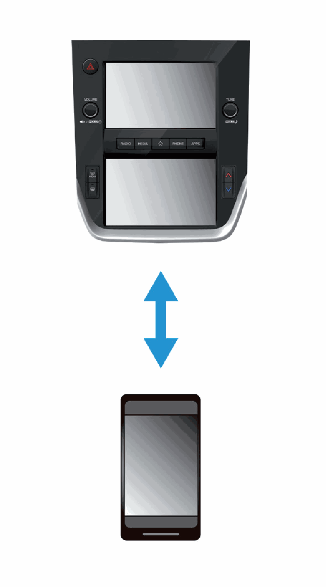

<!-- GENERATED:START function=702723ca3bd3 (generated; edits inside this block are overwritten by the next publish — write your own notes outside it) -->
# 4. Adoption of intuitive and easy-to-use smartphone-like graphical user interface

<b>Function path:</b> Quick Guide / Adoption of intuitive and easy-to-use smartphone-like graphical user interface <b>Source:</b> printed page 16, 17, 18 <b>Test-ready:</b> no — procedure missing or thresholds unfilled

Every "Presumed requirement" row below is machine-derived from the Owner's Manual text by rule-based extraction — not AI-written — and traceable to the printed page in its Source column.

## Figures (areas of the original PDF; the OM has no figure numbers or captions)

- Figure 4-1 source: p.17
- (Copied from OM) P.129

- Figure 4-2 source: p.17
- (Copied from OM) P.129

- Figure 4-3 source: p.17
- (Copied from OM) P.133

- Figure 4-4 source: p.18
- (Copied from OM) the user.

- Figure 4-5 source: p.18
- (Copied from OM) Refer to the vehicle Owner’s Manual.

## 4-2-1. Service overview

| # | Presumed requirement | Strength | Source |
|---|---|---|---|
| 1 | Adoption of intuitive and easy-to-use smartphone-like graphical user interfacesmartphone-like graphical user interface. | capability | p.16 / text |
| 2 | Adoption of intuitive and easy-to-use smartphone-like graphical user interfaceTwo 7.0-inch touch screen displays have been adopted. Information can be displayed seamlessly between these displays and the display in the meter cluster. | capability | p.16 / text |
| 3 | Adoption of intuitive and easy-to-use smartphone-like graphical user interfaceFunction description display function. | capability | p.16 / text |
| 4 | Adoption of intuitive and easy-to-use smartphone-like graphical user interfaceFunction descriptions or operation hints can be displayed when an icon displayed next to the name of a function. | constraint | p.16 / text |
| 5 | Adoption of intuitive and easy-to-use smartphone-like graphical user interfaceCustomized home screen layout P.77. | capability | p.17 / text |
| 6 | Adoption of intuitive and easy-to-use smartphone-like graphical user interfaceFrequently used functions and operations can be added to the home screen. | capability | p.17 / text |
| 7 | Adoption of intuitive and easy-to-use smartphone-like graphical user interfaceExample: For calling specific phone numbers, listening to FM radio stations, etc. | capability | p.17 / text |
| 8 | Adoption of intuitive and easy-to-use smartphone-like graphical user interfaceThe position of screen buttons can be changed by selecting and holding it, then dragging it to the desired position. | capability | p.17 / text |
| 9 | Adoption of intuitive and easy-to-use smartphone-like graphical user interfaceApple CarPlay/Android Auto. | capability | p.17 / text |
| 10 | Adoption of intuitive and easy-to-use smartphone-like graphical user interfaceSupport for Apple CarPlay and Android Auto allows access to functions such as maps, phone calls, and music. | capability | p.17 / text |
| 11 | Adoption of intuitive and easy-to-use smartphone-like graphical user interfaceSystem and Bluetooth phone/device pairing P.23. | capability | p.18 / text |
| 12 | Adoption of intuitive and easy-to-use smartphone-like graphical user interfaceFunctions such as hands-free and applications can be used by connecting the system with Bluetooth phones/devices wirelessly. | capability | p.18 / text |
| 13 | Adoption of intuitive and easy-to-use smartphone-like graphical user interfaceValet mode. | capability | p.18 / text |
| 14 | Adoption of intuitive and easy-to-use smartphone-like graphical user interfaceValet mode restricts operations of the system when valet parking is used, to prevent unwanted access to personal information stored in the system. To enable/disable valet mode, enter a password preset by the user. Refer to the vehicle Owner’s Manual. | constraint | p.18 / text |
<!-- GENERATED:END function=702723ca3bd3 -->

